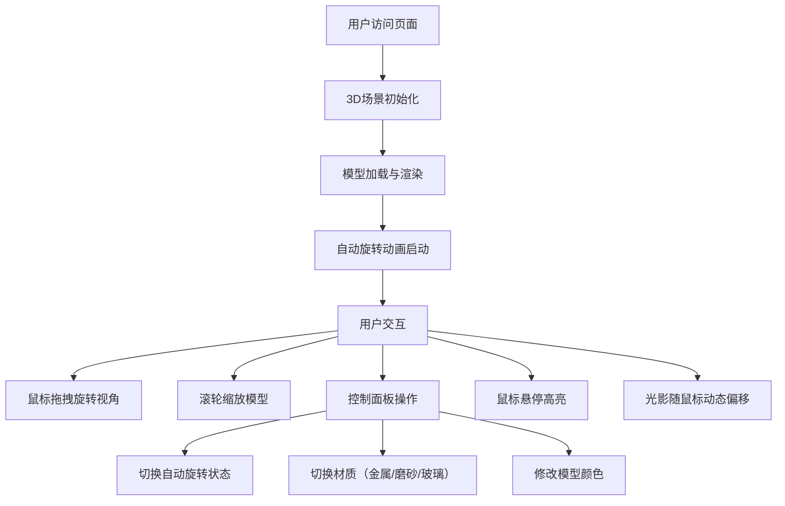

## 1. 产品概述

3D产品交互展示器是一个基于Web的三维产品展示应用，允许用户从任意角度观察商品的立体结构和细节纹理。通过鼠标拖拽旋转、滚轮缩放等交互方式，用户可以自由地审视产品，解决了传统图片和视频无法满足自由旋转和近距离审视需求的问题。

- 核心价值：提供沉浸式的产品展示体验，提升用户对产品的认知和购买决策信心
- 目标用户：电商平台消费者、产品展示网站访客

## 2. 核心功能

### 2.1 功能模块
1. **3D模型展示区**：产品模型渲染、自动旋转动画、鼠标拖拽旋转、滚轮缩放
2. **控制面板**：自动旋转开关、材质切换、颜色选择器
3. **交互效果**：鼠标悬停高亮、光影跟随鼠标
4. **场景系统**：环境光、方向光、背景渐变

### 2.2 页面详情
| 页面名称 | 模块名称 | 功能描述 |
|---------|---------|---------|
| 主展示页 | 3D模型展示区 | 渲染水杯模型（圆柱+球体），支持鼠标拖拽旋转、滚轮缩放（0.5x-5x），默认Y轴自转（周期10秒） |
| 主展示页 | 控制面板 | 右侧毛玻璃效果面板，包含自动旋转开关、三种材质切换（金属/磨砂/透明玻璃）、颜色选择器 |
| 主展示页 | 悬停高亮 | 鼠标移动到模型表面时产生圆形渐变亮光，移出后消失 |
| 主展示页 | 动态光影 | 方向光随鼠标位置产生微弱偏移（水平±20°，垂直±10°） |

## 3. 核心流程

用户打开页面 → 3D模型加载完成并自动旋转 → 用户可通过鼠标拖拽改变视角 → 用户可使用滚轮缩放模型 → 用户可通过右侧控制面板切换材质/颜色/开关自动旋转 → 鼠标悬停在模型上显示高亮光斑 → 光影随鼠标移动产生动态效果

## 4. 用户界面设计

### 4.1 设计风格
- **主题风格**：深色科技感，深邃高级
- **背景**：深色渐变，从顶部深蓝色（#0a1628）过渡到底部黑色（#000000）
- **主色调**：科技蓝（#4a9eff）作为强调色
- **文字颜色**：白色（#ffffff）为主，浅灰（#a0aec0）为辅
- **控件风格**：圆角边框（8px），淡淡的发光边缘，毛玻璃背景效果（backdrop-filter: blur）
- **点击反馈**：按钮缩放至0.95倍并在0.15秒内恢复

### 4.2 页面设计概述
| 页面名称 | 模块名称 | UI元素 |
|---------|---------|-------|
| 主展示页 | 3D模型展示区 | 居中展示，深色渐变背景，模型占据中央大部分面积 |
| 主展示页 | 右侧控制面板 | 半透明毛玻璃效果，白色文字，圆角设计，发光边框 |
| 主展示页 | 材质切换按钮组 | 三个并排按钮，点击时有缩放反馈动画 |
| 主展示页 | 颜色选择器 | 带闪烁动画的颜色选取盒 |

### 4.3 响应式
- 桌面端：控制面板位于屏幕右侧，垂直排列
- 移动端：控制面板变为全宽底栏，控件垂直堆叠布局
- 触摸设备：支持触摸拖拽和捏合缩放

### 4.4 3D场景指导
- **环境**：深色渐变背景，营造科技感和深度
- **灯光设置**：环境光（基础照明）+ 方向光（主光源，左上到右下照射）
- **相机设置**：PerspectiveCamera，视角可通过鼠标拖拽改变
- **交互与动画**：模型Y轴自转（周期10秒）、材质平滑过渡（0.5秒）、悬停高光效果
- **后期效果**：毛玻璃控制面板、发光边缘效果
- **性能要求**：稳定30FPS以上，模型加载和材质切换耗时≤0.5秒
