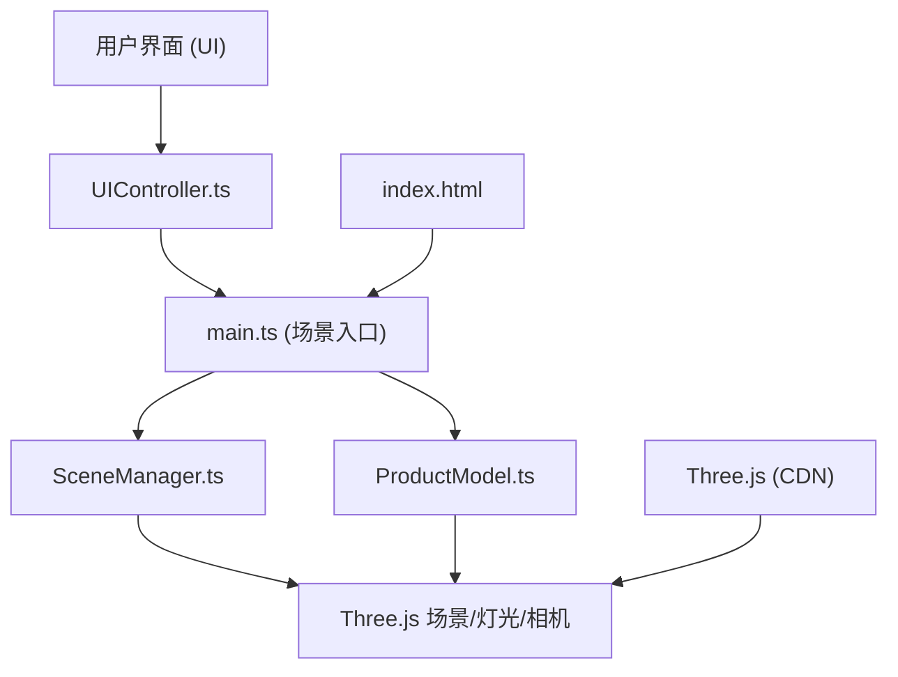

## 1. 架构设计



**模块调用关系与数据流向：**
- `index.html` → `main.ts`：页面入口，初始化应用
- `main.ts` → `SceneManager.ts`：创建场景、灯光、相机，处理窗口自适应
- `main.ts` → `ProductModel.ts`：加载/创建模型，提供旋转、缩放方法
- `main.ts` → `UIController.ts`：处理用户交互事件，调用模型和场景方法
- 数据流向：用户交互 → UIController → ProductModel/SceneManager → Three.js渲染

## 2. 技术描述

- **前端框架**：原生 TypeScript + Three.js (CDN引入)
- **构建工具**：Vite@5
- **语言**：TypeScript@5 (严格模式)
- **3D引擎**：Three.js (通过CDN引入，使用importmap)
- **样式**：原生CSS + CSS变量
- **无后端**：纯客户端应用

## 3. 文件结构

```
auto130/
├── package.json          # 项目配置和依赖
├── vite.config.js        # Vite构建配置
├── tsconfig.json         # TypeScript配置
├── index.html            # 入口页面
└── src/
    ├── main.ts           # 场景入口，初始化核心模块
    ├── ProductModel.ts   # 3D模型管理（创建、旋转、缩放、材质切换）
    ├── SceneManager.ts   # 场景管理（灯光、背景、自适应）
    └── UIController.ts   # 用户交互控制（鼠标、UI事件）
```

### 模块职责说明

| 文件 | 职责 | 对外接口 |
|-----|-----|---------|
| `main.ts` | 应用入口，协调各模块，启动渲染循环 | - |
| `ProductModel.ts` | 创建水杯模型（圆柱+球体），管理旋转、缩放、材质切换、悬停高亮 | `addToScene()`, `rotate()`, `setScale()`, `setMaterial()`, `setColor()`, `setAutoRotation()`, `update()`, `handleHover()`, `handleHoverOut()` |
| `SceneManager.ts` | 管理场景、相机、渲染器、灯光，处理窗口大小变化 | `init()`, `getScene()`, `getCamera()`, `getRenderer()`, `getDirectionalLight()`, `onWindowResize()`, `render()` |
| `UIController.ts` | 处理鼠标拖拽、滚轮缩放、UI面板交互事件 | `init()`, `bindEvents()`, `updateLightPosition()` |

## 4. 核心技术实现

### 4.1 Three.js CDN引入
使用importmap在index.html中引入Three.js：
```html
<script type="importmap">
{
  "imports": {
    "three": "https://cdn.jsdelivr.net/npm/three@0.160.0/build/three.module.js"
  }
}
</script>
```

### 4.2 模型创建
使用Three.js基础几何体组装水杯模型：
- 杯身：CylinderGeometry（圆柱）
- 杯底：SphereGeometry半球或CircleGeometry圆形
- 杯把手：TorusGeometry圆环切片

### 4.3 材质系统
三种材质预设：
1. **金属质感**：MeshStandardMaterial，高metalness，低roughness
2. **磨砂质感**：MeshStandardMaterial，低metalness，高roughness
3. **透明玻璃质感**：MeshPhysicalMaterial，transmission透明度，高清晰度

材质过渡使用线性插值（lerp）在0.5秒内平滑切换。

### 4.4 悬停高亮效果
使用Raycaster检测鼠标与模型的交点，在交点位置创建一个聚光灯光源或使用自定义Shader实现圆形渐变光斑效果。

### 4.5 动态光影
监听鼠标移动事件，将屏幕坐标转换为方向光位置的偏移量，限制在水平±20°、垂直±10°范围内。

## 5. 性能优化

- 使用MeshStandardMaterial替代复杂Shader材质
- 模型使用低多边形几何体
- 渲染循环使用requestAnimationFrame
- 材质切换使用属性插值而非重新创建材质
- 限制帧率在合理范围（目标60FPS，最低30FPS）
