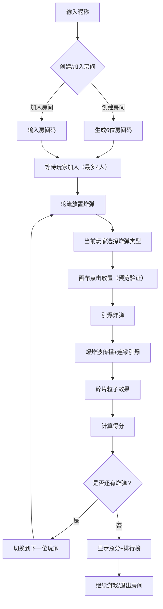

## 1. 产品概述

基于物理的链式反应模拟器，用户通过放置和引爆不同类型的炸弹触发连续爆炸链条，实时观察爆炸波传播与碎片飞溅效果，支持最多4人多人协作轮流游戏。

- 核心玩法：策略性放置炸弹触发最长连锁反应，获取高分
- 目标用户：休闲游戏玩家、物理模拟爱好者
- 市场价值：结合物理模拟与多人协作的创新休闲游戏

## 2. 核心 Features

### 2.1 用户角色

| 角色 | 注册方式 | 核心权限 |
|------|----------|----------|
| 玩家 | 昵称输入 | 创建/加入房间、放置炸弹、观看爆炸、查看排行榜 |

### 2.2 功能模块

1. **房间管理**：创建房间（生成6位房间码）、加入房间（输入房间码）、玩家列表管理
2. **游戏主界面**：计分板、轮次信息、2D游戏画布、工具栏
3. **炸弹系统**：3种炸弹类型（基础炸弹、延时炸弹、定向炸弹）
4. **物理引擎**：爆炸波传播计算、连锁引爆判断、碎片运动轨迹
5. **计分系统**：连锁反应计分、排行榜（localStorage存储前10名）
6. **多人协作**：房间内最多4人轮流放置炸弹

### 2.3 页面详情

| 页面名称 | 模块名称 | 功能描述 |
|---------|----------|----------|
| 首页/房间页 | 房间创建/加入 | 输入昵称、创建房间按钮、输入房间码加入 |
| 游戏主界面 | 计分板 | 毛玻璃背景，显示当前玩家、剩余时间、得分 |
| 游戏主界面 | 游戏画布 | 600x600像素，支持缩放（0.5x-2x）、拖拽平移，渲染炸弹/爆炸波/碎片/障碍物 |
| 游戏主界面 | 工具栏 | 竖排卡片样式，显示3种炸弹类型，当前回合高亮可用 |
| 结算弹窗 | 得分展示 | 显示本轮总分、连锁炸弹数、波及障碍物数 |
| 排行榜 | 榜单展示 | 显示前10名玩家得分 |

## 3. 核心流程

用户输入昵称后，可创建新房间获取6位房间码，或输入房间码加入现有房间。房间内最多4人，轮流放置炸弹。当前玩家选择炸弹类型，在画布上点击放置（绿色预览表示可放，红色表示与障碍物重叠）。放置后引爆，爆炸波扩散触发连锁反应，系统计算得分。一轮结束后显示总分和排行榜。

## 4. 用户界面设计

### 4.1 设计风格

- **主题色**：深蓝灰背景 (#1a1a2e)，暗紫色障碍物 (#6c5ce7)，橙红到亮黄爆炸渐变
- **点缀色**：炸弹用亮色 (#ff6b35、#ffd93d)，绿色可放置预览，红色禁止预览
- **字体**：等宽字体，赛博朋克风格
- **动效**：角落扫描线循环动画、点击卡片缩放闪烁（0.15s）、爆炸画布抖动（2-4px，0.2s）
- **视觉风格**：赛博朋克风，毛玻璃半透明计分板，浅灰色网格线画布

### 4.2 页面设计概述

| 页面名称 | 模块名称 | UI 元素 |
|---------|----------|----------|
| 房间页 | 主容器 | 深蓝灰背景、居中卡片、霓虹边框、扫描线动效 |
| 房间页 | 输入框 | 等宽字体、霓虹聚焦效果、6位房间码输入 |
| 游戏主界面 | 计分板 | 毛玻璃背景 (backdrop-filter)、顶部固定、显示玩家/时间/得分 |
| 游戏主界面 | 游戏画布 | 600x600 像素容器、浅灰网格、支持滚轮缩放、拖拽平移 |
| 游戏主界面 | 工具栏 | 左侧竖排、卡片样式、炸弹图标+名称+说明、当前回合高亮、非回合灰显 |
| 游戏主界面 | 炸弹预览 | 半透明圆环、绿色可放置、红色重叠障碍物 |
| 结算弹窗 | 结果卡片 | 居中显示、总分高亮、连锁数据、排行榜列表 |

### 4.3 响应式

桌面端优先，支持窗口缩放自适应，画布区域保持正方形比例。

### 4.4 性能指标

- 画布渲染帧率 ≥ 30FPS
- 爆炸粒子峰值 ≤ 200个
- WebSocket消息延迟 < 100ms
