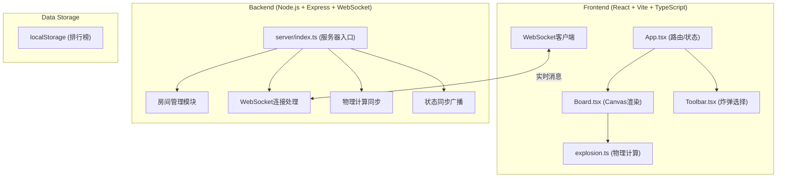

## 1. 架构设计



## 2. 技术栈

- **前端**：React 18 + TypeScript + Vite 5
- **后端**：Express 4 + ws (WebSocket) + uuid
- **类型支持**：@types/react、@types/express、@types/ws
- **构建工具**：Vite（端口3000，代理到后端3001）
- **状态管理**：React useState/useReducer（无需额外库）
- **渲染方式**：HTML5 Canvas 2D API

## 3. 目录结构

```
.
├── package.json
├── index.html
├── vite.config.js
├── tsconfig.json
├── server/
│   └── index.ts          # 后端服务器
└── src/
    ├── main.tsx          # React入口
    ├── App.tsx           # 主应用组件
    ├── components/
    │   ├── Board.tsx     # 游戏画布
    │   └── Toolbar.tsx   # 工具栏
    └── physics/
        └── explosion.ts  # 爆炸物理引擎
```

## 4. 数据类型定义

```typescript
// 位置
interface Position {
  x: number;
  y: number;
}

// 炸弹类型
type BombType = 'basic' | 'delayed' | 'directional';

// 炸弹
interface Bomb {
  id: string;
  type: BombType;
  position: Position;
  playerId: string;
  placedAt: number;      // 放置时间戳
  explodeAt?: number;    // 预计爆炸时间（延时炸弹）
  direction?: number;    // 定向炸弹朝向（弧度）
  isExploding: boolean;
}

// 爆炸波
interface Shockwave {
  id: string;
  position: Position;
  radius: number;
  maxRadius: number;
  startTime: number;
  duration: number;      // 0.6秒
  bombType: BombType;
  direction?: number;    // 定向炸弹方向
  penetrated: number;    // 已穿透障碍物数量
}

// 碎片粒子
interface Debris {
  id: string;
  position: Position;
  velocity: Position;
  size: number;          // 2-6px
  color: string;         // 黄到红渐变
  createdAt: number;
  lifetime: number;      // 1.5秒
}

// 障碍物
interface Obstacle {
  id: string;
  position: Position;
  width: number;         // 2-4格
  height: number;        // 1格
  hitByExplosion: boolean;
}

// 玩家
interface Player {
  id: string;
  nickname: string;
  score: number;
  isCurrentTurn: boolean;
}

// 房间
interface Room {
  code: string;          // 6位数字
  players: Player[];
  currentPlayerIndex: number;
  bombs: Bomb[];
  obstacles: Obstacle[];
  shockwaves: Shockwave[];
  debris: Debris[];
  gameState: 'waiting' | 'playing' | 'ended';
  roundStartTime: number;
  roundTimeLimit: number; // 每轮时间限制
}

// WebSocket消息
type WSMessage = 
  | { type: 'CREATE_ROOM'; nickname: string }
  | { type: 'JOIN_ROOM'; roomCode: string; nickname: string }
  | { type: 'PLACE_BOMB'; roomCode: string; bomb: Bomb }
  | { type: 'TRIGGER_EXPLOSION'; roomCode: string; bombId: string }
  | { type: 'GAME_STATE'; room: Room }
  | { type: 'ROOM_CREATED'; roomCode: string; playerId: string }
  | { type: 'ERROR'; message: string };
```

## 5. API 定义

### HTTP 接口
| 方法 | 路径 | 功能 |
|------|------|------|
| GET | `/api/health` | 健康检查 |
| GET | `/api/room/:code/exists` | 检查房间是否存在 |

### WebSocket 消息
- `CREATE_ROOM`: 创建房间，返回房间码和玩家ID
- `JOIN_ROOM`: 加入房间，同步房间状态
- `PLACE_BOMB`: 放置炸弹，广播给所有玩家
- `TRIGGER_EXPLOSION`: 触发爆炸，同步物理计算
- `GAME_STATE`: 服务器推送完整房间状态

## 6. 核心算法

### 6.1 爆炸波传播
```
输入：引爆点、炸弹类型、当前障碍物列表
输出：受影响的炸弹列表、受影响的障碍物列表
算法：
1. 根据炸弹类型确定爆炸半径、形状（圆形/扇形）、穿透能力
2. 从引爆点按时间步长扩散爆炸波
3. 检测爆炸波与其他炸弹的距离，小于引爆阈值则触发连锁
4. 检测爆炸波与障碍物碰撞，普通炸弹被阻挡，定向炸弹可穿透1个
5. 返回所有被引爆的炸弹和被波及的障碍物
```

### 6.2 连锁引爆判断
```
输入：初始炸弹、所有炸弹列表、障碍物列表
输出：按顺序引爆的炸弹列表
算法：
1. 使用BFS遍历，初始炸弹入队
2. 对每个出队炸弹，计算爆炸波覆盖范围
3. 对范围内未引爆的炸弹，加入引爆队列
4. 考虑障碍物遮挡（定向炸弹除外）
5. 返回按引爆顺序排列的炸弹列表
```

### 6.3 计分规则
```
每引爆1个炸弹: +10分
每波及1个障碍物: +2分
总分 = 炸弹数×10 + 障碍物数×2
```

## 7. 配置参数

| 参数 | 值 | 说明 |
|------|----|------|
| 画布尺寸 | 600x600px | 游戏区域大小 |
| 网格大小 | 30px | 每格像素数 |
| 缩放范围 | 0.5x - 2x | 滚轮缩放 |
| 爆炸波持续 | 0.6s | 圆形扩散动画 |
| 碎片生命周期 | 1.5s | 粒子消失时间 |
| 碎片数量 | 30-50个/爆炸 | 随机范围 |
| 碎片大小 | 2-6px | 随机范围 |
| 重力系数 | 0.3x | 碎片受重力影响 |
| 延时炸弹等待 | 5s | 放置后自动爆炸 |
| 基础炸弹半径 | 3格 | 爆炸范围 |
| 延时炸弹半径 | 5格 | 爆炸范围 |
| 定向炸弹半径 | 4格 | 爆炸范围 |
| 定向炸弹角度 | 60度 | 扇形扩散角 |
| 最大玩家数 | 4人 | 每房间 |
| 房间码长度 | 6位 | 数字 |
| 画布抖动 | 2-4px | 爆炸时效果 |
| 抖动持续 | 0.2s | 爆炸时效果 |
