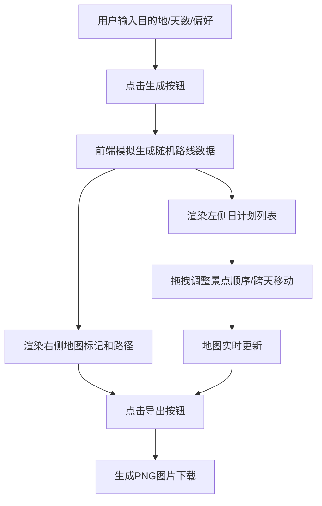

## 1. 产品概述

个性化旅行路线规划应用，根据用户输入的目的地城市、旅行天数和兴趣偏好，自动生成包含每日行程的可视化路线规划图。解决手动规划旅行路线时信息分散、缺乏直观可视化的痛点，帮助用户快速生成并调整旅行计划。

- 目标用户：自由行游客、旅行规划爱好者
- 产品价值：一键生成个性化路线，直观可视化展示，灵活拖拽调整，便捷导出分享

## 2. 核心功能

### 2.1 功能模块

1. **输入面板**：目的地城市输入、天数选择、兴趣偏好多选、生成按钮
2. **日计划列表视图**：按天折叠/展开的景点卡片列表，支持拖拽排序和跨天移动
3. **交互式地图视图**：Leaflet地图展示景点标记点和路径连线
4. **导出功能**：生成包含地图截图和行程表格的PNG图片

### 2.2 页面详情

| 页面名称 | 模块名称 | 功能描述 |
|-----------|-------------|---------------------|
| 主页面 | 输入面板 | 输入目的地、选择天数(1-7)、多选偏好(美食/历史/自然/购物)、点击生成路线 |
| 主页面 | 日计划列表 | 左侧50%宽度，按天卡片展示，默认展开第一天，景点卡片可点击展开详情 |
| 主页面 | 地图视图 | 右侧50%宽度，Leaflet地图展示景点标记(按天分色)和带箭头曲线路径 |
| 主页面 | 导出按钮 | 右上角导出1920x1080分辨率PNG，含地图截图和行程表格 |

## 3. 核心流程

用户输入目的地和偏好 → 点击生成按钮 → 前端模拟生成带随机性的每日路线数据 → 同时渲染左侧日计划列表和右侧地图 → 用户拖拽调整景点顺序或跨天移动 → 地图实时更新标记和路径 → 点击导出按钮生成PNG图片下载

## 4. 用户界面设计

### 4.1 设计风格
- 主背景：浅灰白色 #F5F5F5
- 卡片背景：白色 #FFFFFF，圆角16px，浅阴影 0 2px 8px rgba(0,0,0,0.08)
- 分隔线：2px柔和分隔线 #E0E0E0
- 天数颜色：第一天红、第二天蓝、第三天绿，以此类推
- 字体：现代无衬线字体，层次分明
- 动画：卡片展开250ms、拖拽过渡300ms、放置弹入200ms

### 4.2 页面设计概述

| 页面名称 | 模块名称 | UI元素 |
|-----------|-------------|-------------|
| 主页面 | 输入面板 | 文本输入框、数字选择器、多选标签、主按钮 |
| 主页面 | 日计划卡片 | 左边框彩色标识、折叠/展开箭头、景点卡片网格 |
| 主页面 | 景点卡片 | 类别图标、名称、停留时长、简介、展开详情 |
| 主页面 | 地图视图 | Leaflet地图容器、彩色圆形标记、带箭头曲线路径 |
| 主页面 | 导出按钮 | 右上角固定位置、图标+文字 |

### 4.3 响应式
- 桌面端(≥900px)：左右分栏布局，各占50%
- 移动端(<900px)：上下堆叠布局，各占100%宽度
- 触摸优化：拖拽区域扩大，点击目标最小44px

## 5. 性能要求
- 景点卡片拖拽响应延迟 ≤ 50ms
- 地图标记点实时更新延迟 ≤ 100ms
- 导出图片生成时间 ≤ 3s
