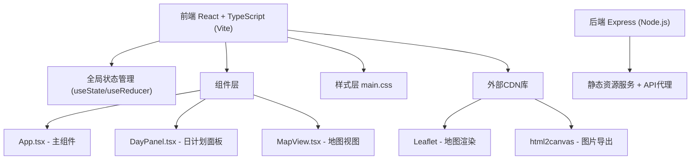

## 1. 架构设计



## 2. 技术描述

- **前端**：React 18 + TypeScript + Vite
- **初始化工具**：Vite
- **后端**：Express 4
- **状态管理**：React useState (轻量级，无需额外库)
- **地图库**：Leaflet (CDN引入)
- **图片导出**：html2canvas (CDN引入)
- **样式**：原生CSS + CSS变量

## 3. 文件结构

| 文件路径 | 用途 |
|---------|------|
| package.json | 项目依赖和脚本 |
| index.html | 入口页面，CDN引入Leaflet和html2canvas |
| vite.config.js | Vite配置，端口3000，代理到后端3001 |
| tsconfig.json | TypeScript严格模式配置 |
| src/components/App.tsx | 主组件，全局状态和交互逻辑 |
| src/components/DayPanel.tsx | 日计划面板，折叠/拖拽排序 |
| src/components/MapView.tsx | Leaflet地图视图 |
| src/styles/main.css | 全局样式和动画 |
| server/index.js | Express后端服务 |

## 4. 数据模型

### 4.1 类型定义

```typescript
type Preference = 'food' | 'history' | 'nature' | 'shopping';

interface Spot {
  id: string;
  name: string;
  category: Preference;
  description: string;
  fullDescription: string;
  duration: number; // 分钟
  lat: number;
  lng: number;
}

interface DayPlan {
  day: number;
  spots: Spot[];
}

interface RouteData {
  destination: string;
  days: number;
  preferences: Preference[];
  plans: DayPlan[];
}
```

### 4.2 天数颜色映射
- Day 1: #E53935 (红)
- Day 2: #1E88E5 (蓝)
- Day 3: #43A047 (绿)
- Day 4: #FB8C00 (橙)
- Day 5: #8E24AA (紫)
- Day 6: #00ACC1 (青)
- Day 7: #F4511E (深橙)

## 5. API定义

本应用主要为前端模拟数据生成，后端仅提供静态服务和代理。

| 路由 | 方法 | 用途 |
|------|------|------|
| /api/generate | POST | 可选：后端生成路线数据 |
| /* | GET | 静态资源服务 |

## 6. 关键交互实现

### 6.1 拖拽排序
- 使用HTML5 Drag and Drop API
- 同天内拖拽：重新排序spots数组
- 跨天拖拽：从源天删除，插入目标天
- 拖拽状态：半透明 + 浅阴影 + CSS transform过渡300ms
- 放置动画：scale 0.95 → 1.0，持续200ms

### 6.2 地图渲染
- Leaflet初始化：OpenStreetMap瓦片
- 标记点：L.circleMarker，颜色按天数映射
- 路径：贝塞尔曲线实现带箭头的曲线路径
- 更新策略：数据变化时清除所有图层重绘

### 6.3 图片导出
- html2canvas捕获整个应用容器
- 目标尺寸1920x1080
- 导出内容：地图截图 + 每日行程表格
