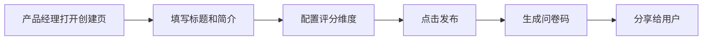
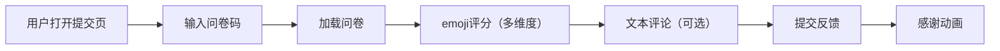
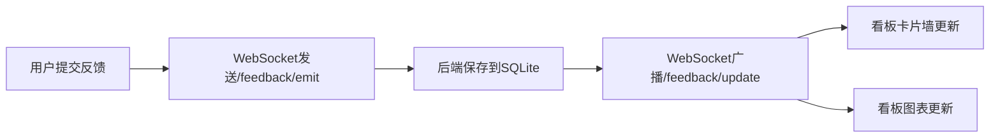

## 1. 产品概述

FeedbackFlow是一个沉浸式反馈收集看板应用，帮助初创团队产品经理快速收集用户反馈，通过富有视觉吸引力的交互形式提升反馈回收率。

- 主要目的：解决传统表单工具缺乏沉浸感和互动性、回收率低的问题
- 目标用户：产品经理、用户研究人员、产品运营人员
- 市场价值：提升用户反馈参与度，帮助产品团队快速获取有价值的用户意见

## 2. 核心功能

### 2.1 用户角色

| 角色 | 注册方式 | 核心权限 |
|------|----------|----------|
| 产品经理 | 无需注册，直接使用 | 创建问卷、查看实时看板、查看数据统计 |
| 普通用户 | 无需注册，通过问卷码参与 | 提交反馈、体验沉浸式问卷 |

### 2.2 功能模块

1. **问卷创建页**：设置问卷标题、简介、评分维度（emoji图标）、是否收集文本评论
2. **反馈提交页**：输入问卷码、沉浸式emoji评分、文本评论输入、提交反馈
3. **实时看板页**：反馈卡片墙、趋势图表、实时数据统计

### 2.3 页面详情

| 页面名称 | 模块名称 | 功能描述 |
|----------|----------|----------|
| 问卷创建页 | 表单模块 | 问卷标题、简介输入，评分维度配置（最多5个维度，每个维度使用emoji作为评分图标） |
| 问卷创建页 | 发布模块 | 生成唯一6位问卷码，支持复制和分享 |
| 问卷创建页 | 进度条模块 | 顶部渐变进度条，随填写进度增长 |
| 反馈提交页 | 问卷码输入模块 | 输入6位问卷码，验证并加载问卷 |
| 反馈提交页 | 评分模块 | 横向滑动展示各维度emoji评分，水波扩散点击动画 |
| 反馈提交页 | 文本输入模块 | 带微动效的文本输入框，输入时emoji闪烁反馈 |
| 反馈提交页 | 提交动效模块 | 卡片翻转动画，烟花粒子感谢动画 |
| 实时看板页 | 卡片墙模块 | 虚拟滚动卡片墙，新卡片从左侧飞入动画，masonry布局 |
| 实时看板页 | 图表模块 | Chart.js趋势折线图，30秒自动刷新，平滑过渡动画 |
| 实时看板页 | 统计模块 | 总反馈数、平均评分显示 |

## 3. 核心流程

### 3.1 产品经理创建问卷流程

产品经理打开创建页 → 填写问卷标题和简介 → 配置评分维度（选择emoji图标、设置是否收集文本） → 点击发布 → 生成6位问卷码 → 分享给用户

### 3.2 用户提交反馈流程

用户打开提交页 → 输入问卷码 → 加载问卷 → 依次进行emoji评分 → （可选）输入文本评论 → 点击提交 → 显示感谢动画

### 3.3 实时看板数据同步流程

用户提交反馈 → WebSocket发送消息 → 后端保存数据 → 广播到所有看板客户端 → 卡片墙更新 → 图表数据更新

## 4. 用户界面设计

### 4.1 设计风格

- **主色调**：深色渐变背景（从#1a1a2e到#16213e）
- **强调色**：各维度emoji主色（❤️ #ff4757、🌟 #ffd700、🔥 #ff6348、💡 #feca57、🎯 #ff7f50）
- **按钮风格**：圆角12px，悬停上浮效果（translateY(-2px)），阴影加深动画
- **字体**：使用独特的无衬线字体，标题采用有特色的展示字体，正文字体清晰易读
- **布局风格**：卡片式布局，毛玻璃半透明效果（backdrop-filter: blur(10px)），柔和发光描边
- **动效**：所有交互反馈时间不超过0.3秒，平滑过渡动画

### 4.2 页面设计概述

| 页面名称 | 模块名称 | UI元素 |
|----------|----------|---------|
| 问卷创建页 | 表单模块 | 深色渐变背景、毛玻璃输入框、渐变进度条、圆角按钮 |
| 问卷创建页 | 维度配置模块 | emoji选择器、开关控件、删除按钮 |
| 反馈提交页 | 问卷卡片 | 柔和渐变动画背景、emoji放大版、水波扩散动画 |
| 反馈提交页 | 提交动效 | 卡片翻转动画、烟花粒子效果 |
| 实时看板页 | 卡片墙 | masonry布局、左侧飞入动画、虚拟滚动、emoji高亮 |
| 实时看板页 | 图表区域 | Chart.js折线图、平滑过渡动画、统计数字 |

### 4.3 响应式设计

- **桌面端**：看板页左侧卡片墙（60%宽度），右侧图表区域（40%宽度）
- **移动端**：看板页卡片墙和图表上下堆叠，图表宽度100%
- **触摸优化**：按钮尺寸不小于48x48px，emoji点击区域放大
- **断点**：768px以下切换为移动端布局

### 4.4 性能优化

- **虚拟滚动**：卡片墙使用虚拟滚动技术，最多显示100张卡片，保持30fps以上
- **WebSocket优化**：消息延迟不超过200ms
- **图表动画**：帧率不低于30fps
- **图片懒加载**：非关键资源延迟加载
