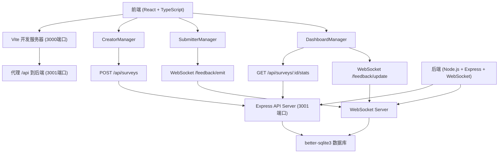
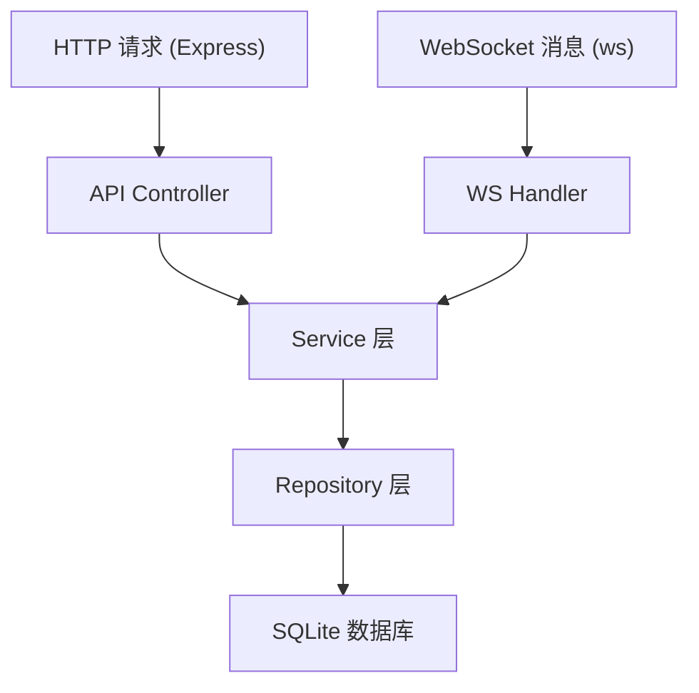
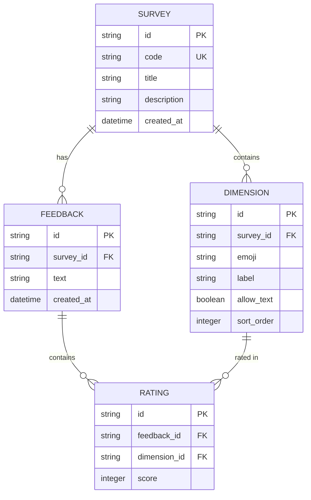

## 1. 架构设计



## 2. 技术描述

- **前端**：React@18 + TypeScript@5 + Vite@5
- **样式方案**：CSS Modules + 自定义CSS变量，不使用Tailwind CSS
- **构建工具**：Vite@5（开发服务器端口3000）
- **后端**：Express@4 + WebSocket (ws@8)
- **数据库**：better-sqlite3（本地文件数据库）
- **图表库**：chart.js@4 + react-chartjs-2@5
- **其他依赖**：uuid@9（生成唯一ID）
- **类型定义**：@types/react、@types/express、@types/ws、@types/better-sqlite3

## 3. 路由定义

| 路由 | 页面/组件 | 用途 |
|------|-----------|------|
| / | CreatorPage | 问卷创建页 |
| /submit | SubmitterPage | 反馈提交页 |
| /dashboard/:id | DashboardPage | 实时看板页 |

## 4. API 定义

### 4.1 REST API

#### 创建问卷
- **请求**：`POST /api/surveys`
- **请求体**：
```typescript
interface CreateSurveyRequest {
  title: string;
  description: string;
  dimensions: Array<{
    emoji: string;
    label: string;
    allowText: boolean;
  }>;
}
```
- **响应**：
```typescript
interface CreateSurveyResponse {
  id: string;
  code: string;
  title: string;
  description: string;
  dimensions: Dimension[];
  createdAt: string;
}
```

#### 获取问卷
- **请求**：`GET /api/surveys/:id`
- **响应**：
```typescript
interface GetSurveyResponse {
  id: string;
  code: string;
  title: string;
  description: string;
  dimensions: Dimension[];
  createdAt: string;
}
```

#### 获取问卷统计
- **请求**：`GET /api/surveys/:id/stats`
- **响应**：
```typescript
interface GetStatsResponse {
  totalFeedbacks: number;
  averageRating: number;
  hourlyData: Array<{
    hour: string;
    count: number;
  }>;
}
```

### 4.2 WebSocket 事件

#### 提交反馈
- **事件名**：`/feedback/emit`
- **消息体**：
```typescript
interface FeedbackEmitMessage {
  surveyId: string;
  ratings: Array<{
    dimensionId: string;
    score: number; // 1-5
  }>;
  text?: string;
}
```

#### 广播新反馈
- **事件名**：`/feedback/update`
- **消息体**：
```typescript
interface FeedbackUpdateMessage {
  id: string;
  surveyId: string;
  ratings: Array<{
    dimensionId: string;
    score: number;
    emoji: string;
  }>;
  text?: string;
  createdAt: string;
}
```

## 5. 服务器架构图



### 5.1 模块职责

- **API Controller**：处理HTTP请求，参数校验，返回响应
- **WS Handler**：处理WebSocket连接和消息，广播通知
- **Service 层**：业务逻辑处理（问卷码生成、数据统计等）
- **Repository 层**：数据库CRUD操作封装

## 6. 数据模型

### 6.1 数据模型定义



### 6.2 DDL 语句

```sql
CREATE TABLE surveys (
  id TEXT PRIMARY KEY,
  code TEXT UNIQUE NOT NULL,
  title TEXT NOT NULL,
  description TEXT,
  created_at DATETIME DEFAULT CURRENT_TIMESTAMP
);

CREATE TABLE dimensions (
  id TEXT PRIMARY KEY,
  survey_id TEXT NOT NULL,
  emoji TEXT NOT NULL,
  label TEXT NOT NULL,
  allow_text INTEGER DEFAULT 0,
  sort_order INTEGER NOT NULL,
  FOREIGN KEY (survey_id) REFERENCES surveys(id) ON DELETE CASCADE
);

CREATE TABLE feedbacks (
  id TEXT PRIMARY KEY,
  survey_id TEXT NOT NULL,
  text TEXT,
  created_at DATETIME DEFAULT CURRENT_TIMESTAMP,
  FOREIGN KEY (survey_id) REFERENCES surveys(id) ON DELETE CASCADE
);

CREATE TABLE ratings (
  id TEXT PRIMARY KEY,
  feedback_id TEXT NOT NULL,
  dimension_id TEXT NOT NULL,
  score INTEGER NOT NULL CHECK (score BETWEEN 1 AND 5),
  FOREIGN KEY (feedback_id) REFERENCES feedbacks(id) ON DELETE CASCADE,
  FOREIGN KEY (dimension_id) REFERENCES dimensions(id) ON DELETE CASCADE
);

CREATE INDEX idx_surveys_code ON surveys(code);
CREATE INDEX idx_feedbacks_survey_id ON feedbacks(survey_id);
CREATE INDEX idx_feedbacks_created_at ON feedbacks(created_at);
CREATE INDEX idx_ratings_feedback_id ON ratings(feedback_id);
CREATE INDEX idx_ratings_dimension_id ON ratings(dimension_id);
```

## 7. 文件结构

```
.
├── package.json              # 项目配置和依赖
├── vite.config.js            # Vite构建配置
├── tsconfig.json             # TypeScript配置
├── index.html                # 入口HTML
├── src/
│   ├── App.tsx               # 主应用组件，路由管理
│   ├── types/                # TypeScript类型定义
│   │   └── index.ts
│   ├── modules/
│   │   ├── creator/          # 问卷创建模块
│   │   │   ├── CreatorManager.ts
│   │   │   ├── CreatorPage.tsx
│   │   │   └── styles.module.css
│   │   ├── submitter/        # 反馈提交模块
│   │   │   ├── SubmitterManager.ts
│   │   │   ├── SubmitterPage.tsx
│   │   │   └── styles.module.css
│   │   └── dashboard/        # 看板模块
│   │       ├── DashboardManager.ts
│   │       ├── DashboardPage.tsx
│   │       ├── components/
│   │       │   ├── CardWall.tsx
│   │       │   ├── FeedbackCard.tsx
│   │       │   ├── TrendChart.tsx
│   │       │   └── VirtualScroll.tsx
│   │       └── styles.module.css
│   ├── utils/                # 工具函数
│   │   ├── websocket.ts
│   │   └── api.ts
│   ├── hooks/                # 自定义Hooks
│   │   ├── useWebSocket.ts
│   │   └── useVirtualScroll.ts
│   └── styles/               # 全局样式
│       └── global.css
└── server/
    ├── index.ts              # 后端入口
    ├── types.ts              # 后端类型定义
    ├── controllers/          # 控制器
    │   ├── surveyController.ts
    │   └── statsController.ts
    ├── services/             # 服务层
    │   ├── surveyService.ts
    │   ├── feedbackService.ts
    │   └── statsService.ts
    ├── repositories/         # 数据访问层
    │   ├── surveyRepository.ts
    │   ├── feedbackRepository.ts
    │   └── dimensionRepository.ts
    ├── websocket/            # WebSocket处理
    │   └── handler.ts
    └── db/                   # 数据库
        ├── init.ts
        └── connection.ts
```

## 8. 数据流向说明

### 8.1 问卷创建流程
`CreatorPage.tsx` → 用户输入表单 → `CreatorManager.ts` → 调用 `POST /api/surveys` → `surveyController.ts` → `surveyService.ts` → `surveyRepository.ts` → SQLite

### 8.2 反馈提交流程
`SubmitterPage.tsx` → 用户选择emoji → `SubmitterManager.ts` → WebSocket发送 `/feedback/emit` → `handler.ts` → `feedbackService.ts` → `feedbackRepository.ts` → SQLite → 广播 `/feedback/update`

### 8.3 看板实时更新流程
WebSocket接收 `/feedback/update` → `DashboardManager.ts` → 更新状态 → `CardWall.tsx` 渲染新卡片 → `TrendChart.tsx` 更新图表

### 8.4 统计数据获取
`DashboardPage.tsx` → 定时调用 `GET /api/surveys/:id/stats` → `statsController.ts` → `statsService.ts` → 查询SQLite → 返回统计数据 → 图表更新
