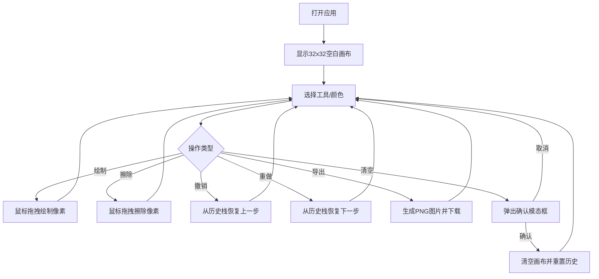

## 1. 产品概述

PixelMosaic 是一款像素艺术协作编辑应用，让用户可以在深色主题的网格画布上自由绘制像素图案，支持多种笔刷工具、撤销重做操作和导出PNG图片功能。面向像素艺术爱好者、游戏开发者和创意设计人员，提供流畅直观的像素创作体验。

## 2. 核心功能

### 2.1 用户角色
| 角色 | 注册方式 | 核心权限 |
|------|----------|----------|
| 普通用户 | 无需注册 | 绘制、擦除、撤销重做、导出 |

### 2.2 功能模块
1. **画布页面**：像素网格绘制区域、鼠标交互、缩放控制
2. **工具栏**：颜色选择、笔刷大小、橡皮擦、撤销重做、导出

### 2.3 页面详情
| 页面名称 | 模块名称 | 功能描述 |
|----------|----------|----------|
| 画布页面 | 像素网格 | 32x32网格，支持鼠标拖拽绘制，悬停显示半透明光标指示 |
| 画布页面 | 状态栏 | 显示鼠标网格坐标、像素数量统计、清零按钮 |
| 画布页面 | 缩放控制 | 鼠标滚轮缩放0.5x-3x，画布居中显示 |
| 画布页面 | 清空确认 | 二次确认模态框，半透明黑色背景+白色圆角卡片 |
| 工具栏 | 颜色选择器 | 16种预设颜色色板，显示当前颜色十六进制值和圆点预览 |
| 工具栏 | 笔刷大小选择器 | 三个圆形按钮代表1x1、2x2、3x3 |
| 工具栏 | 橡皮擦 | 切换为擦除模式，设置像素为白色背景色 |
| 工具栏 | 撤销重做 | 最多50步历史记录，无法操作时按钮置灰 |
| 工具栏 | 导出按钮 | 导出PNG图片，四角圆角裁剪效果 |

## 3. 核心流程

用户打开应用后，在默认32x32网格画布上使用鼠标左键拖拽绘制像素。通过右侧工具栏选择颜色、笔刷大小或切换擦除模式。绘制过程中可随时撤销重做操作。完成后可导出为PNG图片。画布下方实时显示坐标和像素统计信息。

## 4. 用户界面设计

### 4.1 设计风格
- 主背景色：#1e1e2e（深色），工具区域背景：#282840，边框：#3a3a5a
- 按钮风格：圆角6px边框，hover亮度提升10%，点击时scale(0.95)+0.1s加速缓动
- 字体：等宽字体monospace用于状态栏（12px，浅灰色），界面字体使用无衬线体
- 布局风格：左侧画布区域 + 右侧工具栏，顶部应用标题
- 图标风格：左上角纯CSS绘制的4x4黑白像素点阵图标

### 4.2 页面设计概览
| 页面名称 | 模块名称 | UI元素 |
|----------|----------|--------|
| 画布页面 | 像素网格 | 深色背景，#444网格线，半透明光标指示器 |
| 画布页面 | 状态栏 | monospace 12px浅灰文字，坐标格式"列,行" |
| 画布页面 | 清空确认模态 | 半透明黑色遮罩，白色圆角卡片，红色确认按钮，灰色取消按钮 |
| 工具栏 | 颜色选择器 | 16色色板网格，选中色显示hex值和圆点预览 |
| 工具栏 | 笔刷选择 | 三个圆形按钮，大小递增 |
| 工具栏 | 功能按钮 | 圆角6px，hover亮度+10%，点击scale(0.95) |

### 4.3 响应式设计
- 桌面优先设计，画布区域自适应可用空间
- 工具栏固定宽度在右侧
- 缩放后画布居中显示

### 4.4 无3D场景
不适用
