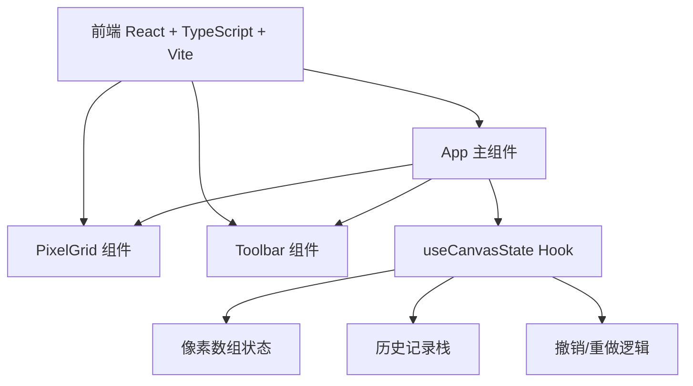
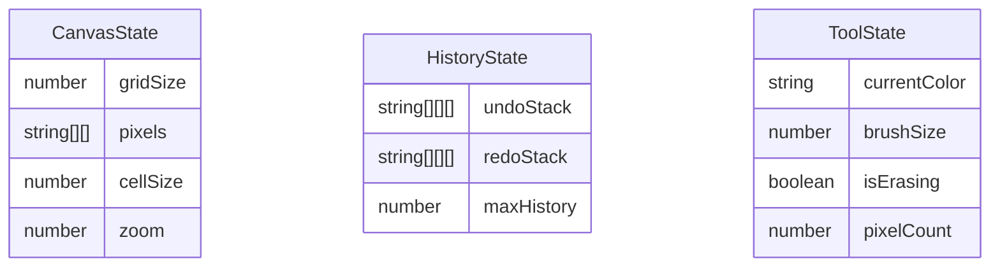

## 1. 架构设计



纯前端应用，无后端服务。所有状态管理在客户端完成。

## 2. 技术说明
- 前端：React@18 + TypeScript + Vite
- 初始化工具：vite-init (react-ts模板)
- 后端：无
- 数据库：无
- 状态管理：React useState + 自定义Hook（useCanvasState）

## 3. 路由定义
| 路由 | 用途 |
|------|------|
| / | 主页面，包含画布和工具栏 |

单页应用，无路由切换。

## 4. API定义
无后端API。

## 5. 服务端架构
无后端服务。

## 6. 数据模型

### 6.1 数据模型定义



### 6.2 数据定义

- **CanvasState**: 核心画布数据
  - `gridSize`: 网格尺寸（默认32）
  - `pixels`: 二维颜色数组 `string[][]`，每个元素为十六进制颜色值
  - `cellSize`: 单元格像素大小（8-24px）
  - `zoom`: 缩放比例（0.5-3.0）

- **HistoryState**: 历史记录
  - `undoStack`: 撤销栈，最多50个快照
  - `redoStack`: 重做栈，最多50个快照
  - `maxHistory`: 最大历史记录数（50）

- **ToolState**: 工具状态
  - `currentColor`: 当前前景色（默认#000000）
  - `brushSize`: 笔刷大小（1/2/3）
  - `isErasing`: 是否为擦除模式
  - `pixelCount`: 已绘制像素计数

### 6.3 文件结构
```
├── package.json
├── index.html
├── vite.config.js
├── tsconfig.json
└── src/
    ├── main.tsx
    ├── App.tsx
    ├── components/
    │   ├── PixelGrid.tsx
    │   └── Toolbar.tsx
    └── hooks/
        └── useCanvasState.ts
```
