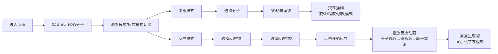

## 1. 产品概述

分子结构与化学反应3D可视化工具，面向化学爱好者和学生，提供直观的分子3D模型探索与化学反应模拟体验。

- **核心目的**：将抽象的化学概念转化为可视化的3D交互体验，降低化学学习门槛
- **目标用户**：化学爱好者、中学生、大学生化学学习者
- **产品价值**：通过交互式3D可视化，帮助用户理解分子空间结构和化学反应本质

## 2. 核心功能

### 2.1 用户角色
| 角色 | 注册方式 | 核心权限 |
|------|----------|----------|
| 访客用户 | 无需注册 | 浏览所有分子模型、模拟化学反应、导出截图 |

### 2.2 功能模块
1. **分子3D展示**：球棍模型/空间填充模型/线框模型切换、原子标签、拖拽旋转、滚轮缩放、自动旋转
2. **分子选择**：预定义分子库（H2O、CO2、C6H6、C60等），支持快速切换
3. **反应模拟**：选择两种反应物，动态展示分子靠近、键断裂、原子重组的完整动画过程
4. **控制面板**：显示模式切换、原子标签开关、暂停/恢复旋转、重置视角、PNG截图导出
5. **响应式布局**：桌面端右侧面板、平板端底部抽屉、移动端浮动按钮

### 2.3 页面详情
| 页面名称 | 模块名称 | 功能描述 |
|----------|----------|----------|
| 主页面 | 3D场景区 | 渲染分子3D模型，支持鼠标交互，深色星空背景 |
| 主页面 | 分子选择区 | 左侧分子列表，支持浏览模式和反应模式切换 |
| 主页面 | 控制面板 | 右侧悬浮磨砂玻璃卡片，包含显示模式、视角控制、截图等 |
| 主页面 | 反应信息区 | 显示化学方程式和生成物高亮提示 |

## 3. 核心流程

### 3.1 分子浏览流程
用户进入页面 → 默认显示H2O分子 → 鼠标拖拽旋转/滚轮缩放 → 从左侧选择其他分子 → 场景切换显示新分子 → 可通过控制面板调整显示模式

### 3.2 反应模拟流程
用户切换到反应模式 → 从左侧列表选择反应物1 → 选择反应物2 → 点击开始反应 → 3D场景播放反应动画（约3秒）→ 反应结束高亮生成物 → 显示化学方程式

## 4. 用户界面设计

### 4.1 设计风格

**整体调性**：科技感、未来感、沉浸式深色主题

- **主色调**：深蓝到紫黑渐变背景（#0a0a1f → #1a0a2e）
- **强调色**：青蓝色（#00d4ff）用于交互高亮和发光效果
- **原子配色**：遵循CPK标准（碳灰#909090、氢白#ffffff、氧红#ff3030、氮蓝#3050f8）
- **卡片风格**：半透明磨砂玻璃效果（backdrop-filter: blur），圆角边缘带微弱发光边框
- **按钮风格**：扁平图标+文字标签，hover时有光晕扩散动画
- **字体**：无衬线字体，现代简洁

### 4.2 页面设计概述

| 页面名称 | 模块名称 | UI元素 |
|----------|----------|--------|
| 主页面 | 3D场景区 | 全屏3D画布、深色渐变背景、星空粒子效果、柔和环境光+两处方向光 |
| 主页面 | 分子选择区 | 左侧垂直列表、卡片式分子项、选中态高亮、模式切换Tab |
| 主页面 | 控制面板 | 右侧悬浮磨砂玻璃卡片、分组控制项、图标按钮、开关控件 |
| 主页面 | 反应信息 | 底部/顶部方程式展示、生成物高亮提示、动画进度指示 |

### 4.3 响应式设计

采用桌面优先（Desktop-first）设计，三级响应式断点：

| 断点 | 布局模式 | 控制面板位置 |
|------|----------|-------------|
| ≥1024px（桌面端） | 三栏布局 | 固定在右侧，常驻显示 |
| 768px-1023px（平板端） | 自适应布局 | 折叠为底部可收起抽屉 |
| <768px（移动端） | 单列布局 | 抽屉自动收起，通过底部浮动按钮展开 |

触控优化：
- 触控目标最小44px
- 支持双指缩放
- 滑动手势支持

### 4.4 3D场景指导

**环境与氛围**：
- 背景：深蓝到紫黑径向渐变 + 微弱星空粒子层
- 雾效：轻微指数雾，增强空间纵深感

**光照设置**：
- 环境光：柔和的AmbientLight，强度0.4
- 方向光1：左上方（偏冷色调），强度0.8，投射阴影
- 方向光2：右后方（偏暖色调），强度0.5，补光

**相机设置**：
- 透视相机，fov=60
- 初始视角自动居中，包围盒自适应
- OrbitControls控制，支持阻尼效果
- 自动旋转（可暂停），速度缓慢

**材质与渲染**：
- 原子：MeshStandardMaterial，金属度0.3，粗糙度0.2，带高光
- 化学键：半透明圆柱，透明度0.7
- 后期处理：轻微Bloom效果增强发光感

**性能要求**：
- C60富勒烯（60原子90键）旋转帧率≥45fps
- 反应模拟动画帧率≥30fps
- 几何复用、实例化渲染优化（如适用）
