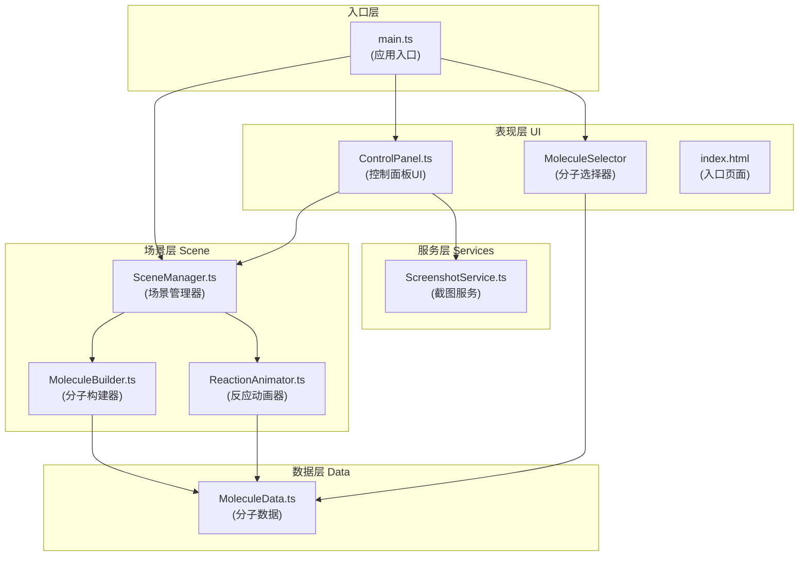

## 1. 架构设计

本项目为纯前端3D可视化应用，采用分层架构设计，将3D渲染逻辑、业务逻辑和UI层严格分离。



## 2. 技术描述

- **前端框架**：原生 TypeScript（不使用React/Vue，轻量高效）
- **3D引擎**：Three.js r160+
- **构建工具**：Vite 5.x
- **语言**：TypeScript 5.x（严格模式）
- **模块系统**：ESNext
- **样式**：原生CSS（CSS变量 + CSS动画）

### 核心依赖
| 依赖包 | 版本 | 用途 |
|--------|------|------|
| three | ^0.160.0 | 3D渲染引擎 |
| @types/three | ^0.160.0 | Three.js类型定义 |
| vite | ^5.0.0 | 构建工具与开发服务器 |
| typescript | ^5.3.0 | TypeScript编译器 |

## 3. 文件结构

```
auto14/
├── index.html                 # 入口HTML
├── package.json               # 依赖配置
├── vite.config.js             # Vite配置
├── tsconfig.json              # TypeScript配置
└── src/
    ├── main.ts                # 应用入口
    ├── scene/
    │   ├── SceneManager.ts    # 场景生命周期管理
    │   ├── MoleculeBuilder.ts # 分子模型构建
    │   └── ReactionAnimator.ts # 反应动画逻辑
    ├── data/
    │   └── MoleculeData.ts    # 预定义分子数据
    ├── ui/
    │   └── ControlPanel.ts    # 控制面板UI
    └── services/
        └── ScreenshotService.ts # 截图服务
```

## 4. 核心模块说明

### 4.1 SceneManager.ts
**职责**：Three.js场景生命周期管理
- 初始化场景、相机、渲染器、光照
- 管理OrbitControls（拖拽、缩放、自动旋转）
- 维护渲染循环（requestAnimationFrame）
- 提供addMolecule/removeMolecule/startReaction等API
- 处理窗口resize自适应

**关键属性**：
```typescript
class SceneManager {
  scene: THREE.Scene
  camera: THREE.PerspectiveCamera
  renderer: THREE.WebGLRenderer
  controls: OrbitControls
  currentMolecule: THREE.Group | null
  isAutoRotating: boolean
  displayMode: 'ball-stick' | 'space-filling' | 'wireframe'
}
```

### 4.2 MoleculeBuilder.ts
**职责**：根据分子数据构建3D模型
- 构建原子球体（不同元素不同颜色/大小）
- 构建化学键圆柱（半透明）
- 支持三种显示模式切换
- 支持原子标签显示（CSS2DRenderer或Sprite）

**关键方法**：
```typescript
class MoleculeBuilder {
  build(moleculeData: MoleculeData): THREE.Group
  setDisplayMode(mode: DisplayMode): void
  setLabelsVisible(visible: boolean): void
}
```

### 4.3 ReactionAnimator.ts
**职责**：化学反应动画逻辑
- 接收两个反应物分子Group
- 分阶段动画：靠近 → 键断裂 → 原子重组 → 生成物
- 使用缓动函数（easeInOutQuad等）计算插值
- 每帧更新原子位置和键连接状态
- 动画时长约3秒

**关键方法**：
```typescript
class ReactionAnimator {
  start(reactant1: MoleculeData, reactant2: MoleculeData, product: MoleculeData): void
  update(deltaTime: number): boolean // 返回是否完成
  onComplete(callback: () => void): void
}
```

### 4.4 MoleculeData.ts
**职责**：预定义分子数据
- 分子数据结构：原子列表（元素类型+坐标）、键列表（原子索引对）
- 预定义分子：H2, O2, H2O, CO2, C6H6, C60等
- 反应配对规则：哪些反应物组合可以反应，生成什么

**数据结构**：
```typescript
interface AtomData {
  element: string  // 'H', 'O', 'C', 'N'等
  position: [number, number, number]
}

interface BondData {
  from: number  // 原子索引
  to: number    // 原子索引
  order?: number // 单键/双键/三键
}

interface MoleculeData {
  name: string
  formula: string
  atoms: AtomData[]
  bonds: BondData[]
}
```

### 4.5 ControlPanel.ts
**职责**：生成HTML控制面板
- 动态创建DOM元素
- 绑定事件回调到SceneManager
- 管理显示模式切换、标签开关、旋转控制、视角重置、截图触发
- 响应式布局处理

### 4.6 ScreenshotService.ts
**职责**：PNG截图导出
- 调用renderer.domElement.toDataURL()
- 导出前隐藏UI层，导出后恢复
- 触发浏览器下载

## 5. 性能优化策略

1. **几何复用**：同种元素的原子共享SphereGeometry
2. **材质复用**：相同显示模式共享材质实例
3. **矩阵更新优化**：动画时仅更新position/rotation，避免重建几何
4. **合理分段**：球体分段数适中（16段），平衡质量与性能
5. **渲染质量控制**：根据设备性能自动调整抗锯齿和像素比
6. **动画节流**：反应动画使用固定时间步长，确保一致性
7. **CSS硬件加速**：UI动画使用transform和opacity，触发GPU加速

## 6. 响应式实现方案

通过CSS媒体查询 + JS断点检测实现三级响应式：

- **桌面端(≥1024px)**：控制面板固定右侧，宽度300px
- **平板端(768-1023px)**：底部抽屉，可滑动收起，默认展开
- **移动端(<768px)**：底部浮动按钮触发抽屉，默认收起

使用CSS变量统一管理间距、圆角、阴影等设计token，确保一致性。
