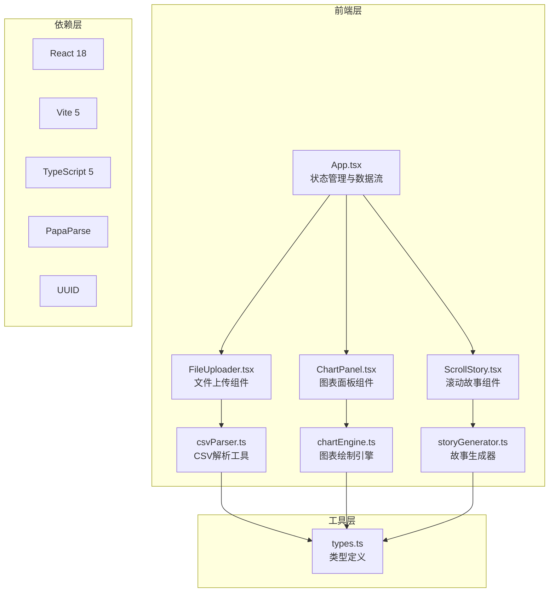

## 1. 架构设计



## 2. 技术描述
- **前端框架**：React 18 + TypeScript 5
- **构建工具**：Vite 5（开发端口3000）
- **CSV解析**：PapaParse 5
- **唯一标识**：UUID 9
- **状态管理**：React useState/useRef（轻量级场景）
- **图表渲染**：Canvas 2D API（原生）
- **动画**：CSS Transition + Intersection Observer API

## 3. 项目结构
```
├── src/
│   ├── components/
│   │   ├── FileUploader.tsx    # 文件上传组件
│   │   ├── ChartPanel.tsx      # 图表面板组件
│   │   └── ScrollStory.tsx     # 滚动故事组件
│   ├── utils/
│   │   ├── csvParser.ts        # CSV解析与类型推断
│   │   ├── chartEngine.ts      # Canvas图表绘制引擎
│   │   └── storyGenerator.ts   # 故事场景生成器
│   ├── types.ts                # TypeScript类型定义
│   ├── App.tsx                 # 主应用组件
│   └── main.tsx                # 应用入口
├── package.json
├── tsconfig.json
├── vite.config.js
└── index.html
```

## 4. 核心数据模型

### 4.1 CSV数据类型
```typescript
type FieldType = 'time' | 'numeric' | 'categorical';

interface CSVField {
  name: string;
  type: FieldType;
  color: string;
}

interface ParsedCSVData {
  headers: CSVField[];
  rows: Record<string, any>[];
  rowCount: number;
}
```

### 4.2 图表配置
```typescript
interface ChartConfig {
  xField: string;           // 时间字段名
  yFields: string[];        // 数值字段名数组（1-3个）
  fieldColors: Record<string, string>;
  showTrendLine: boolean;
}

interface TurningPoint {
  index: number;
  xValue: Date;
  yValue: number;
  field: string;
  slopeChange: number;
  description: string;
}
```

### 4.3 故事场景
```typescript
interface StoryScene {
  id: string;
  type: 'opening' | 'turning-point' | 'trend' | 'summary';
  title: string;
  content: string;
  highlightData?: Record<string, number>;
  chartAnnotation?: TurningPoint;
  animationDelay: number;
}
```

## 5. 性能约束
- **数据量限制**：≤200行数据
- **解析渲染耗时**：≤200ms
- **帧率**：≥60fps
- **内存占用**：≤200MB
- **优化策略**：
  - Canvas分层渲染，仅重绘变化区域
  - 使用 requestAnimationFrame 批量更新
  - Intersection Observer 实现懒加载动画
  - 事件委托减少监听器数量
