## 1. 产品概述

Sketch2Model 是一款面向非专业设计师的2D草图转3D建模工具，用户在白色画布上绘制封闭2D轮廓，系统自动沿Z轴拉伸生成可交互的3D几何体。解决概念设计阶段快速将脑中形状转化为可旋转查看3D物体的痛点。

- 目标用户：产品经理、创意人员、非专业设计师、学生
- 核心价值：零学习成本，手绘即建模，所见即所得

## 2. 核心功能

### 2.1 功能模块

1. **绘制画布模块**：2D自由绘制、墨水延迟动画、双击闭合路径
2. **3D拉伸模块**：轮廓线沿Z轴拉伸生成几何体、深度滑块调节
3. **场景交互模块**：OrbitControls旋转/平移/缩放、视角阻尼与缓动
4. **属性面板模块**：几何体信息展示、光滑/平坦着色切换
5. **状态栏模块**：FPS帧率实时显示、绘制点数统计

### 2.2 页面详情

| 页面名称 | 模块名称 | 功能描述 |
|-----------|-------------|---------------------|
| 主页面 | 绘制画布 | 鼠标自由绘制深灰色(#333)线条，3px线宽，0.2s墨水延迟动画，双击闭合路径 |
| 主页面 | 深度滑块 | 0.5-10范围拉伸深度调节，磨砂玻璃样式 |
| 主页面 | 3D场景 | 半透明浅蓝材质，黑色线框边缘，默认45度视角 |
| 主页面 | 视角控制 | 左键旋转(X/Y轴，阻尼0.85)、右键平移、滚轮缩放(0.5-5倍)，0.3s ease-out缓动 |
| 主页面 | 属性面板 | 顶点数、面数、体积近似值、生成时间戳；光滑着色开关(0.5s材质过渡) |
| 主页面 | 状态栏 | 底部40px高度，实时FPS与绘制点数 |

## 3. 核心流程

用户绘制2D草图 → 双击闭合路径 → 系统生成封闭顶点数组 → 根据深度值沿Z轴拉伸 → 在3D场景中渲染半透明浅蓝几何体 → 用户可旋转/平移/缩放查看 → 切换光滑着色观察不同效果

```mermaid
flowchart LR
    A["开始绘制"] --> B["鼠标移动绘制线条"]
    B --> C["0.2s延迟渲染墨水效果"]
    C --> D["用户双击闭合路径"]
    D --> E["生成封闭轮廓顶点数组"]
    E --> F["根据滑块深度值沿Z轴拉伸"]
    F --> G["Three.js生成ExtrudeGeometry"]
    G --> H["添加半透明浅蓝材质与黑色线框"]
    H --> I["渲染到3D场景(默认45度视角)"]
    I --> J["用户交互:旋转/平移/缩放"]
    J --> K["切换光滑/平坦着色(0.5s过渡)"]
    K --> L["属性面板实时更新几何体信息"]
```

## 4. 用户界面设计

### 4.1 设计风格
- **主题**：深色科技风，背景色#1a1a2e，画布区域#0f0f1a
- **强调色**：浅金色#e0b354用于标题和图标
- **按钮/滑块**：磨砂玻璃效果(rgba(255,255,255,0.1)背景，1px rgba(255,255,255,0.2)边框)，悬停变亮至rgba(255,255,255,0.2)，0.2s过渡
- **字体**：现代无衬线字体，标题粗体，正文常规

### 4.2 页面设计概述

| 页面名称 | 模块名称 | UI Elements |
|-----------|-------------|-------------|
| 主页面 | 画布区域 | 70%宽度，#0f0f1a背景，白色绘画表面，深灰线条3px |
| 主页面 | 属性面板 | 30%宽度，圆角卡片标题(浅金色#e0b354)，信息列表，切换开关 |
| 主页面 | 深度滑块 | 画布底部，磨砂玻璃样式，0.5-10数值显示 |
| 主页面 | 状态栏 | 底部40px高度，左右布局(FPS/绘制点数)，深色背景浅色文字 |
| 主页面 | 3D物体 | 半透明浅蓝材质(alpha~0.6)，黑色线框边缘，光滑/平坦着色切换 |

### 4.3 响应式设计
- **桌面端(≥900px)**：左右布局，画布70% / 属性面板30%
- **移动端(<900px)**：上下布局，画布在上，属性面板折叠到下方，状态栏字号自适应缩小
- 触摸设备支持：触摸拖拽旋转、双指捏合缩放

### 4.4 3D场景指导
- **环境**：深色背景，简洁无干扰，突出几何体本身
- **光照**：环境光(AmbientLight 0.5) + 方向光(DirectionalLight 0.8) + 点光源补光，光滑着色模式下产生高光
- **相机**：PerspectiveCamera，初始距离适中，默认45度俯视角
- **交互**：OrbitControls，enableDamping=true, dampingFactor=0.85，minZoom=0.5, maxZoom=5
- **动画**：材质切换使用0.5s过渡动画，视角变换0.3s ease-out
- **性能预算**：1000三角面≥45FPS，绘制响应<50ms
