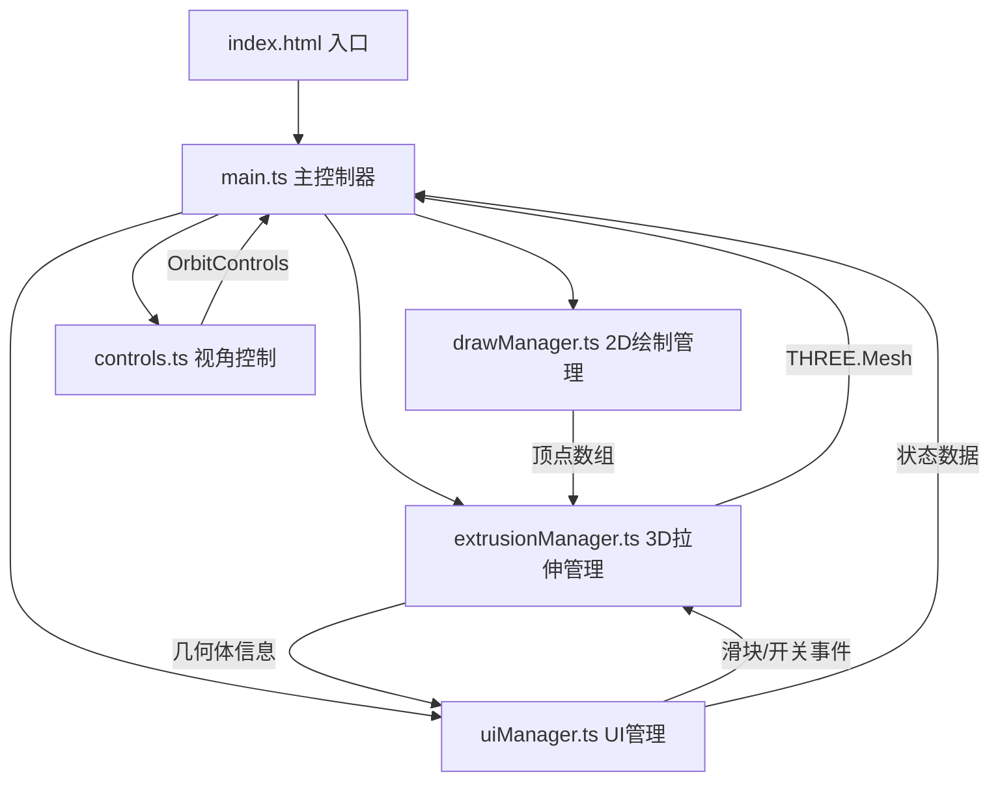

## 1. 架构设计



纯前端单页应用，采用模块化架构，所有计算在客户端完成，无需后端服务。Three.js通过CDN引入减少打包体积。

## 2. 技术描述

- **前端框架**：原生 TypeScript + Vite (用户指定，不使用React/Vue)
- **3D渲染**：Three.js (CDN引入 importmap) + OrbitControls
- **构建工具**：Vite 5.x，开发端口3000
- **语言**：TypeScript (strict模式，esModuleInterop)
- **样式**：原生CSS，CSS变量主题系统
- **初始化方式**：手动创建项目结构（用户明确指定文件结构）

## 3. 文件结构

| 文件路径 | 职责说明 |
|---------|---------|
| `package.json` | 依赖：typescript、vite；脚本：npm run dev |
| `index.html` | 入口页面，#app挂载点，Three.js CDN (importmap) |
| `vite.config.js` | Vite配置，开发服务器端口3000 |
| `tsconfig.json` | TypeScript严格模式，esModuleInterop |
| `src/main.ts` | 初始化场景/相机/渲染器，协调各模块，启动动画循环 |
| `src/drawManager.ts` | 2D画布绘制，鼠标事件追踪，墨水延迟动画，路径闭合 |
| `src/extrusionManager.ts` | ExtrudeGeometry生成，材质管理，光滑/平坦切换 |
| `src/controls.ts` | OrbitControls封装，阻尼配置，视角重置方法 |
| `src/uiManager.ts` | 属性面板、状态栏、滑块、开关的创建与事件绑定 |

## 4. 模块接口定义

### 4.1 DrawManager
```typescript
interface DrawManager {
  constructor(canvas: HTMLCanvasElement, onPathClosed: (points: THREE.Vector2[]) => void);
  setInkDelay(ms: number): void;
  clear(): void;
  getPointCount(): number;
}
```

### 4.2 ExtrusionManager
```typescript
interface ExtrusionManager {
  constructor(scene: THREE.Scene);
  extrude(vertices: THREE.Vector2[], depth: number): THREE.Mesh;
  setSmoothShading(smooth: boolean, transitionMs: number): void;
  getGeometryInfo(): { vertices: number; faces: number; volume: number; timestamp: Date };
  clear(): void;
}
```

### 4.3 ControlsManager
```typescript
interface ControlsManager {
  constructor(camera: THREE.PerspectiveCamera, domElement: HTMLElement);
  resetView(durationMs: number): void;
  update(): void; // 每帧调用，应用阻尼
  setZoomRange(min: number, max: number): void;
}
```

### 4.4 UIManager
```typescript
interface UIManager {
  constructor(container: HTMLElement);
  onDepthChange(callback: (depth: number) => void): void;
  onShadingToggle(callback: (smooth: boolean) => void): void;
  updateGeometryInfo(info: { vertices: number; faces: number; volume: number; timestamp: Date }): void;
  updateStatus(fps: number, drawPoints: number): void;
}
```

## 5. 关键技术实现要点

### 5.1 墨水延迟动画
- 使用队列存储待绘制的鼠标点坐标与时间戳
- requestAnimationFrame循环中，根据当前时间与记录时间差≥200ms时才渲染该点
- 相邻点间使用二次贝塞尔插值实现平滑曲线

### 5.2 路径闭合检测
- 监听dblclick事件，自动将最后一点与起点连接
- 使用THREE.Shape验证路径有效性，去除自交线段

### 5.3 拉伸几何体生成
- `THREE.ExtrudeGeometry` + `THREE.Shape`构建形状
- `bevelEnabled: false`保持锐利边缘
- 材质：`THREE.MeshPhysicalMaterial`(透明浅蓝) + `THREE.LineSegments`(EdgesGeometry黑色线框)

### 5.4 着色模式切换
- 光滑：`material.flatShading = false`，几何体执行`geometry.computeVertexNormals()`
- 平坦：`material.flatShading = true`
- 过渡：使用TWEEN或手动插值`material.opacity`、`material.roughness`在500ms内渐变

### 5.5 体积近似计算
- 对封闭网格使用签名四面体法(Signed Volume)
- 遍历所有三角面，累加`dot(cross(v1-v0, v2-v0), v0) / 6`

### 5.6 FPS计算
- 存储最近60帧的时间戳，滑动窗口平均
- 每500ms更新一次状态栏显示
