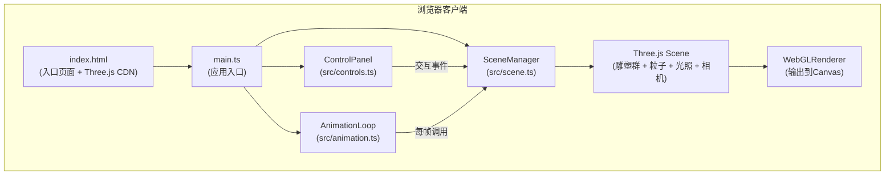

## 1. 架构设计



调用关系与数据流：
1. `main.ts` 创建 `SceneManager` → 创建 `ControlPanel` → 创建 `AnimationLoop` 并启动
2. `AnimationLoop` 每帧计算 `{ morphFactor, time, delta }`，调用 `SceneManager.updateMorph(data)`
3. `ControlPanel` 监听鼠标/键盘事件，调用 `SceneManager` 的 `togglePause()` / `toggleExplode()` / `resetCamera()` 等方法
4. `SceneManager` 内部操作 Three.js 场景对象，`AnimationLoop` 最后调用 `renderer.render(scene, camera)`

## 2. 技术说明
- **前端框架**：原生 TypeScript（无UI框架），直接操作 Three.js API
- **构建工具**：Vite@5，开发服务器端口 3000，输出目录 dist
- **语言**：TypeScript@5 严格模式（strict: true），启用 esModuleInterop 与 isolatedModules
- **Three.js引入方式**：通过 `<script>` CDN（unpkg/jsdelivr）在 index.html 全局注入，在 TS 中使用 `declare global` 声明 THREE 类型
- **渲染器**：WebGLRenderer + antialias，alpha通道启用，devicePixelRatio = Math.min(window.devicePixelRatio, 2)
- **控制器**：Three.js 内置 OrbitControls（CDN 提供 examples/jsm/controls/OrbitControls.js）

## 3. 路由定义
| 路由 | 用途 |
|-------|---------|
| / | 单页面应用，主场景渲染 |

## 4. 文件结构
```
auto142/
├── index.html                     # 入口页面：全屏canvas容器，引入Three.js + OrbitControls CDN
├── package.json                   # dev依赖：typescript、vite；脚本：npm run dev
├── vite.config.js                 # Vite配置：port=3000，outDir=dist
├── tsconfig.json                  # TS配置：strict, esModuleInterop, isolatedModules
└── src/
    ├── main.ts                    # 入口：创建Scene/Control/Animation，启动循环，监听resize
    ├── scene.ts                   # SceneManager类：雕塑创建、粒子系统、morph更新、爆炸切换
    ├── controls.ts                # ControlPanel类：OrbitControls封装、鼠标键盘事件绑定
    └── animation.ts               # AnimationLoop类：requestAnimationFrame循环、时间参数计算
```

## 5. 类与核心方法定义

### 5.1 SceneManager (src/scene.ts)
```typescript
class SceneManager {
  scene: THREE.Scene
  camera: THREE.PerspectiveCamera
  renderer: THREE.WebGLRenderer
  mainSculpture: THREE.Group
  orbitSculptures: Array<{ group: THREE.Group; radius: number; speed: number; angle: number; baseScale: number }>
  particles: THREE.Points
  particlePositions: Float32Array
  orbitRings: THREE.Line[]
  isExploding: boolean
  explodeProgress: number
  explodeDirection: number

  constructor(canvas: HTMLCanvasElement)
  setupLighting(): void
  createMainSculpture(): void              // 中央复合雕塑（6种几何体）
  createOrbitSculptures(): void            // 6个环绕子雕塑
  createOrbitRing(radius: number): THREE.Line
  createParticles(): void                  // 粒子星空背景
  createMorphedGeometry(type: string): THREE.BufferGeometry  // 带morphTarget的几何体
  updateMorph(data: { morphFactor: number; time: number; mouseX: number; mouseY: number }): void
  togglePause(): void
  toggleExplode(): void                    // 触发2秒爆炸/聚拢
  resetCamera(): void
  onResize(): void
}
```

### 5.2 ControlPanel (src/controls.ts)
```typescript
class ControlPanel {
  scene: SceneManager
  controls: OrbitControls
  mouseX: number
  mouseY: number
  isPaused: boolean

  constructor(scene: SceneManager, domElement: HTMLElement)
  setupOrbitControls(): void
  setupMouseListeners(): void               // 鼠标位置记录（供粒子使用）
  setupKeyboardListeners(): void            // 1:暂停/恢复, 2:爆炸, 3:重置
  getMousePosition(): { x: number; y: number }
  setPaused(paused: boolean): void
}
```

### 5.3 AnimationLoop (src/animation.ts)
```typescript
class AnimationLoop {
  scene: SceneManager
  controls: ControlPanel
  startTime: number
  isRunning: boolean
  rafId: number | null

  constructor(scene: SceneManager, controls: ControlPanel)
  start(): void
  stop(): void
  tick(): void                              // requestAnimationFrame 回调
  calculateMorphFactor(elapsed: number): number
}
```

## 6. 核心数据结构

### 几何体变形方案
- 使用 `BufferGeometry.morphAttributes.position` 预计算顶点：
  - morphTarget 0：原始几何体顶点（形态A）
  - morphTarget 1：顶点沿法线方向放大1.6-2.0倍的星形尖刺形态（形态B）
- 通过设置 `mesh.morphTargetInfluences[0] = 1 - morphFactor; morphTargetInfluences[1] = morphFactor` 平滑过渡
- 圆环体(TorusGeometry)采用顶点沿切向+径向偏移实现花瓣状变形

### 色彩变换方案
- 每个材质存储基础 `baseHue`（0-1随机生成，确保饱和度≥80%，亮度60%-90%）
- 每帧更新：`currentHue = (baseHue + morphFactor * 0.5 + positionOffset) % 1`
- 使用 HSL→RGB 转换：暖色(橙红hue≈0.03-0.08) ↔ 冷色(蓝紫hue≈0.66-0.75)

### 爆炸/聚拢动画
- 状态机：`explodeDirection ∈ {-1, 0, 1}`（聚拢/空闲/发散）
- 每帧 `explodeProgress += delta * 0.5`（2秒完成），clamp到[0,1]
- 环绕半径插值：`currentRadius = baseRadius * (1 + 1.5 * easeInOutCubic(explodeProgress))`
- easeInOutCubic: `t < 0.5 ? 4t³ : 1 - (-2t+2)³/2`

## 7. 性能优化策略
1. **BufferGeometry 复用**：6种子雕塑共享同一组 BufferGeometry 引用，仅材质独立
2. **粒子使用 Points + BufferGeometry**：单 DrawCall 渲染数千粒子
3. **线框使用 EdgesGeometry + LineSegments**：而非 wireframe=true（避免重复绘制面）
4. **DevicePixelRatio 上限 2**：在高DPI屏幕上平衡画质与性能
5. **对象池/预计算**：所有几何、材质、粒子位置在初始化时一次性创建，运行期仅更新uniform/matrix
6. **Resize 防抖**：100ms节流窗口大小变化处理
