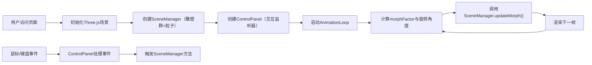

## 1. 产品概述
MorphicGeometry 是一款面向艺术展览与数字创意领域的交互式 3D 几何雕塑 Web 应用，让观众通过鼠标/触控与漂浮在三维空间中的动态几何雕塑进行实时互动，沉浸式感受形状、颜色与运动的和谐变化。
- 核心用途：艺术展览互动装置、数字创意展示工具、教育演示
- 目标用户：策展人、数字艺术家、设计教育者、艺术观众

## 2. 核心特性

### 2.1 功能模块
1. **主场景页面**：三维几何雕塑展示、粒子星空背景、实时交互响应

### 2.2 页面详情
| 页面名称 | 模块名称 | 功能描述 |
|-----------|-------------|---------------------|
| 主场景 | 中心复合雕塑 | 由立方体/球体/二十面体/圆环/圆锥/圆柱组成的主雕塑，半透明高饱和度材质+白色线框 |
| 主场景 | 环绕子雕塑群 | 6个相同几何体环绕公转+自转，可见轨迹虚线圆环 |
| 主场景 | 动态变形系统 | 形态A（原始）与形态B（星形尖刺）周期性平滑变形（morphFactor驱动） |
| 主场景 | 色彩变换系统 | 颜色随morphFactor与位置正弦变化，暖橙红渐变到冷蓝紫 |
| 主场景 | 粒子背景系统 | 数千彩色粒子组成立体星空，缓慢旋转，大小密度随鼠标轻微变化 |
| 主场景 | 交互控制系统 | 鼠标拖拽旋转视角、滚轮缩放；键盘1暂停/恢复，2爆炸发散/聚拢，3重置视角 |

## 3. 核心流程
用户进入页面后，自动加载三维场景并启动动画循环。中心雕塑与6个环绕子雕塑开始公转、自转与形态变形，粒子背景同步旋转。用户可随时通过鼠标或键盘进行交互：
- 鼠标拖拽 → OrbitControls 旋转视角
- 滚轮 → 缩放视距
- 按键1 → 动画暂停/恢复切换
- 按键2 → 子雕塑爆炸发散/聚拢切换动画（持续2秒）
- 按键3 → 视角重置到初始位置

## 4. 用户界面设计
### 4.1 设计风格
- **主色调**：深色渐变背景 `#0a0a2e → #1a1a3e`，营造深空艺术画廊氛围
- **几何体材质**：高饱和度半透明（不透明度0.7-0.9），玻璃质感，白色细线描边
- **色彩渐变**：暖色系（橙红 `#ff6b35`、红 `#e63946`）→ 冷色系（蓝 `#457b9d`、紫 `#7b2cbf`）
- **字体**：无UI文字，纯视觉沉浸体验
- **布局**：全屏canvas，无可见UI控件，零干扰

### 4.2 页面设计概述
| 页面名称 | 模块名称 | UI元素 |
|-----------|-------------|-------------|
| 主场景 | 背景层 | CSS深色渐变 + Canvas 3D粒子星空（景深：近大远小、近亮远暗） |
| 主场景 | 雕塑层 | 中心复合雕塑（6种几何体随机颜色）、6个环绕子雕塑、虚线轨迹圆环 |
| 主场景 | 交互层 | 完全隐形，仅通过鼠标与键盘事件驱动 |
| 主场景 | 动效层 | morph变形平滑过渡（2秒周期）、色彩正弦过渡、爆炸/聚拢缓动动画 |

### 4.3 响应式
- 桌面端优先：鼠标拖拽 + 滚轮 + 键盘快捷键
- 自适应：监听window resize，canvas自动适配窗口尺寸，相机aspect与渲染器尺寸同步更新
- 触控兼容：OrbitControls原生支持触控手势旋转/缩放

### 4.4 3D场景指导
- **环境与氛围**：深空画廊风格，无外部光源贴图，使用AmbientLight + PointLight多点柔和照明
- **光照设置**：AmbientLight(0xffffff, 0.4) 环境光 + 2个PointLight位于对角方向，强度0.8-1.0
- **相机设置**：PerspectiveCamera，fov=60，near=0.1，far=2000，初始位置(0, 0, 15)
- **构图与焦点**：中心雕塑为视觉焦点，环绕子雕塑形成平衡构图，粒子背景营造空间纵深感
- **交互与动画**：
  - 变形动画：morphFactor = 0.5 * (1 + sin(time * 0.5))，2秒一个完整周期
  - 公转：6个子雕塑半径3-7不等，角速度0.2-0.8 rad/s
  - 自转：每个几何体自身0.1-0.3 rad/s
  - 爆炸/聚拢：2秒内子雕塑半径从正常→2.5倍→正常，使用easeInOutCubic缓动
- **后处理**：不使用额外后处理，通过半透明材质blending与线框叠加实现玻璃雕塑质感
- **性能预算**：
  - 粒子数：3000-5000（BufferGeometry + Points）
  - 几何体：7个复合组（每个含6个Mesh），总面数控制在5万以内
  - 帧率目标：≥30FPS，Chrome/Firefox/Edge主流浏览器流畅运行
