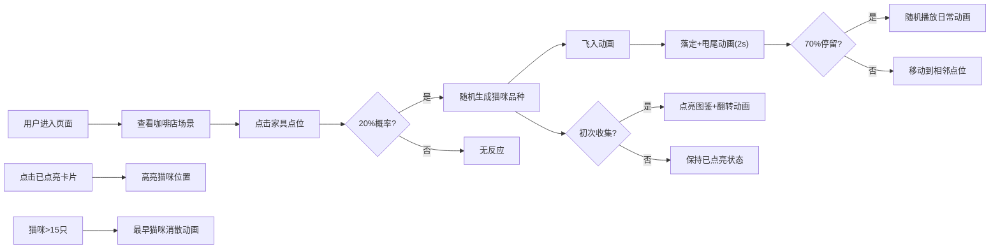

## 1. 产品概述

虚拟猫咪咖啡馆是一款治愈系网页互动应用，用户通过点击像素风格咖啡店场景中的不同位置，随机召唤和收集10种不同品种的猫咪，每只猫咪都有独特的外观、性格和互动动画，为用户提供轻松愉悦的云吸猫体验。

- 核心价值：为爱猫人士提供无负担的云养猫体验，通过收集玩法和可爱动画治愈用户
- 目标用户：喜欢猫咪、追求轻松休闲体验的年轻用户群体

## 2. 核心功能

### 2.1 用户角色
| 角色 | 注册方式 | 核心权限 |
|------|----------|----------|
| 普通用户 | 无需注册 | 召唤猫咪、收集图鉴、查看猫咪状态 |

### 2.2 功能模块
1. **咖啡店场景**：像素风格俯视图，包含4个可交互点位（吧台、书架、地毯、窗台）
2. **猫咪图鉴**：展示10种猫咪卡片，显示品种、稀有度、性格描述
3. **活动状态面板**：实时显示当前在场猫咪的行为状态
4. **猫咪动画系统**：飞入、落定、日常行为、移动、消散等动画

### 2.3 页面详情
| 页面名称 | 模块名称 | 功能描述 |
|---------|----------|----------|
| 主页面 | 咖啡店面俯视图 | 像素风格场景，响应式自适应，点击点位召唤猫咪 |
| 主页面 | 猫咪图鉴展示区 | 展示已收集猫咪卡片，未收集为灰暗状态，点亮时播放翻转动画 |
| 主页面 | 猫咪活动状态面板 | 显示在场猫咪实时行为，每5秒自动切换 |

## 3. 核心流程

用户进入页面 → 查看咖啡店场景和图鉴 → 点击场景中的家具点位 → 20%概率生成猫咪 → 猫咪飞入并落定 → 播放动画或移动到相邻点位 → 图鉴自动点亮（初次收集）→ 点击卡片高亮对应猫咪 → 猫咪超过15只时最早的猫咪消散

## 4. 用户界面设计

### 4.1 设计风格
- **主色调**：温暖的咖啡色 (#8B4513) 作为主色，米色 (#F5F5DC) 作为背景，搭配柔和的粉色 (#FFB6C1) 和薄荷绿 (#98FB98) 点缀
- **设计风格**：像素艺术风格 + 温馨治愈系，圆角卡片，柔和阴影
- **字体**：标题使用像素风字体"Press Start 2P"，正文使用"ZCOOL KuaiLe"中文可爱字体
- **卡片边框**：普通#C0C0C0银色，稀有#FFD700金色，传说使用彩虹渐变
- **动画风格**：流畅的缓动动画，弹跳感的飞入效果，柔和的发光脉动

### 4.2 页面设计概述
| 页面名称 | 模块名称 | UI元素 |
|---------|----------|--------|
| 主页面 | 咖啡店面俯视图 | 像素风格绘制，咖啡色木质地板，吧台、书架、地毯、窗台四个可交互点位，响应式自适应尺寸 |
| 主页面 | 猫咪图鉴展示区 | 卡片式布局，5列网格，未收集为灰白状态，点亮时3D翻转动画，边框颜色随稀有度变化 |
| 主页面 | 猫咪活动状态面板 | 列表布局，每只猫咪显示图标+品种名+当前行为，每5秒自动刷新 |

### 4.3 响应式设计
- 桌面端（≥1024px）：左侧场景占60%宽度，右侧图鉴+面板占40%，上下布局
- 平板端（768px-1023px）：左侧场景占55%，右侧占45%
- 移动端（<768px）：上下布局，场景在上，图鉴和面板在下
- 所有交互元素确保触摸友好，最小点击区域44x44px

## 5. 性能要求
- 动画帧率稳定在50FPS以上
- 使用requestAnimationFrame驱动所有循环动画
- 猫咪数量上限15只，超出自动移除最早生成的
- 所有资源加载优化，首屏时间<2秒
