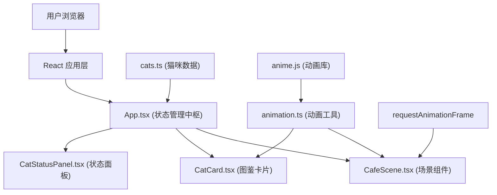

## 1. 架构设计



## 2. 技术描述

- **前端框架**：React 18 + TypeScript
- **构建工具**：Vite 5
- **动画库**：animejs
- **状态管理**：React Hooks (useState, useEffect, useRef, useCallback)
- **样式方案**：CSS Modules + CSS Variables
- **字体**：Google Fonts (Press Start 2P, ZCOOL KuaiLe)

## 3. 目录结构

```
auto143/
├── src/
│   ├── components/
│   │   ├── CafeScene.tsx      # 咖啡店场景组件
│   │   ├── CatCard.tsx        # 猫咪图鉴卡片组件
│   │   └── CatStatusPanel.tsx # 猫咪活动状态面板
│   ├── data/
│   │   └── cats.ts            # 猫咪品种数据
│   ├── utils/
│   │   └── animation.ts       # 动画工具函数
│   ├── App.tsx                # 主应用组件
│   ├── main.tsx               # 应用入口
│   └── styles/
│       └── globals.css        # 全局样式
├── index.html
├── package.json
├── tsconfig.json
└── vite.config.js
```

## 4. 数据模型

### 4.1 类型定义

```typescript
interface CatBreed {
  id: string;
  name: string;
  rarity: 'common' | 'rare' | 'legendary';
  rarityProbability: number;
  personalities: string[];
  colorTheme: {
    primary: string;
    secondary: string;
    accent: string;
  };
  emoji: string;
}

interface SpawnedCat {
  id: string;
  breedId: string;
  position: 'bar' | 'bookshelf' | 'carpet' | 'windowsill';
  behavior: 'sleeping' | 'grooming' | 'playing' | 'sitting' | 'yawning' | 'lying';
  spawnedAt: number;
  currentPersonality: string;
}

interface CatCollection {
  [breedId: string]: {
    unlocked: boolean;
    unlockedAt?: number;
    count: number;
  };
}

type SpotType = 'bar' | 'bookshelf' | 'carpet' | 'windowsill';
```

### 4.2 猫咪行为类型

| 行为类型 | 描述 | 触发条件 |
|---------|------|----------|
| sleeping | 睡觉 Zzz | 日常行为随机 |
| grooming | 舔毛 | 日常行为随机 |
| playing | 玩毛线球 | 日常行为随机 |
| sitting | 蹲坐甩尾 | 刚落定时 |
| yawning | 打哈欠 | 日常行为随机 |
| lying | 躺平 | 日常行为随机 |

## 5. 动画系统设计

### 5.1 动画类型

| 动画名称 | 用途 | 技术实现 |
|---------|------|----------|
| flyIn | 猫咪从屏幕外飞入目标点位 | anime.js + 贝塞尔缓动 |
| landingSit | 落定后蹲坐甩尾2秒 | anime.js + 循环动画 |
| idleBehavior | 日常行为动画（舔爪、打哈欠、躺平） | requestAnimationFrame + CSS transforms |
| moveToSpot | 小步移动到相邻点位 | anime.js + 路径动画 |
| cardFlip | 图鉴卡片点亮翻转动画 | CSS 3D transform + anime.js |
| highlightRing | 猫咪位置高亮脉动 | CSS animation + box-shadow |
| fadeAway | 猫咪化为光点消散 | anime.js + opacity + scale |

### 5.2 性能优化策略

1. 所有循环动画使用 requestAnimationFrame 统一调度
2. 使用 CSS transforms 和 opacity 进行动画，避免 reflow
3. 猫咪 DOM 元素池化，超过15只时销毁最早的
4. 动画使用 will-change 提示浏览器优化
5. 避免在动画回调中执行复杂计算

## 6. 核心组件状态

### App.tsx 管理的状态

```typescript
// 已生成的猫咪列表
const [spawnedCats, setSpawnedCats] = useState<SpawnedCat[]>([]);

// 猫咪收集状态
const [catCollection, setCatCollection] = useState<CatCollection>({});

// 当前高亮的猫咪ID
const [highlightedCatId, setHighlightedCatId] = useState<string | null>(null);

// 刚解锁的猫咪ID（用于播放翻转动画）
const [newlyUnlockedBreedId, setNewlyUnlockedBreedId] = useState<string | null>(null);
```

## 7. 核心算法

### 7.1 猫咪生成概率

- 点位点击触发生成：20% 概率
- 稀有度分配：普通60%，稀有30%，传说10%
- 品种随机：在对应稀有度的猫咪中均匀随机

### 7.2 行为切换

- 每5秒自动切换所有在场猫咪的行为
- 行为随机选择：sleeping, grooming, playing, yawning, lying

### 7.3 猫咪移动

- 落定后30%概率移动到相邻点位
- 相邻点位定义：吧台↔书架，书架↔地毯，地毯↔窗台，窗台↔吧台

## 8. 性能指标

- 目标帧率：≥50 FPS
- 猫咪上限：15只
- 单只猫咪动画开销：<1ms/frame
- 内存使用：<50MB
