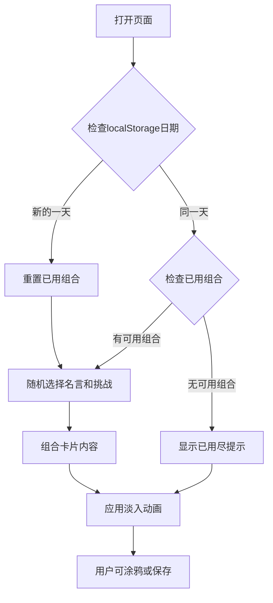
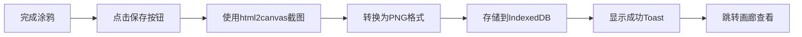

# IdeaCard 灵感卡片 - 产品需求文档

## 1. 产品概述

一款每日灵感卡片生成器，帮助用户每天获取激励和创意。核心价值在于通过随机组合的名言、挑战和涂鸦功能，为用户提供日常灵感和创意出口。目标用户为追求个人成长和创意思维的成年人群。

## 2. 核心功能

### 2.1 功能模块

1. **灵感卡片页**：展示每日灵感卡片，包含名言、挑战和涂鸦区域
2. **画廊页**：展示用户已保存的卡片集合
3. **涂鸦系统**：支持绘画、保存和加载的完整涂鸦功能

### 2.2 页面详情

#### 2.2.1 灵感卡片页

| 模块名称 | 功能描述 |
|---------|----------|
| 日期头像 | 圆形头像区域，显示当日日期首字母 |
| 名言展示区 | 深灰色衬线字体，带淡入上移动画 |
| 挑战展示区 | 橙色无衬线字体，带波浪下划线装饰 |
| 涂鸦区域 | 400x300px，带网格辅助线 |
| 绘画工具 | 8色色盘、3档笔触大小 |
| 操作按钮 | "换一张"和"保存到画廊"按钮 |

#### 2.2.2 画廊页

| 模块名称 | 功能描述 |
|---------|----------|
| 卡片网格墙 | 等比例缩略图展示 |
| 卡片信息 | 显示创建日期 |
| 大图预览 | 点击查看完整尺寸 |
| 排序功能 | 按日期倒序排列 |
| 数据管理 | 清空所有数据 |

## 3. 核心流程

### 3.1 每日卡片生成流程



### 3.2 保存卡片流程



## 4. 用户界面设计

### 4.1 设计风格

**视觉风格**：现代卡片式设计，柔和渐变背景营造温暖氛围

**配色方案**：
- 主色调：#667eea → #764ba2（渐变）
- 成功色：#2ED573
- 强调色：#FF6B35（橙色）
- 背景色：#f5f7fa → #c3cfe2（动画渐变）
- 文字色：#333（深灰）
- 白色：#FFFFFF

**字体方案**：
- 名言：serif字体，24px
- 挑战：sans-serif字体，16px
- 按钮：sans-serif，14px

**按钮样式**：
- 主按钮：圆角矩形，渐变背景，悬停缩放1.05，点击涟漪效果
- 次按钮：圆角矩形，固体背景，悬停变色

**卡片样式**：
- 尺寸：600px × 650px
- 圆角：16px
- 阴影：box-shadow: 0 20px 60px rgba(0,0,0,0.15)
- 背景：白色

### 4.2 涂鸦工具设计

**颜色色盘**：8种预设颜色
- #FF4757（红色）
- #2ED573（绿色）
- #1E90FF（蓝色）
- #FFA502（橙色）
- #A29BFE（紫色）
- #FD79A8（粉色）
- #00D2D3（青色）
- #F8A5C2（浅粉）

**笔触大小**：3档
- 小：5px
- 中：12px
- 大：20px

### 4.3 动画效果

- 名言淡入：opacity 0→1, translateY 20px→0, 0.6秒
- Toast提示：从底部滑入，2秒后淡出
- 背景渐变：16秒循环
- 按钮悬停：transform scale 1.05, 0.3秒过渡

### 4.4 响应式设计

**桌面端**：
- 卡片宽度：600px
- 涂鸦区域：400x300px

**移动端**（<768px）：
- 卡片宽度：90vw
- 涂鸦区域高度：200px

## 5. 数据持久化

### 5.1 localStorage存储

```typescript
interface DailyCombination {
  date: string;          // YYYY-MM-DD格式
  usedIndices: number[]; // 已使用的组合索引
}
```

### 5.2 IndexedDB存储

```typescript
interface SavedCard {
  id: string;            // UUID
  imageData: string;     // Base64 PNG
  createdAt: number;     // 时间戳
}
```

## 6. API接口设计

### 6.1 名言接口

- **端点**：GET /api/quotes
- **响应**：
```json
{
  "quote": "名言内容",
  "author": "作者名"
}
```

### 6.2 挑战接口

- **端点**：GET /api/challenges
- **响应**：
```json
{
  "challenge": "挑战内容"
}
```
