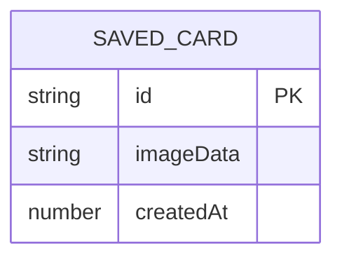

# IdeaCard 灵感卡片 - 技术架构文档

## 1. 架构设计

```
┌─────────────────────────────────────────────────────────┐
│                      前端层                              │
│  ┌──────────────────────────────────────────────────┐  │
│  │         React + TypeScript + Vite                 │  │
│  │  ┌─────────────┐  ┌─────────────┐                │  │
│  │  │   App.tsx   │  │  Gallery.tsx│                │  │
│  │  └─────────────┘  └─────────────┘                │  │
│  │  ┌─────────────┐  ┌─────────────┐                │  │
│  │  │  Card.tsx   │  │  storage.ts │                │  │
│  │  └─────────────┘  └─────────────┘                │  │
│  └──────────────────────────────────────────────────┘  │
└─────────────────────────────────────────────────────────┘
                          │
                          │ HTTP (代理 /api)
                          ▼
┌─────────────────────────────────────────────────────────┐
│                      后端层                              │
│  ┌──────────────────────────────────────────────────┐  │
│  │        Express + TypeScript                       │  │
│  │  ┌─────────────────────────────────────────────┐ │  │
│  │  │           /api/quotes                       │ │  │
│  │  │           /api/challenges                   │ │  │
│  │  └─────────────────────────────────────────────┘ │  │
│  └──────────────────────────────────────────────────┘  │
└─────────────────────────────────────────────────────────┘
```

## 2. 技术栈描述

### 2.1 前端技术

- **框架**：React 18
- **构建工具**：Vite
- **语言**：TypeScript（严格模式）
- **样式**：CSS3（原生CSS）
- **绘画**：HTML5 Canvas API
- **截图**：html2canvas
- **存储**：localStorage + IndexedDB

### 2.2 后端技术

- **运行时**：Node.js
- **框架**：Express
- **端口**：3001
- **数据**：内存预置数据

## 3. 路由定义

| 路由 | 用途 |
|------|------|
| / | 主页面（灵感卡片） |
| /gallery | 画廊页面 |
| /api/quotes | 获取随机名言 |
| /api/challenges | 获取随机挑战 |

## 4. API定义

### 4.1 GET /api/quotes

**请求参数**：无

**响应示例**：
```json
{
  "quote": "生活不是等待暴风雨过去，而是学会在雨中跳舞。",
  "author": "维维安·格林"
}
```

### 4.2 GET /api/challenges

**请求参数**：无

**响应示例**：
```json
{
  "challenge": "给一位朋友写一封手写信"
}
```

## 5. 数据模型

### 5.1 数据模型定义



### 5.2 IndexedDB Schema

**数据库名称**：ideacard-gallery

**对象存储**：cards

**索引**：
- id: 主键
- createdAt: 创建时间戳

## 6. 项目文件结构

```
├── package.json
├── index.html
├── vite.config.js
├── tsconfig.json
├── server/
│   └── index.ts          # Express服务器
└── src/
    ├── App.tsx            # 主应用组件
    ├── components/
    │   ├── Card.tsx      # 卡片组件
    │   └── Gallery.tsx   # 画廊组件
    └── utils/
        └── storage.ts    # IndexedDB操作封装
```

## 7. 依赖清单

### 7.1 生产依赖

- react
- react-dom
- express
- uuid
- html2canvas

### 7.2 开发依赖

- typescript
- @types/react
- @types/express
- @types/uuid
- vite
- @vitejs/plugin-react
- tsx

## 8. 启动脚本

**命令**：`npm run dev`

**行为**：
1. 使用 concurrently 同时启动：
   - 前端：Vite开发服务器（端口3000）
   - 后端：Express服务器（端口3001）
2. Vite配置代理将 /api 请求转发到后端

## 9. localStorage数据结构

```typescript
// 每日组合记录
localStorage.setItem('ideacard-daily', JSON.stringify({
  date: '2026-06-13',
  usedIndices: [0, 1, 2]
}));

// 索引计算方式
const index = (quoteIndex * 50 + challengeIndex) % 2500;
```

## 10. Canvas绘制规范

### 10.1 涂鸦区域

- 尺寸：400x300px（桌面）/ 宽度自适应，高度200px（移动）
- 背景：纯白色 #FFFFFF
- 网格线：#e0e0e0，20px间隔

### 10.2 笔触预览

- 圆形轮廓，颜色为当前选中色
- 实时跟随鼠标位置
- 仅在涂鸦区域内显示

### 10.3 保存为图片

- 使用html2canvas截取整个卡片DOM
- 导出格式：PNG
- 分辨率：2x（高清）
