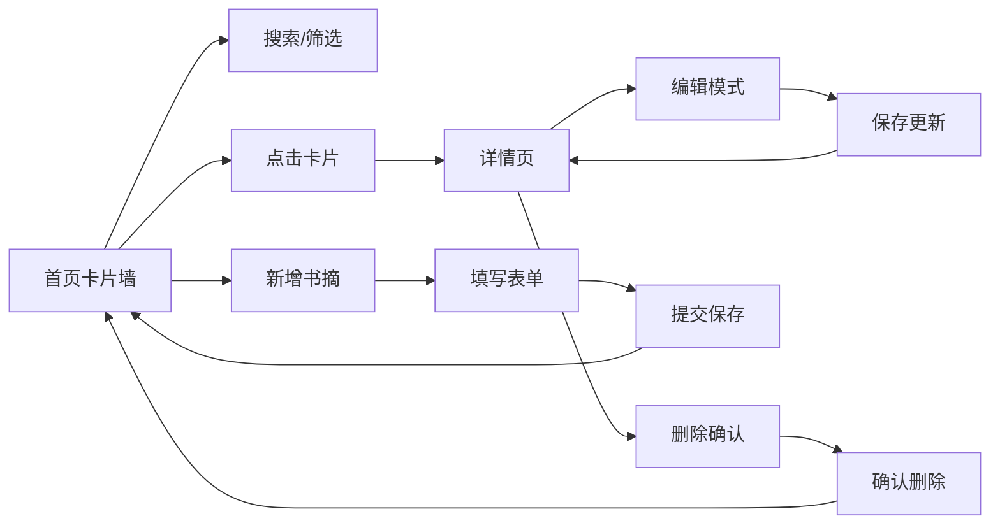

## 1. 产品概述

书摘管理与分享Web应用是一款轻量化的阅读笔记工具，帮助读者在阅读时快速摘录书籍中的精彩段落，添加个人批注，并按主题标签整理为虚拟读书卡片墙。

- 主要目的：为线上读书会和个人读者提供便捷的书摘记录、整理和分享工具
- 解决问题：阅读时缺乏轻量化工具记录关键段落和阅读心得
- 目标用户：读书会成员、深度阅读爱好者、知识整理者
- 产品价值：打造沉浸式的阅读笔记体验，通过卡片墙形式直观展示和回顾阅读收获

## 2. 核心功能

### 2.1 用户角色

| 角色 | 注册方式 | 核心权限 |
|------|----------|----------|
| 普通用户 | 无需注册（本地存储） | 书摘增删改查、标签管理、搜索筛选 |

### 2.2 功能模块

1. **书摘卡片墙首页**：瀑布流展示书摘卡片、搜索输入框、标签筛选器、空状态提示
2. **新增书摘页**：书摘录入表单、星级评分、标签选择/创建
3. **书摘详情页**：完整书摘展示、编辑模式切换、删除确认对话框

### 2.3 页面详情

| 页面名称 | 模块名称 | 功能描述 |
|----------|----------|----------|
| 书摘卡片墙首页 | 顶部导航栏 | 应用Logo、搜索输入框、标签筛选下拉、新增按钮 |
| 书摘卡片墙首页 | 瀑布流卡片墙 | CSS columns实现瀑布流、卡片悬浮动效、淡入动画 |
| 书摘卡片墙首页 | 空状态 | 无匹配结果时显示插图和友善文字 |
| 新增书摘页 | 书摘表单 | 书名、作者、摘录段落、个人批注、星级评分、标签选择 |
| 书摘详情页 | 详情展示 | 完整摘录、批注、评分、标签、添加时间 |
| 书摘详情页 | 编辑功能 | 切换编辑模式、表单预填、保存更新 |
| 书摘详情页 | 删除功能 | 删除按钮、确认对话框、淡入背景遮罩 |

## 3. 核心流程

用户打开应用 → 浏览书摘卡片墙 → 通过搜索/筛选快速定位书摘 → 点击卡片查看详情 → 可编辑或删除书摘 → 也可新增书摘记录阅读心得

## 4. 用户界面设计

### 4.1 设计风格

- **主色调**：浅米色背景（#FFF8F0），暖色调温馨舒适
- **卡片样式**：白色卡片，16px圆角，浅灰阴影，悬浮时上移8px带多层阴影和淡蓝色边框光晕
- **标签样式**：柔和彩色圆角标签（浅蓝#E3F2FD、浅绿#E8F5E9、浅粉#FCE4EC）
- **文字主色**：深灰色（#333333）
- **导航栏**：半透明毛玻璃效果（backdrop-filter: blur(10px)）
- **按钮风格**：圆角按钮，点击有按下缩放效果（scale(0.95)）
- **星级评分**：金色高亮星星，点击交互
- **字体**：选用优雅的衬线体搭配圆润的无衬线体，营造书香氛围

### 4.2 页面设计概览

| 页面名称 | 模块名称 | UI元素 |
|----------|----------|--------|
| 书摘卡片墙首页 | 顶部导航栏 | 毛玻璃背景、Logo图标、搜索框、标签下拉、新增按钮 |
| 书摘卡片墙首页 | 瀑布流卡片墙 | 响应式columns布局、卡片悬浮动效、滑入动画 |
| 新增书摘页 | 表单区域 | 输入框、文本域、星级评分、标签选择器、提交按钮 |
| 书摘详情页 | 内容展示 | 完整书摘、批注、标签、评分、时间戳、操作按钮 |
| 通用 | 对话框 | 淡入背景遮罩、居中卡片、确认/取消按钮 |
| 通用 | 提示条 | 顶部滑入、成功绿色对勾/失败红色警告、2秒自动消失 |

### 4.3 响应式

- 桌面端优先，移动端自适应
- 小屏（<768px）：单列瀑布流
- 中屏（768-1024px）：两列瀑布流
- 大屏（>1024px）：三列瀑布流
- 触控设备优化按钮尺寸和交互区域

### 4.4 动效设计

- 卡片添加：从底部向上滑入（0.3s ease-out）
- 卡片删除：缩小淡出（0.2s ease-in）
- 卡片悬浮：上移8px + 多层阴影 + 边框淡蓝色光晕
- 按钮点击：scale(0.95) 微缩效果
- 筛选结果：淡入动画出现
- 对话框：背景淡入遮罩 + 内容缩放弹入
- 提示条：顶部滑入/滑出
