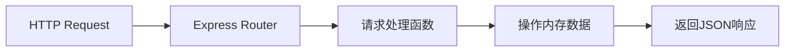
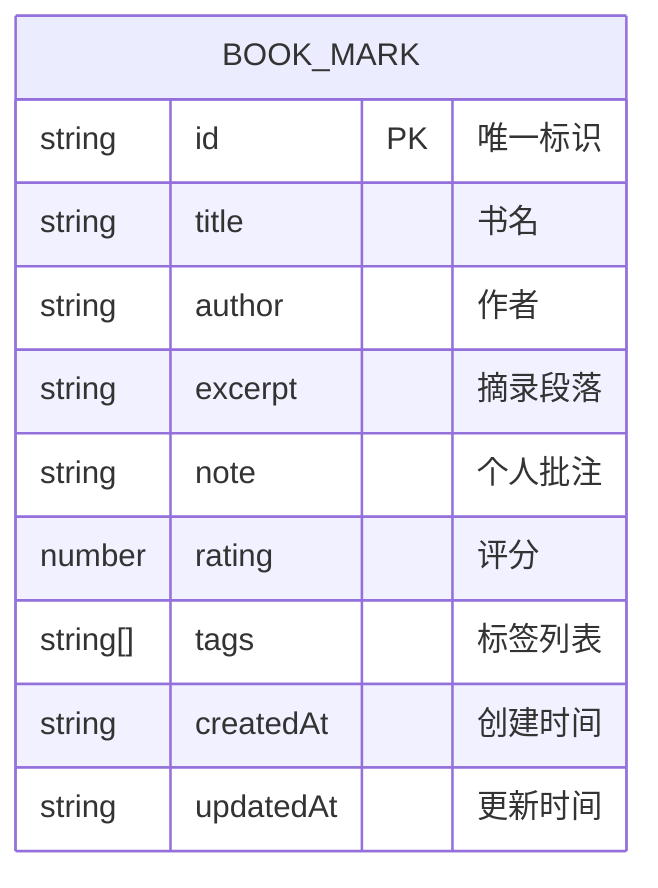

## 1. 架构设计

```mermaid
flowchart TD
    subgraph Frontend["前端 (React + Vite)"]
        A["src/main.tsx"] --> B["src/App.tsx"]
        B --> C["页面组件"]
        C --> C1["HomePage 首页卡片墙"]
        C --> C2["AddBookmarkPage 新增书摘"]
        C --> C3["DetailPage 书摘详情"]
        C --> D["公共组件"]
        D --> D1["BookCard 书摘卡片"]
        D --> D2["StarRating 星级评分"]
        D --> D3["TagSelector 标签选择器"]
        D --> D4["ConfirmDialog 确认对话框"]
        D --> D5["Toast 提示条"]
        D --> D6["Navbar 导航栏"]
        C --> E["自定义Hooks"]
        E --> E1["useBookmarks 书摘数据管理"]
        E --> E2["useDebounce 防抖"]
        C --> F["API 接口层"]
        C --> G["类型定义"]
    end
    
    subgraph Backend["后端 (Express)"]
        H["server/index.ts"] --> I["RESTful API"]
        I --> I1["GET /api/bookmarks 获取书摘列表"]
        I --> I2["POST /api/bookmarks 新增书摘"]
        I --> I3["GET /api/bookmarks/:id 获取单条书摘"]
        I --> I4["PUT /api/bookmarks/:id 更新书摘"]
        I --> I5["DELETE /api/bookmarks/:id 删除书摘"]
        I --> J["内存数据存储"]
        J --> J1["bookmarks[] 书摘数组"]
        J --> J2["uuid 生成唯一ID"]
    end
    
    F -- "RESTful API / JSON --> I
```

## 2. 技术描述

- **前端**：React 18 + TypeScript + Vite
- **路由**：react-router-dom v6
- **样式**：原生CSS（CSS Modules）
- **状态管理**：React Hooks + 自定义Hook
- **后端**：Express 4 + TypeScript
- **数据存储**：内存数组（uuid生成唯一ID）
- **前后端通信**：RESTful API + JSON
- **开发工具**：Vite 开发服务器 + 代理到后端

## 3. 路由定义

| 路由 | 页面 | 用途 |
|------|------|------|
| / | HomePage | 书摘卡片墙首页 |
| /add | AddBookmarkPage | 新增书摘页面 |
| /bookmark/:id | DetailPage | 书摘详情页面 |

## 4. API 定义

### 4.1 类型定义

```typescript
interface BookMark {
  id: string;
  title: string;
  author: string;
  excerpt: string;
  note?: string;
  rating: number;
  tags: string[];
  createdAt: string;
  updatedAt: string;
}
```

### 4.2 接口列表

| 方法 | 路径 | 描述 | 请求体 | 响应 |
|------|------|------|--------|------|
| GET | /api/bookmarks | 获取书摘列表 | - | BookMark[] |
| POST | /api/bookmarks | 新增书摘 | Omit<BookMark, 'id' \| 'createdAt' \| 'updatedAt'> | BookMark |
| GET | /api/bookmarks/:id | 获取单条书摘 | - | BookMark |
| PUT | /api/bookmarks/:id | 更新书摘 | Partial<BookMark> | BookMark |
| DELETE | /api/bookmarks/:id | 删除书摘 | - | { success: boolean } |

## 5. 服务端架构



- **职责说明：
- Express服务端使用内存数组暂存数据，uuid生成唯一ID
- 监听端口3001
- 数据流向：接收前端HTTP请求 → 操作内存数据 → 返回JSON响应

## 6. 数据模型

### 6.1 数据模型定义



### 6.2 数据约束

- 摘录段落最多500字
- 评分1-5星
- 最多3个标签
- id由服务端uuid生成
- createdAt/updatedAt自动维护
