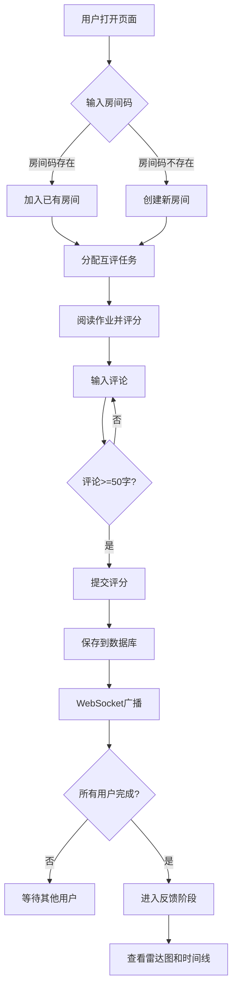

# PeerReview 小组互评与反馈看板 - 产品需求文档

## 1. 产品概述

PeerReview是一个在线教育平台的小组互评与反馈看板应用，旨在解决传统问卷方式评分偏差大、无法实时汇总和可视化反馈结果的问题。

- **核心价值**：通过匿名互评机制减少评分偏差，实时聚合数据并生成个人能力雷达图，帮助教师和学生直观了解学习效果
- **目标用户**：在线教育平台的教师和学生，适用于小组作业互评、同伴评估等场景

## 2. 核心功能

### 2.1 用户角色

| 角色 | 进入方式 | 核心权限 |
|------|----------|----------|
| 教师 | 创建房间 | 创建房间、查看所有学生互评进度 |
| 学生 | 输入房间码加入 | 进行匿名互评、查看个人反馈看板 |

### 2.2 功能模块

1. **登录/创建房间页面**：昵称输入、6位房间码输入/生成、加入按钮
2. **互评面板页面**：作业选择列表、评分滑块、评论输入框、提交功能
3. **反馈看板页面**：个人能力雷达图、评语时间线、实时通知

### 2.3 页面详情

| 页面名称 | 模块名称 | 功能描述 |
|----------|----------|----------|
| 登录页面 | 房间入口 | 输入昵称和房间码，创建新房间或加入已有房间，按钮渐变色#667eea→#764ba2，悬停毛玻璃效果 |
| 互评面板 | 作业选择栏 | 左侧30%宽度显示待评作业列表，窄屏变为顶部水平标签卡 |
| 互评面板 | 详细评分区 | 右侧70%宽度显示作业详情、评分滑块(1-5分，颜色渐变)、评论输入框(50字以上验证) |
| 反馈看板 | 能力雷达图 | Canvas绘制的五边形雷达图，五个维度：沟通、合作、责任、创新、知识，支持tooltip显示原始评分 |
| 反馈看板 | 评语时间线 | 按时间倒序显示匿名评论卡片，带情感色彩竖条和贡献标签 |

## 3. 核心流程

### 3.1 用户流程描述

1. **房间创建/加入流程**：用户打开页面→输入昵称→输入/生成房间码→点击加入按钮→系统验证房间码→创建新房间或加入已有房间→跳转至互评面板

2. **互评流程**：系统随机分配3份匿名作业→用户阅读作业标题和摘要→拖动评分滑块(1-5分)→输入50字以上评论→点击提交→数据保存到数据库→WebSocket广播通知→更新反馈看板

3. **反馈查看流程**：所有用户完成互评→系统自动进入反馈阶段→用户查看个人能力雷达图→悬停查看维度原始评分→浏览评语时间线

### 3.2 流程图

## 4. 用户界面设计

### 4.1 设计风格

- **主题切换**：深色主题(默认)与浅色主题
  - 深色主题：主背景#1a1a2e，卡片背景#16213e，强调色#0f3460和#e94560，亮色文字#eeeeee
  - 浅色主题：主背景#fafafa，卡片背景#ffffff，强调色#667eea和#764ba2，深色文字#333333
- **按钮样式**：圆角8px、1.5倍行高、渐变背景#667eea→#764ba2、悬停毛玻璃效果
- **字体**：标题使用Inter无衬线字体，正文使用系统默认字体
- **图标**：统一使用emoji图标保持简洁
- **布局**：响应式设计，宽屏左侧30%作业列表+右侧70%评分区，窄屏垂直滚动布局

### 4.2 页面设计概览

| 页面名称 | 模块名称 | UI元素 |
|----------|----------|--------|
| 登录页面 | 房间入口 | 居中卡片布局、渐变按钮、输入框带图标、主题切换按钮右上角 |
| 互评面板 | 作业选择栏 | 横向卡片布局、选中时上浮阴影扩大效果(transform: translateY(-4px))、右边界1px分隔线 |
| 互评面板 | 评分滑块 | 1-5分步进、实时分数显示、颜色渐变(红#e74c3c→黄#f1c40f→绿#2ecc71)、数字缩放脉冲动画 |
| 互评面板 | 评论输入框 | 多行文本框、字数统计、低于50字红色警告、达到后绿色对勾 |
| 反馈看板 | 雷达图 | Canvas绘制、五边形顶点、同心圆刻度1-5、半透明蓝色填充#3498db80、tooltip悬停显示 |
| 反馈看板 | 评语卡片 | 时间戳格式化(如"2分钟前")、情感色彩竖条(正面#2ecc71、中性#f39c12、负面#e74c3c)、贡献标签 |
| 全局 | 通知气泡 | 右上角弹出、从右侧滑入、停留3秒自动消失 |

### 4.3 响应式设计

- **桌面优先**：宽屏(≥768px)采用左右分栏布局，左侧30%作业列表，右侧70%评分区
- **移动适配**：窄屏(<768px)自动切换垂直滚动布局，作业选择栏变为顶部水平标签卡，点击展开详细评分区
- **触摸优化**：滑块和按钮触摸区域足够大，支持滑动操作

### 4.4 动画效果

- **页面切换**：渐隐渐入0.3秒过渡
- **作业卡片选中**：transform: translateY(-4px)，box-shadow扩散增加6px
- **评分滑块**：数值变化时数字缩放脉冲动画
- **主题切换**：平滑过渡动画
- **通知气泡**：从右侧滑入动画

## 5. 性能要求

- 雷达图渲染：每帧16ms内完成(60FPS)
- 评分提交到WebSocket通知到页面更新：端到端延迟不超过200ms
- 数据库查询优化：使用索引加速房间和用户查询