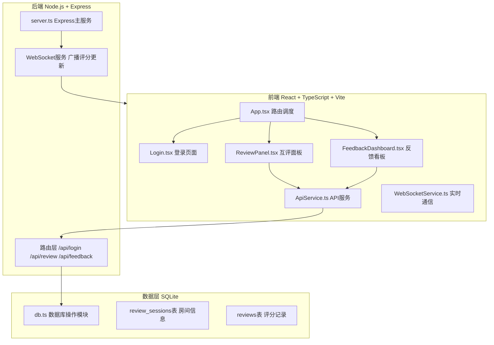
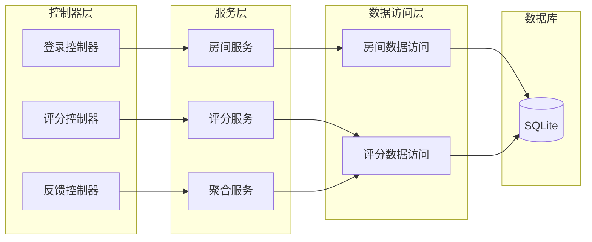
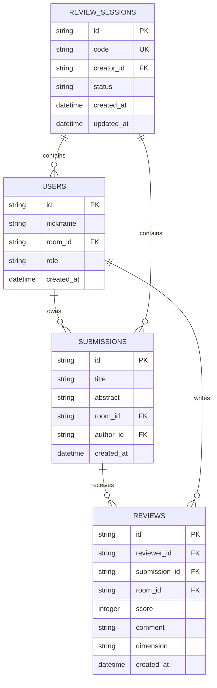

# PeerReview 小组互评与反馈看板 - 技术架构文档

## 1. 架构设计



## 2. 技术描述

- **前端**：React@18 + TypeScript + Vite + Tailwind CSS
- **初始化工具**：vite-init (react-express-ts模板)
- **后端**：Express@4 + TypeScript
- **数据库**：SQLite (better-sqlite3)
- **实时通信**：WebSocket (ws库)
- **状态管理**：Zustand
- **路由**：react-router-dom

## 3. 路由定义

| 路由 | 用途 |
|------|------|
| /login | 登录页面，输入昵称和房间码 |
| /review | 互评面板，显示待评作业列表和评分区域 |
| /feedback | 反馈看板，显示个人能力雷达图和评语时间线 |

## 4. API定义

### 4.1 TypeScript类型定义

```typescript
// 用户信息
interface User {
  id: string;
  nickname: string;
  roomId: string;
  role: 'teacher' | 'student';
}

// 房间信息
interface Room {
  id: string;
  code: string;
  createdAt: Date;
  creatorId: string;
  status: 'waiting' | 'reviewing' | 'completed';
}

// 作业信息
interface Submission {
  id: string;
  title: string;
  abstract: string;
  roomId: string;
  authorId: string;
}

// 评分记录
interface Review {
  id: string;
  reviewerId: string;
  submissionId: string;
  roomId: string;
  score: number;
  comment: string;
  dimension: 'communication' | 'cooperation' | 'responsibility' | 'innovation' | 'knowledge';
  createdAt: Date;
}

// API请求/响应类型
interface LoginRequest {
  nickname: string;
  roomCode: string;
}

interface LoginResponse {
  user: User;
  room: Room;
  submissions: Submission[];
}

interface ReviewRequest {
  reviewerId: string;
  submissionId: string;
  roomId: string;
  score: number;
  comment: string;
}

interface FeedbackResponse {
  radarData: {
    dimension: string;
    score: number;
    reviews: { score: number; comment: string }[];
  }[];
  comments: {
    id: string;
    content: string;
    createdAt: Date;
    sentiment: 'positive' | 'neutral' | 'negative';
    tags: string[];
  }[];
}
```

### 4.2 API端点

| 端点 | 方法 | 用途 | 请求体 | 响应体 |
|------|------|------|--------|--------|
| /api/login | POST | 创建/加入房间 | LoginRequest | LoginResponse |
| /api/review | POST | 提交评分 | ReviewRequest | { success: boolean } |
| /api/feedback | GET | 获取聚合数据 | userId, roomId | FeedbackResponse |
| /api/submissions | GET | 获取待评作业 | userId, roomId | Submission[] |

## 5. 服务器架构图



## 6. 数据模型

### 6.1 数据模型定义



### 6.2 数据定义语言

```sql
-- 房间表
CREATE TABLE review_sessions (
    id TEXT PRIMARY KEY,
    code TEXT UNIQUE NOT NULL,
    creator_id TEXT NOT NULL,
    status TEXT DEFAULT 'waiting' CHECK(status IN ('waiting', 'reviewing', 'completed')),
    created_at DATETIME DEFAULT CURRENT_TIMESTAMP,
    updated_at DATETIME DEFAULT CURRENT_TIMESTAMP
);

-- 用户表
CREATE TABLE users (
    id TEXT PRIMARY KEY,
    nickname TEXT NOT NULL,
    room_id TEXT NOT NULL,
    role TEXT DEFAULT 'student' CHECK(role IN ('teacher', 'student')),
    created_at DATETIME DEFAULT CURRENT_TIMESTAMP,
    FOREIGN KEY (room_id) REFERENCES review_sessions(id)
);

-- 作业表
CREATE TABLE submissions (
    id TEXT PRIMARY KEY,
    title TEXT NOT NULL,
    abstract TEXT NOT NULL,
    room_id TEXT NOT NULL,
    author_id TEXT NOT NULL,
    created_at DATETIME DEFAULT CURRENT_TIMESTAMP,
    FOREIGN KEY (room_id) REFERENCES review_sessions(id),
    FOREIGN KEY (author_id) REFERENCES users(id)
);

-- 评分表
CREATE TABLE reviews (
    id TEXT PRIMARY KEY,
    reviewer_id TEXT NOT NULL,
    submission_id TEXT NOT NULL,
    room_id TEXT NOT NULL,
    score INTEGER NOT NULL CHECK(score >= 1 AND score <= 5),
    comment TEXT NOT NULL,
    dimension TEXT NOT NULL CHECK(dimension IN ('communication', 'cooperation', 'responsibility', 'innovation', 'knowledge')),
    created_at DATETIME DEFAULT CURRENT_TIMESTAMP,
    FOREIGN KEY (reviewer_id) REFERENCES users(id),
    FOREIGN KEY (submission_id) REFERENCES submissions(id),
    FOREIGN KEY (room_id) REFERENCES review_sessions(id)
);

-- 索引
CREATE INDEX idx_reviews_room ON reviews(room_id);
CREATE INDEX idx_reviews_reviewer ON reviews(reviewer_id);
CREATE INDEX idx_reviews_submission ON reviews(submission_id);
CREATE INDEX idx_sessions_code ON review_sessions(code);
CREATE INDEX idx_users_room ON users(room_id);

-- 默认作业库
INSERT INTO submissions (id, title, abstract, room_id, author_id) VALUES 
    ('default-1', '数据分析项目报告', '本项目使用Python对电商销售数据进行深度分析，包括数据清洗、特征工程、可视化展示等环节，最终得出用户购买行为模式与销售趋势预测。', 'default', 'system'),
    ('default-2', '机器学习算法实现', '实现了KNN、决策树、随机森林三种分类算法，并在鸢尾花数据集上进行对比实验，分析了各算法的准确率、召回率和F1分数。', 'default', 'system'),
    ('default-3', 'Web应用开发实践', '使用React和Node.js开发了一个在线协作白板应用，支持多人实时编辑、历史版本回溯、导出PDF等功能。', 'default', 'system'),
    ('default-4', '数据库系统设计', '设计并实现了一个图书管理系统的数据库，包含用户管理、图书借阅、逾期提醒等模块，使用MySQL存储过程优化查询性能。', 'default', 'system'),
    ('default-5', '网络安全实验报告', '完成了SQL注入、XSS攻击、CSRF防护等安全实验，分析了常见Web漏洞的成因和防护策略，并编写了安全检测脚本。', 'default', 'system');
```

## 7. 文件结构

```
project/
├── package.json                 # 项目依赖和脚本配置
├── vite.config.ts              # Vite构建配置
├── tsconfig.json               # TypeScript配置
├── index.html                  # 入口HTML
├── client/                     # 前端代码
│   ├── src/
│   │   ├── App.tsx            # 主应用组件，路由调度
│   │   ├── main.tsx           # 入口文件
│   │   ├── index.css          # 全局样式
│   │   ├── Login.tsx          # 登录页面组件
│   │   ├── ReviewPanel.tsx    # 互评面板组件
│   │   ├── FeedbackDashboard.tsx # 反馈看板组件
│   │   ├── components/        # 可复用组件
│   │   │   ├── RadarChart.tsx # 雷达图组件
│   │   │   ├── CommentCard.tsx # 评论卡片组件
│   │   │   ├── Notification.tsx # 通知气泡组件
│   │   │   └── ThemeToggle.tsx # 主题切换组件
│   │   ├── hooks/             # 自定义Hooks
│   │   │   ├── useWebSocket.ts # WebSocket连接管理
│   │   │   └── useTheme.ts    # 主题切换逻辑
│   │   ├── services/          # 服务层
│   │   │   ├── ApiService.ts  # API请求封装
│   │   │   └── WebSocketService.ts # WebSocket服务
│   │   ├── store/             # 状态管理
│   │   │   └── useStore.ts    # Zustand状态管理
│   │   ├── types/             # 类型定义
│   │   │   └── index.ts       # 全局类型
│   │   └── utils/             # 工具函数
│   │       ├── sentiment.ts   # 情感分析
│   │       ├── dimension.ts   # 维度匹配
│   │       └── format.ts      # 格式化工具
│   └── public/                 # 静态资源
└── server/                    # 后端代码
    ├── server.ts              # Express主服务
    ├── db.ts                  # SQLite数据库操作
    ├── routes/                # 路由处理
    │   ├── login.ts           # 登录路由
    │   ├── review.ts          # 评分路由
    │   └── feedback.ts        # 反馈路由
    └── utils/                 # 工具函数
        └── roomCode.ts        # 房间码生成
```

## 8. 数据流向

### 8.1 登录流程数据流

```
用户输入 → Login.tsx → ApiService.login() → POST /api/login → server.ts → db.ts → 返回用户信息和房间数据 → 更新Zustand状态 → 路由跳转
```

### 8.2 互评流程数据流

```
用户评分 → ReviewPanel.tsx → ApiService.sendReview() → POST /api/review → server.ts → db.ts → WebSocket广播 → 所有客户端FeedbackDashboard更新
```

### 8.3 反馈查看数据流

```
页面加载 → FeedbackDashboard.tsx → ApiService.getAggregated() → GET /api/feedback → server.ts → db.ts聚合查询 → 返回雷达图数据和评论列表 → Canvas绘制雷达图
```