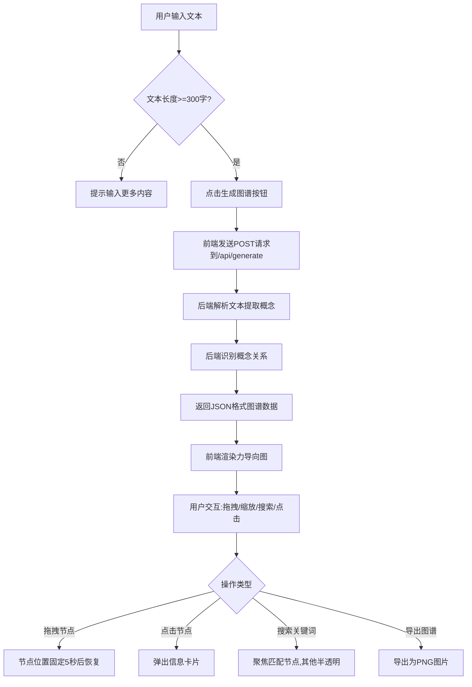

## 1. 产品概述

知识图谱探索器是一款帮助用户从长文本中快速梳理概念关联和层级关系的可视化工具。通过简单的NLP模拟方法自动提取核心概念，并以交互式力导向图的形式展示知识结构，解决阅读长文或学习新知识时难以快速理解概念间关系的痛点。

- 目标用户：学生、研究人员、知识工作者
- 核心价值：将复杂文本转化为直观的知识图谱，提升学习效率和知识理解深度

## 2. 核心功能

### 2.1 功能模块

1. **文本输入页面**：文本输入区、生成按钮、清除按钮
2. **图谱展示页面**：力导向图渲染、节点交互、搜索功能、导出功能

### 2.2 页面详情

| 页面名称 | 模块名称 | 功能描述 |
|---------|---------|---------|
| 主页面 | 文本输入区 | 左侧40%宽度，支持粘贴或输入不少于300字的文本，带字数统计 |
| 主页面 | 生成按钮 | 点击后将文本发送到后端API，触发图谱生成 |
| 主页面 | 清除按钮 | 清空文本输入区和当前图谱 |
| 主页面 | 图谱展示区 | 右侧60%宽度，Canvas渲染力导向图，支持拖拽、缩放、点击交互 |
| 主页面 | 搜索框 | 图谱上方搜索框，支持关键词搜索和自动补全 |
| 主页面 | 导航栏 | 顶部导航栏，显示应用名称和导出按钮 |
| 主页面 | 信息卡片 | 点击节点弹出浮动卡片，显示概念详情、关联概念和频率统计 |

## 3. 核心流程

## 4. 用户界面设计

### 4.1 设计风格

- 主色调：深蓝渐变（#2c3e50到#3498db）用于导航栏
- 次要色：浅灰（#f5f5f5）用于输入区背景，纯白用于图谱区
- 节点颜色：人物#FF6B6B、地点#4ECDC4、事件#45B7D1、概念#96CEB4
- 字体：系统默认字体，正文16px，节点文字12-20px自适应
- 按钮样式：圆角8px，悬停时颜色加深
- 布局风格：左右两栏布局，响应式堆叠

### 4.2 页面设计概览

| 页面名称 | 模块名称 | UI元素 |
|---------|---------|--------|
| 主页面 | 导航栏 | 高度60px，深蓝渐变背景，左侧应用名称，右侧导出按钮 |
| 主页面 | 文本输入区 | 40%宽度，浅灰背景，textarea最小高度300px，圆角8px边框，聚焦时蓝色边框 |
| 主页面 | 图谱展示区 | 60%宽度，白色背景，Canvas全屏渲染 |
| 主页面 | 节点 | 圆形节点，直径40-80px，白字显示概念名，悬停放大1.2倍+光圈动画 |
| 主页面 | 边 | 带箭头有向边，显示关系标签，悬停加粗2px |
| 主页面 | 信息卡片 | 白色背景，圆角12px，2px阴影，显示概念详情、关联列表、频率柱状图 |
| 主页面 | 搜索框 | 图谱上方，支持自动补全，搜索结果平滑动画过渡0.5秒 |

### 4.3 响应式设计

- 桌面优先设计，屏幕宽度小于768px时自动切换为上下堆叠布局
- 图谱支持鼠标拖拽平移和滚轮缩放
- 触摸设备支持手势操作

### 4.4 性能要求

- 图谱包含50个节点和100条边时，拖拽和缩放帧率不低于45fps
- 节点拖动后位置固定5秒，松开后1秒动画恢复力导向布局
- 搜索和节点交互使用平滑动画过渡