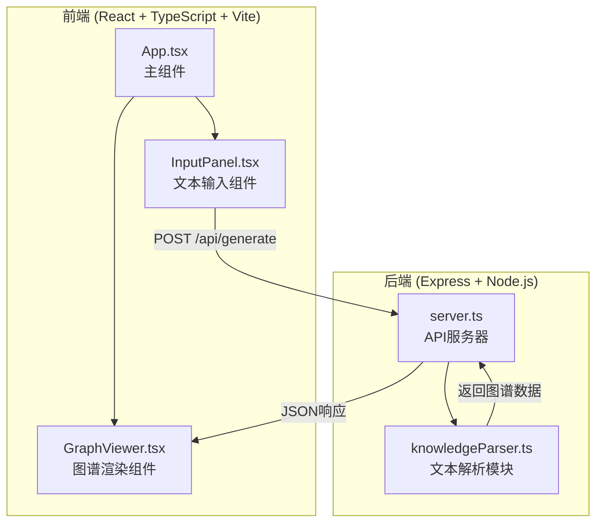
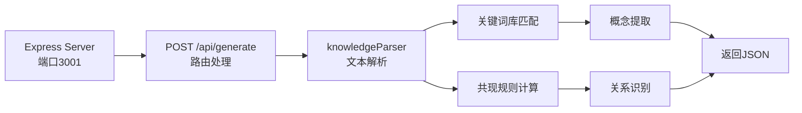
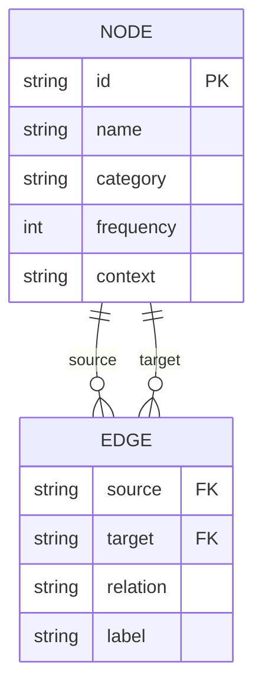

## 1. 架构设计



## 2. 技术说明

- **前端框架**: React@18 + TypeScript + Vite
- **初始化工具**: vite-init (react-express-ts模板)
- **后端框架**: Express@4
- **数据库**: 无需数据库，使用模拟数据
- **状态管理**: React useState/useReducer
- **图谱渲染**: Canvas 2D API实现力导向图
- **构建工具**: Vite

## 3. 路由定义

| 路由 | 用途 |
|------|------|
| / | 主页面，包含文本输入区和图谱展示区 |

## 4. API定义

### 4.1 生成图谱接口

**POST /api/generate**

请求体:
```typescript
interface GenerateRequest {
  text: string;
}
```

响应体:
```typescript
interface GenerateResponse {
  nodes: Node[];
  edges: Edge[];
}

interface Node {
  id: string;
  name: string;
  category: 'person' | 'location' | 'event' | 'concept';
  frequency: number;
  context: string;
}

interface Edge {
  source: string;
  target: string;
  relation: 'contains' | 'belongs_to' | 'causes' | 'related';
  label: string;
}
```

## 5. 服务器架构图



## 6. 数据模型

### 6.1 数据模型定义



### 6.2 关键词库定义

预定义关键词库用于概念提取:

| 类别 | 关键词示例 |
|------|-----------|
| 人物 | 张三、李四、王五、教授、博士、科学家、研究者、作者、专家 |
| 地点 | 北京、上海、中国、美国、实验室、研究所、大学、城市、国家 |
| 事件 | 会议、实验、研究、发现、发明、发布、成立、发展、突破 |
| 概念 | 人工智能、机器学习、深度学习、神经网络、算法、数据、模型 |

### 6.3 关系识别规则

| 关系类型 | 触发词 | 示例 |
|---------|-------|------|
| contains | 包含、包括、由...组成 | "人工智能包含机器学习" |
| belongs_to | 属于、是...的一部分 | "机器学习属于人工智能" |
| causes | 导致、引起、产生、使得 | "研究导致了新发现" |
| related | 相关、关联、与...有关 | "算法与数据相关" |

## 7. 文件结构

```
project/
├── package.json
├── index.html
├── vite.config.js
├── tsconfig.json
├── src/
│   ├── client/
│   │   ├── App.tsx
│   │   ├── InputPanel.tsx
│   │   └── GraphViewer.tsx
│   └── server/
│       ├── server.ts
│       └── knowledgeParser.ts
```