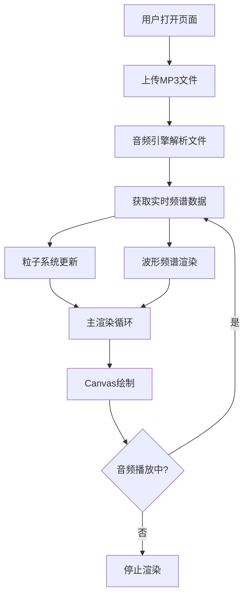

## 1. 产品概述

基于Canvas的音频可视化应用，用户上传MP3文件后，在浏览器中实时生成动态的粒子星系与波形频谱混合视觉效果。使用TypeScript和原生Canvas 2D实现，所有逻辑在客户端运行，无需后端。

- 目标用户：音乐爱好者、视觉艺术创作者
- 核心价值：将音频转化为沉浸式视觉体验，提供多种视觉主题选择

## 2. 核心功能

### 2.1 功能模块

1. **主页面**：全屏Canvas可视化画布、音频上传控件、播放控制面板、主题切换

### 2.2 页面详情

| 页面名称 | 模块名称 | 功能描述 |
|---------|---------|---------|
| 主页面 | 音频上传区 | 虚线边框圆角矩形，支持拖拽上传，拖拽时背景变蓝 |
| 主页面 | Canvas可视化 | 粒子星系、中心波形频谱、粒子连线、边缘光晕 |
| 主页面 | 控制面板 | 播放/暂停、停止、主题切换按钮，音量调节滑块 |
| 主页面 | 信息显示 | 歌曲名称、播放时间、总时长、进度条、唱片封面占位符 |

## 3. 核心流程

## 4. 用户界面设计

### 4.1 设计风格

- **主色调**：深色背景 #0a0a1a，配合四种主题色系
- **按钮样式**：胶囊形状，半透明暗色背景 rgba(0,0,0,0.5)，悬停变为 #333
- **字体**：系统字体栈，确保跨平台一致性
- **布局风格**：全屏Canvas，浮动控制面板（毛玻璃效果）
- **图标风格**：简洁线性图标

### 4.2 四种视觉主题

| 主题名称 | 粒子颜色范围 | 背景渐变 | 波形线条颜色 |
|---------|------------|---------|------------|
| 极光梦境 | 青色→紫色→粉色 | 深蓝→紫→青 | 青色渐变 |
| 霓虹都市 | 粉色→橙色→黄色 | 深紫→黑→粉紫 | 粉色霓虹 |
| 熔岩地狱 | 红色→橙色→黄色 | 黑→深红→橙红 | 火焰橙红 |
| 深海幽蓝 | 深蓝→青色→绿色 | 深蓝→黑→青蓝 | 海洋青蓝 |

### 4.3 页面设计概览

| 页面名称 | 模块名称 | UI元素 |
|---------|---------|--------|
| 主页面 | 上传区域 | 虚线边框、圆角矩形、背景#f5f5f5、拖拽时变#4A90D9 |
| 主页面 | Canvas画布 | 全屏、深色背景#0a0a1a |
| 主页面 | 控制面板 | 毛玻璃效果（背景模糊12px）、z-index:10、底部居中 |
| 主页面 | 信息面板 | 左上角、歌曲信息、时间进度条（4px高圆角条） |
| 主页面 | 控制按钮 | 胶囊形状、点击缩放0.95倍反馈、悬停变#333 |

### 4.4 响应式设计

- 桌面端：控制按钮水平排列
- 移动端：控制按钮竖向排列，间距增大
- Canvas始终全屏适配

### 4.5 动画效果

- 粒子椭圆轨道运动，低频能量调制轨道半径
- 波形频谱64扇形区域，0.5秒波浪偏移动画
- 粒子连线动态蛛网结构
- 边缘高斯模糊光晕
- 按钮点击0.1秒缩放反馈

## 5. 性能要求

- 渲染帧率：稳定55fps以上
- 粒子数量：支持800个粒子不掉帧
- 内存占用：不超过200MB
- 启动方式：npm install && npm run dev