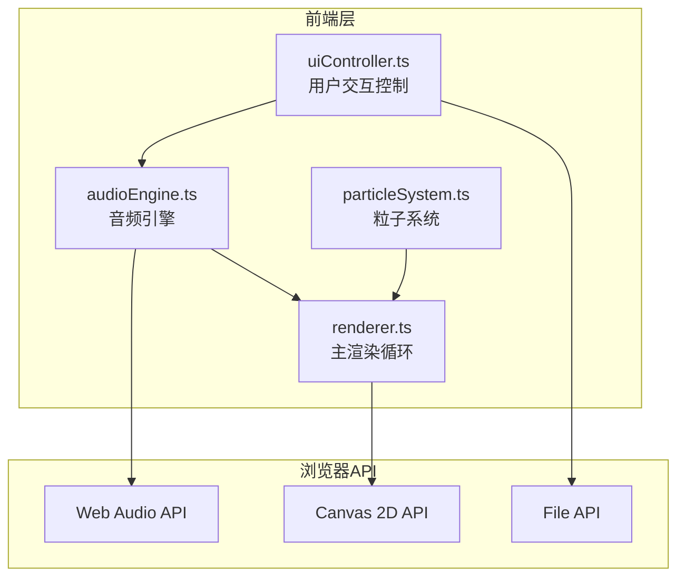
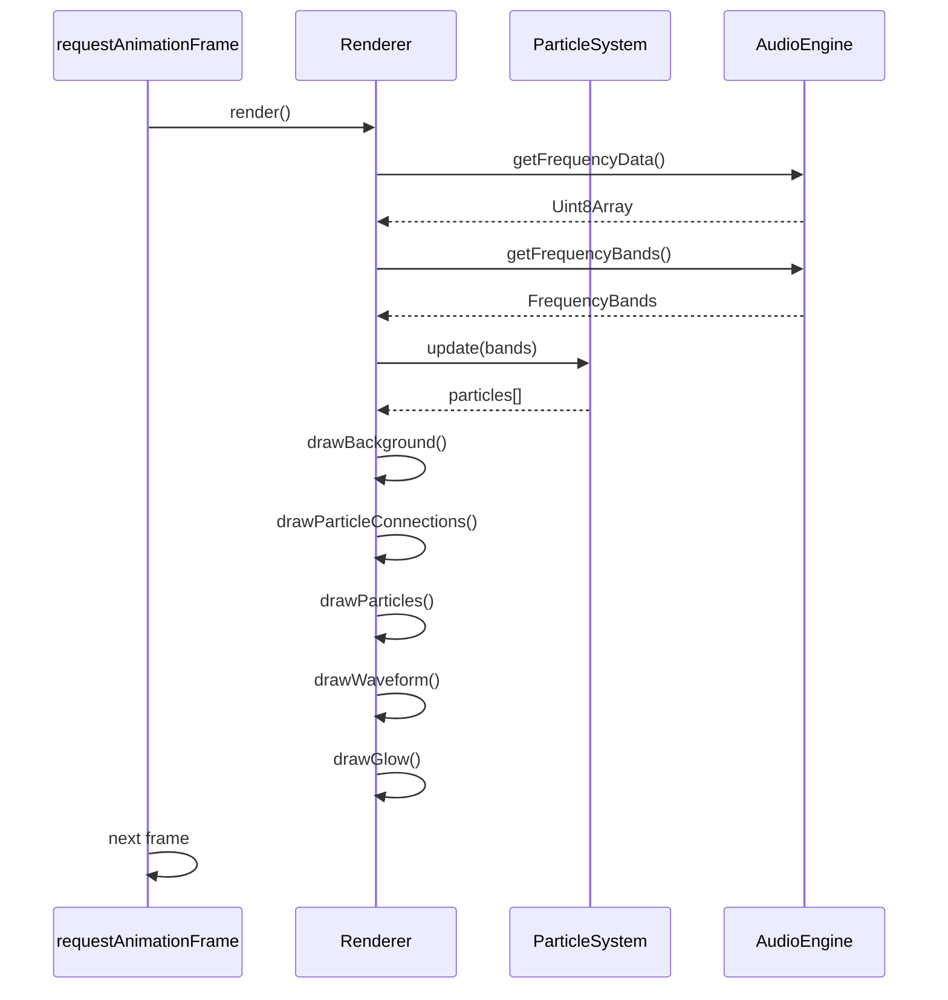

## 1. 架构设计



## 2. 技术说明

- **前端框架**：原生TypeScript + Vite构建
- **初始化工具**：Vite
- **后端**：无（纯客户端应用）
- **数据库**：无（无需数据持久化）
- **关键技术**：
  - Web Audio API：音频解析与频谱分析
  - Canvas 2D：高性能2D渲染
  - requestAnimationFrame：60fps动画循环

## 3. 文件结构

```
project/
├── package.json          # 项目配置，依赖typescript和vite
├── vite.config.js        # Vite配置，开发服务器端口3000
├── tsconfig.json         # TypeScript配置，严格模式，target ES2020
├── index.html            # 入口页面
└── src/
    ├── audioEngine.ts    # 音频解析，频谱数据获取
    ├── particleSystem.ts # 粒子系统管理
    ├── renderer.ts       # 主渲染循环
    └── uiController.ts   # UI交互控制
```

## 4. 模块接口定义

### 4.1 audioEngine.ts

```typescript
interface AudioEngine {
  initialize(): void;
  loadAudio(file: File): Promise<void>;
  play(): void;
  pause(): void;
  stop(): void;
  setVolume(volume: number): void;
  getFrequencyData(): Uint8Array;
  getCurrentTime(): number;
  getDuration(): number;
  isPlaying(): boolean;
}

interface FrequencyBands {
  low: number;      // 0-100Hz 能量值
  mid: number;      // 500-2000Hz 能量值
  high: number;     // 2000-20000Hz 能量值
  full: Uint8Array; // 完整频谱数据
}
```

### 4.2 particleSystem.ts

```typescript
interface Particle {
  x: number;
  y: number;
  vx: number;
  vy: number;
  radius: number;
  color: string;
  life: number;
  maxLife: number;
  angle: number;
  orbitRadius: number;
  orbitSpeed: number;
}

interface ParticleSystem {
  initialize(count: number): void;
  update(frequencyBands: FrequencyBands): void;
  getParticles(): Particle[];
  setTheme(theme: Theme): void;
}
```

### 4.3 renderer.ts

```typescript
interface Renderer {
  initialize(canvas: HTMLCanvasElement): void;
  render(particles: Particle[], frequencyData: Uint8Array, bands: FrequencyBands): void;
  resize(width: number, height: number): void;
  setTheme(theme: Theme): void;
}

interface Theme {
  name: string;
  particleColors: string[];
  backgroundGradient: string[];
  waveColor: string;
  glowColor: string;
}
```

### 4.4 uiController.ts

```typescript
interface UIController {
  initialize(onFileUpload: (file: File) => void): void;
  updateProgress(current: number, total: number): void;
  updateSongInfo(name: string): void;
  setPlayState(playing: boolean): void;
  onThemeChange(callback: (theme: Theme) => void): void;
  onVolumeChange(callback: (volume: number) => void): void;
}
```

## 5. 渲染流程



## 6. 主题配置

```typescript
const themes: Record<string, Theme> = {
  aurora: {
    name: '极光梦境',
    particleColors: ['#00ffff', '#ff00ff', '#00ff88'],
    backgroundGradient: ['#0a0a1a', '#1a0a2e', '#0a1a2e'],
    waveColor: '#00ffff',
    glowColor: 'rgba(0, 255, 255, 0.3)'
  },
  neon: {
    name: '霓虹都市',
    particleColors: ['#ff0080', '#ff8800', '#ffff00'],
    backgroundGradient: ['#1a0a1a', '#0a0a0a', '#2a0a2a'],
    waveColor: '#ff0080',
    glowColor: 'rgba(255, 0, 128, 0.3)'
  },
  lava: {
    name: '熔岩地狱',
    particleColors: ['#ff0000', '#ff8800', '#ffff00'],
    backgroundGradient: ['#0a0a0a', '#1a0505', '#2a0a0a'],
    waveColor: '#ff4400',
    glowColor: 'rgba(255, 68, 0, 0.3)'
  },
  ocean: {
    name: '深海幽蓝',
    particleColors: ['#0044ff', '#00ffff', '#00ff88'],
    backgroundGradient: ['#0a0a1a', '#050a1a', '#0a1a2a'],
    waveColor: '#00aaff',
    glowColor: 'rgba(0, 170, 255, 0.3)'
  }
};
```

## 7. 性能优化策略

1. **粒子池化**：预分配粒子对象，避免运行时内存分配
2. **离屏Canvas**：复杂背景使用离屏Canvas缓存
3. **批量绘制**：合并相同颜色的绘制操作
4. **频谱数据降采样**：64个频段足够视觉效果
5. **requestAnimationFrame**：自动同步显示器刷新率
6. **避免频繁DOM操作**：所有渲染在Canvas内完成