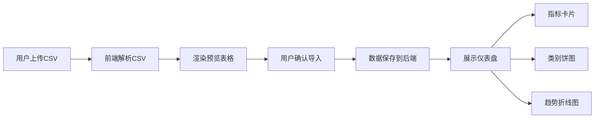

## 1. 产品概述

个人财务数据多维度可视化分析应用，帮助用户在记账后从全局角度洞察消费结构、趋势和异常。用户通过上传CSV银行流水数据，系统自动解析并生成直观的可视化仪表盘，包括关键指标卡片、类别占比饼图和月度趋势折线图。

- 解决用户记账后难以进行全局财务分析的痛点
- 面向有记账习惯、需要进行个人财务管理的用户
- 核心价值：快速洞察消费结构，发现消费趋势与异常

## 2. 核心功能

### 2.1 用户角色

| 角色 | 注册方式 | 核心权限 |
|------|----------|----------|
| 普通用户 | 无需注册，本地使用 | 上传CSV数据、查看分析仪表盘 |

### 2.2 功能模块

1. **数据上传模块**：CSV文件拖拽/点击上传、前端解析、表格预览、数据导入
2. **仪表盘模块**：指标卡片（月度支出、收入、结余、交易笔数）、类别占比饼图、月度趋势折线图

### 2.3 页面详情

| 页面名称 | 模块名称 | 功能描述 |
|----------|----------|----------|
| 主页面 | 上传区域 | 支持拖拽或点击选择CSV文件，拖入时有波纹扩散效果和边框变色 |
| 主页面 | 预览表格 | 右侧展示可编辑预览表格，hover高亮、点击选中，确认后导入 |
| 主页面 | 指标卡片 | 四个关键指标卡片，带数字递增动画，圆角白色带阴影 |
| 主页面 | 饼图 | Canvas绘制的交互式饼图，hover扇区弹出，显示百分比 |
| 主页面 | 折线图 | 月度趋势折线图，渐变填充，hover显示数据tooltip |

## 3. 核心流程

用户上传CSV银行流水文件 → 前端解析CSV并自动识别列 → 渲染可编辑预览表格 → 用户确认后点击导入 → 数据提交后端保存 → 仪表盘展示分析结果（指标卡片、饼图、折线图）

## 4. 用户界面设计

### 4.1 设计风格

- 主色调：蓝色 #3498db（强调色）
- 功能色：红色 #e74c3c（支出/负）、绿色 #2ecc71（收入/正）、橙色 #f39c12、黄色 #f1c40f、紫色 #9b59b6、粉色 #e91e63
- 中性色：背景 #f9f9f9、浅灰 #f5f5f5、边框 #ccc、文字深灰 #2c3e50 / #555
- 卡片样式：白色圆角矩形，2px浅灰边框，微阴影 box-shadow 0 2px 8px rgba(0,0,0,0.08)
- 按钮样式：圆角，点击有缩放回弹动画
- 字体：现代无衬线字体，清晰易读
- 布局：左右分栏（上传+预览），上下分块（卡片+饼图+折线图）

### 4.2 页面设计概述

| 页面名称 | 模块名称 | UI元素 |
|----------|----------|--------|
| 主页面 | 上传区域 | 虚线边框、拖拽高亮、波纹动画、淡入效果 |
| 主页面 | 预览表格 | hover浅灰高亮、点击蓝色边框选中、表格线分隔 |
| 主页面 | 指标卡片 | 数字递增动画、色彩区分、圆角阴影 |
| 主页面 | 饼图 | Canvas绘制、hover弹出15px、百分比标签、图例 |
| 主页面 | 折线图 | 渐变填充、数据点标记、tooltip箭头指示 |

### 4.3 响应式

- 桌面优先设计，页面宽度自适应（最小1024px，最大1440px）
- 内容区域居中布局，左右留白24px
- 移动端不做优先适配

### 4.4 动画与交互

- 组件切换和加载：淡入动画（opacity 0→1，0.3s ease-in）
- 按钮点击：缩放0.98后回弹1
- 数字递增：0到真实值过渡0.8秒
- 上传区域拖入：波纹扩散效果 + 边框虚线变实线
- 饼图hover：扇区向外弹出15px
- 所有交互动画帧率稳定在50FPS以上
