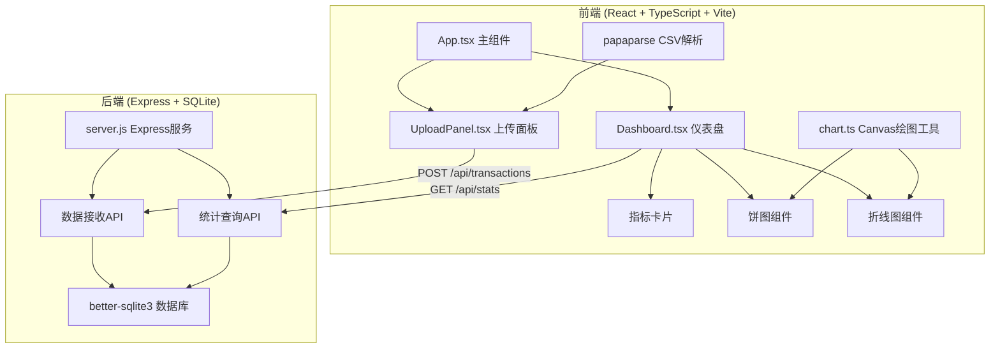
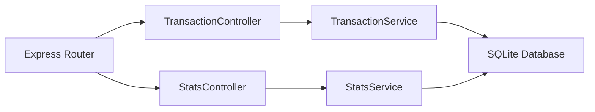
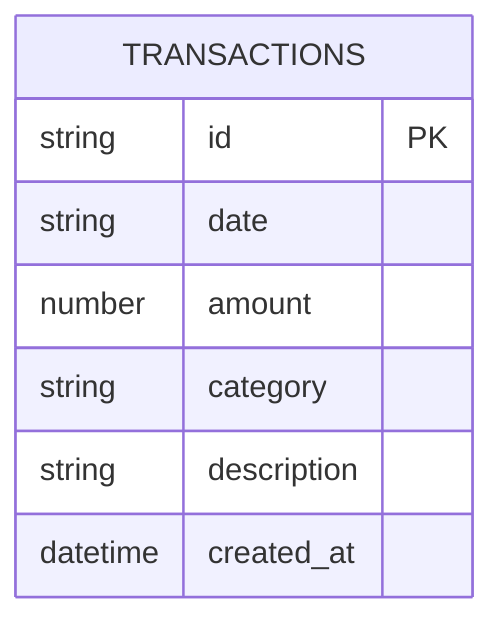

## 1. 架构设计



## 2. 技术描述

- 前端：React@18 + TypeScript + Vite
- 后端：Express@4 + better-sqlite3
- 数据库：SQLite（文件型，无需额外服务）
- CSV解析：papaparse（浏览器端）
- 图表：Canvas 2D 原生绘制
- 代理：Vite devServer 代理 /api 到后端 3001 端口

## 3. 路由定义

| 路由 | 用途 |
|------|------|
| / | 主页面，包含上传和仪表盘 |

## 4. API 定义

### 4.1 导入交易数据

**POST /api/transactions**

请求体：
```typescript
interface Transaction {
  id: string;
  date: string;
  amount: number;
  category: string;
  description: string;
}

type TransactionCreateRequest = Omit<Transaction, 'id'>[];
```

响应：
```typescript
interface ImportResponse {
  success: boolean;
  count: number;
}
```

### 4.2 获取统计数据

**GET /api/stats**

响应：
```typescript
interface StatsResponse {
  monthlyExpense: number;
  monthlyIncome: number;
  balance: number;
  transactionCount: number;
  categoryStats: { category: string; amount: number; percentage: number }[];
  monthlyTrend: { month: string; expense: number; income: number }[];
}
```

## 5. 服务器架构图



## 6. 数据模型

### 6.1 数据模型定义



### 6.2 数据定义语言

```sql
CREATE TABLE IF NOT EXISTS transactions (
  id TEXT PRIMARY KEY,
  date TEXT NOT NULL,
  amount REAL NOT NULL,
  category TEXT NOT NULL,
  description TEXT,
  created_at DATETIME DEFAULT CURRENT_TIMESTAMP
);

CREATE INDEX IF NOT EXISTS idx_transactions_date ON transactions(date);
CREATE INDEX IF NOT EXISTS idx_transactions_category ON transactions(category);
```
