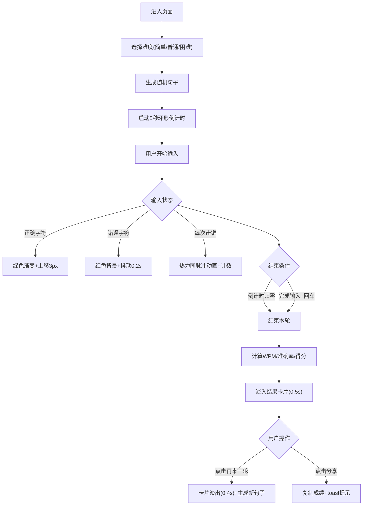

## 1. 产品概述
打字速度与节奏训练Web应用，帮助用户提升英文打字速度与准确率，通过游戏化设计提供即时反馈和数据可视化分析。
- 核心功能：随机句子生成、实时打字匹配、WPM/准确率计算、击键热力图、速度趋势分析
- 目标用户：英语学习者、程序员、办公人员等需要提升打字能力的人群

## 2. 核心特性

### 2.1 功能模块
1. **打字输入区**：高亮显示当前输入字符、实时反馈正确/错误状态
2. **游戏控制面板**：倒计时进度条、实时WPM显示、难度切换、剩余单词数
3. **击键热力图**：6行×10列字母矩阵，颜色深浅表示按键频率，脉冲动画反馈
4. **结果卡片**：打分徽章、趋势折线图、再来一轮/分享功能

### 2.2 页面详情
| 页面名称 | 模块名称 | 功能描述 |
|-----------|-------------|---------------------|
| 主训练页 | 打字输入区 | Canvas绘制文本，正确字符绿色渐变上移3px，错误字符红色背景抖动0.2秒 |
| 主训练页 | 环形倒计时 | 右上角60px直径，颜色绿→红渐变，5秒倒计时 |
| 主训练页 | 控制面板 | 倒计时进度条、WPM实时值、剩余单词数、三种难度按钮(渐变过渡0.3s) |
| 主训练页 | 击键热力图 | 6行×10列彩色矩阵，浅蓝→白→深紫渐变，脉冲扩散动画0.4s |
| 结果卡片 | 打分徽章 | 铜/银/金三色，渐变光晕旋转动画2秒一圈 |
| 结果卡片 | 趋势折线图 | Canvas绘制最近10轮WPM，区域填充渐变，末端数据点呼吸动画 |
| 结果卡片 | 操作按钮 | 再来一轮(渐变紫蓝)、分享成绩(复制到剪贴板+toast提示) |

## 3. 核心流程
用户进入页面 → 选择难度 → 系统生成随机句子并启动5秒倒计时 → 用户输入字符(实时高亮与热力图反馈) → 倒计时结束或按回车 → 淡入结果卡片(展示徽章、趋势图、热力图) → 点击再来一轮或分享 → 卡片淡出并生成新句子

## 4. 用户界面设计

### 4.1 设计风格
- **主题**：深色科技风，背景#0f0f1a，文字#e2e8f0，卡片#1e1e2e
- **颜色系统**：
  - 正确反馈：绿色#50fa7b
  - 错误反馈：红色#ff5555
  - 热力图：浅蓝#87ceeb → 白色#ffffff → 深紫#8b5cf6
  - 难度按钮：简单(渐变蓝紫) → 普通(橙红) → 困难(深红)
  - 徽章：铜#b87333 / 银#c0c0c0 / 金#ffd700
- **按钮样式**：圆角矩形，弹性过渡，悬停缩放1.08，点击缩小0.95
- **字体**：等宽字体(Consolas/Monaco)，桌面20px，移动端16px
- **布局**：上下两区，卡片式圆角设计
- **动画曲线**：cubic-bezier(0.4, 0, 0.2, 1)

### 4.2 页面设计概述
| 页面名称 | 模块名称 | UI元素 |
|-----------|-------------|-------------|
| 主训练页 | 打字输入区 | 深灰圆角卡片#1e1e2e，字符高亮动态效果，右上环形进度条 |
| 主训练页 | 控制面板 | 线性进度条，大字号WPM数值，三态难度切换按钮 |
| 主训练页 | 击键热力图 | 6×10矩阵格点，渐变填充，白色脉冲扩散动画 |
| 结果卡片 | 整体 | 640×400px，毛玻璃backdrop-filter:blur(16px)，浅灰透明#ffffffcc |
| 结果卡片 | 徽章 | 左上角，渐变光晕旋转，根据分数变色 |
| 结果卡片 | 折线图 | 中央Canvas，X轴轮次/ Y轴WPM(0-120)，渐变填充区域 |
| 结果卡片 | 按钮区 | 底部双按钮，紫蓝渐变+悬停动效 |

### 4.3 响应式
- **桌面端(≥1200px)**：固定尺寸布局，字体20px，热力图6×10
- **移动端(<768px)**：输入区/卡片宽度92%自适应，字体16px，热力图3×10
- **平板(768-1199px)**：比例缩放适配

### 4.4 性能要求
- WPM更新频率：每100ms刷新
- 热力图重绘：≤100ms延迟
- 动画帧率：稳定60fps
