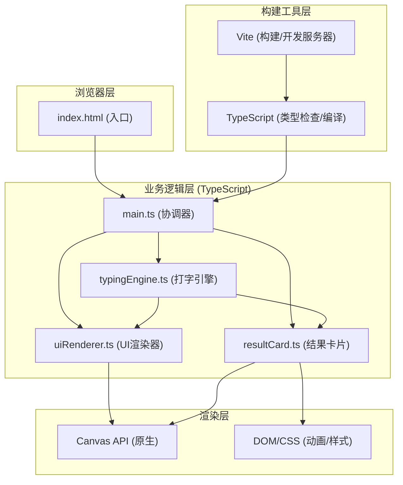

## 1. 架构设计



## 2. 技术描述
- **前端框架**：无UI框架，纯TypeScript + 原生Canvas + DOM
- **构建工具**：Vite@5.x（端口3000）
- **语言**：TypeScript@5.x（严格模式，target ES2020）
- **渲染方式**：Canvas 2D API绘制文本/图表/热力图，CSS负责DOM动画
- **状态管理**：类实例内部状态，事件驱动数据流转
- **性能优化**：requestAnimationFrame帧循环，节流更新(100ms)

## 3. 文件结构与职责

```
auto158/
├── index.html              # 入口HTML，#app容器，全屏深度主题背景
├── package.json            # 依赖：typescript、vite；脚本：npm run dev
├── vite.config.js          # Vite配置，端口3000
├── tsconfig.json           # TS配置，严格模式，ES2020
└── src/
    ├── main.ts             # 入口：初始化模块，启动训练循环，协调数据流
    ├── typingEngine.ts     # 打字引擎：句子生成、输入匹配、WPM/准确率、击键计数
    ├── uiRenderer.ts       # UI渲染：Canvas绘制文本、环形进度条、热力图
    └── resultCard.ts       # 结果卡片：毛玻璃背景、徽章、折线图、按钮逻辑
```

### 3.1 模块接口定义

#### typingEngine.ts 导出接口
```typescript
type Difficulty = 'easy' | 'normal' | 'hard';

interface RoundResult {
  wpm: number;
  accuracy: number;
  score: number;
  timeUsed: number;
  sentence: string;
  correctChars: number;
  totalChars: number;
}

interface KeyPressRecord {
  key: string;
  timestamp: number;
  correct: boolean;
}

declare class TypingEngine {
  // 事件订阅
  on(event: 'roundEnd', cb: (result: RoundResult) => void): void;
  on(event: 'inputChange', cb: () => void): void;
  on(event: 'keyPress', cb: (record: KeyPressRecord) => void): void;
  
  // 核心操作
  setDifficulty(d: Difficulty): void;
  startNewRound(): string;
  handleInput(char: string): boolean;
  handleBackspace(): void;
  handleEnter(): boolean;
  startTimer(): void;
  stopTimer(): void;
  
  // 状态查询
  getCurrentSentence(): string;
  getUserInput(): string;
  getCurrentIndex(): number;
  getWPM(): number;
  getAccuracy(): number;
  getTimeRemaining(): number; // 毫秒
  getKeyCountMap(): Record<string, number>;
  getRemainingWords(): number;
  getHistory(): RoundResult[];
  isRoundActive(): boolean;
}
```

#### uiRenderer.ts 导出接口
```typescript
declare class UIRenderer {
  constructor(container: HTMLElement, engine: TypingEngine);
  
  // 生命周期
  start(): void;
  stop(): void;
  resize(): void;
  
  // 强制刷新
  forceRender(): void;
}
```

#### resultCard.ts 导出接口
```typescript
declare class ResultCard {
  constructor(container: HTMLElement, engine: TypingEngine);
  
  on(event: 'restart', cb: () => void): void;
  
  show(result: RoundResult): void;
  hide(): void;
}
```

## 4. 核心算法

### 4.1 WPM计算公式
```
WPM = (正确字符数 / 5) / (已用时间 / 60秒)
```
- 5个字符 = 1个标准单词
- 仅统计正确输入的字符

### 4.2 准确率计算公式
```
准确率 = 正确字符数 / 总输入字符数 × 100%
```

### 4.3 得分计算公式
```
得分 = WPM × 0.6 + 准确率 × 0.4
```
- 范围：0-100分

### 4.4 句子生成策略
| 难度 | 单词数 | 词汇类型 |
|------|--------|----------|
| easy | 6-8 | 仅常用词(前150) |
| normal | 10-12 | 常用词(前300)+中等词(150-400) |
| hard | 14-16 | 全词库混合，含复杂词(如entrepreneur) |

### 4.5 热力图颜色插值
- 颜色梯度：浅蓝#87ceeb → 白色#ffffff → 深紫#8b5cf6
- 归一化按键次数(0-1)映射到颜色梯度
- 低次数→浅蓝区间，中等次数→白色区间，高次数→深紫区间

## 5. 性能设计

### 5.1 帧循环策略
```
requestAnimationFrame → uiRenderer.render()
  ├─ 检查距离上次WPM更新≥100ms → 更新WPM显示
  ├─ 检查热力图是否有更新 → 重绘热力图
  ├─ 绘制打字文本区(字符高亮/动画)
  ├─ 绘制环形倒计时进度条
  └─ 更新动画状态(抖动/脉冲/呼吸)
```

### 5.2 动画管理
- 抖动动画：用CSS @keyframes + class切换触发
- 脉冲动画：Canvas绘制半径渐变+透明度衰减
- 呼吸动画：sin函数控制透明度/大小
- 所有transition统一使用 cubic-bezier(0.4, 0, 0.2, 1)

### 5.3 响应式断点
```typescript
const BREAKPOINTS = {
  MOBILE: 768,    // < 768px
  TABLET: 1200,   // 768-1199px
  DESKTOP: 1200   // >= 1200px
};
```

## 6. 数据模型

### 6.1 词汇库数据结构
```typescript
interface WordLibrary {
  common: string[];      // 常用词 ~150
  medium: string[];      // 中等词 ~250
  complex: string[];     // 复杂词 ~100
}
```
总计：内置500个英文常用/中等/复杂词汇

### 6.2 热力图矩阵布局
```
6行×10列键盘映射(桌面端)：
Row 0: Q W E R T Y U I O P
Row 1: A S D F G H J K L 
Row 2: Z X C V B N M    
Row 3-5: 扩展键区(含常用字母补充/空格区可视化)

移动端简化为3行×10列
```

### 6.3 历史结果存储
```typescript
// localStorage持久化最近50轮结果
interface HistoryStore {
  results: RoundResult[];
  maxSize: 50;
}
```
