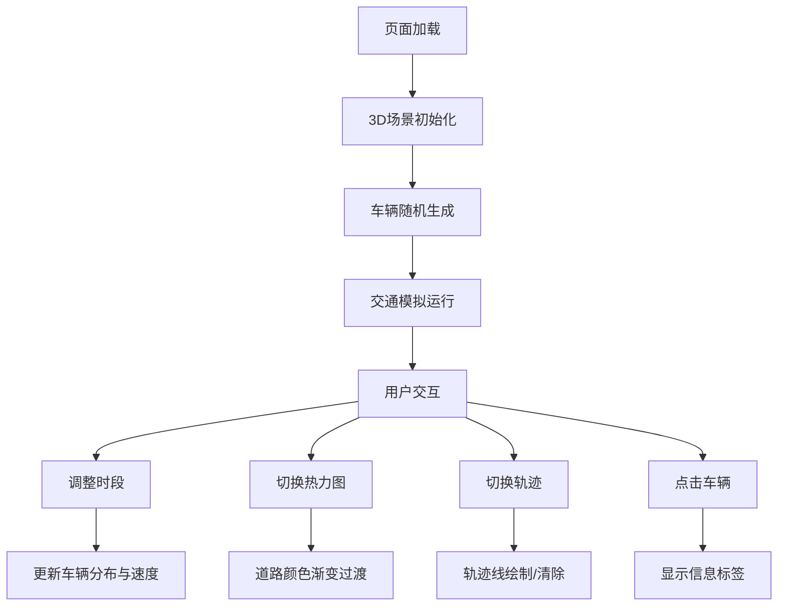

## 1. 产品概述
城市交通流量动态可视化仪表盘，基于三维地理空间数据直观展示不同时段、不同路段的实时车流热力图和车辆轨迹动画，帮助城市管理者和交通规划人员分析交通模式。
- 核心功能：3D城市场景渲染、实时车辆模拟、热力图可视化、轨迹追踪、时段切换
- 目标用户：城市规划师、交通管理部门、数据分析师

## 2. 核心功能

### 2.1 功能模块
1. **3D城市场景**：网格地面、低多边形建筑群、半透明街道平面、45度俯视视角
2. **车辆模拟系统**：30个车辆节点在10条主干道上移动，实时更新位置、速度、道路ID
3. **热力图模式**：根据车辆密度将道路段染成渐变颜色（绿-黄-红）
4. **轨迹模式**：每个车辆身后绘制淡蓝色半透明轨迹线（最近30帧位置）
5. **时段控制**：0-23时滑块，高峰时段车速下降、密度增加

### 2.2 页面详情
| 页面名称 | 模块名称 | 功能描述 |
|-----------|-------------|---------------------|
| 主仪表盘 | 3D场景渲染 | Three.js渲染城市建筑、街道、车辆，支持鼠标拖拽旋转和滚轮缩放 |
| 主仪表盘 | 控制面板 | 时段选择滑块、热力图开关、车辆轨迹开关，毛玻璃卡片样式 |
| 主仪表盘 | 车辆信息标签 | 点击车辆显示当前速度和所在道路编号 |

## 3. 核心流程
用户进入页面后，3D场景淡入显示，车辆随机生成并开始移动。用户可通过右上角控制面板：
1. 拖动时段滑块切换不同时段的交通模式
2. 点击热力图开关查看道路拥堵情况
3. 点击轨迹开关查看车辆行驶轨迹
4. 点击任意车辆查看详细信息

## 4. 用户界面设计

### 4.1 设计风格
- 主色调：深灰色背景（#1a1a2e）、白色文字
- 强调色：淡蓝紫色（rgba(100, 150, 255, 0.3)）边框
- 热力图渐变色：绿色（低密度）→ 黄色（中等）→ 红色（高密度）
- 轨迹线：淡蓝色半透明
- 按钮风格：圆角胶囊形，切换时弹簧弹性动画
- 字体：现代无衬线字体，清晰易读
- 布局：全屏3D场景 + 右上角固定控制面板

### 4.2 页面设计概述
| 页面名称 | 模块名称 | UI元素 |
|-----------|-------------|-------------|
| 主仪表盘 | 3D场景 | 网格地面、随机立方体建筑、半透明街道、彩色车辆球体、平滑动画 |
| 主仪表盘 | 控制面板 | 毛玻璃背景、圆角边框、时段滑块（带刻度和数值）、两个开关按钮 |
| 主仪表盘 | 车辆标签 | 白色背景卡片、黑色文字、显示速度和道路编号 |

### 4.3 响应性
- 桌面端优先设计，自适应窗口大小变化
- 3D场景占满整个视口，控制面板固定在右上角
- 窗口resize时自动调整相机和渲染器尺寸

### 4.4 3D场景指导
- **环境**：深色背景，营造科技感夜景氛围
- **光照**：环境光 + 方向光，建筑有明显光影层次
- **相机设置**：45度俯视角度，支持OrbitControls拖拽旋转和滚轮缩放
- **动画**：页面加载场景淡入、车辆生成淡出、热力图切换0.5秒过渡动画
- **交互**：点击车辆弹出信息，鼠标悬停高亮
- **性能优化**：使用requestAnimationFrame循环，避免频繁setState，维持30fps以上
