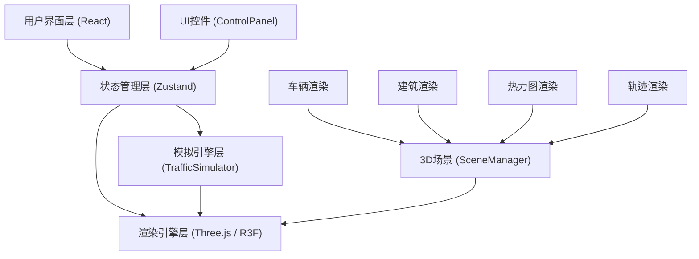

## 1. 架构设计



## 2. 技术描述
- **前端框架**：React 18 + TypeScript
- **3D渲染**：Three.js + @react-three/fiber + @react-three/drei
- **状态管理**：Zustand
- **构建工具**：Vite
- **样式方案**：原生CSS + CSS变量，毛玻璃效果使用backdrop-filter

## 3. 模块结构与文件定义

| 文件路径 | 模块名称 | 职责描述 |
|-----------|-------------|---------------------|
| `src/store/appStore.ts` | 状态管理 | 存放currentHour、showHeatmap、showTrails状态，提供修改方法 |
| `src/modules/simulator/TrafficSimulator.ts` | 交通模拟 | 30个车辆在10条道路上移动，每200ms更新位置速度 |
| `src/modules/renderer/SceneManager.ts` | 场景管理 | Three.js场景初始化、相机控制、建筑生成、车辆渲染 |
| `src/modules/ui/ControlPanel.tsx` | 控制面板 | React组件，时段滑块、热力图开关、轨迹开关 |
| `src/App.tsx` | 主应用 | 整合所有模块，响应式布局 |
| `src/main.tsx` | 入口文件 | React应用挂载 |
| `src/index.css` | 全局样式 | CSS变量、暗色主题、毛玻璃效果 |

## 4. 数据模型

### 4.1 车辆数据结构
```typescript
interface Vehicle {
  id: number;
  x: number;
  y: number;
  z: number;
  prevX: number;
  prevZ: number;
  speed: number;
  roadId: number;
  color: string;
  direction: number;
  trail: Array<{ x: number; z: number }>;
}
```

### 4.2 道路数据结构
```typescript
interface Road {
  id: number;
  startX: number;
  startZ: number;
  endX: number;
  endZ: number;
  width: number;
  vehicleCount: number;
  heatColor: string;
}
```

### 4.3 应用状态
```typescript
interface AppState {
  currentHour: number;
  showHeatmap: boolean;
  showTrails: boolean;
  setCurrentHour: (hour: number) => void;
  toggleHeatmap: () => void;
  toggleTrails: () => void;
}
```

## 5. 性能优化策略
1. 使用requestAnimationFrame进行渲染循环，避免setTimeout/setInterval
2. 车辆位置使用线性插值平滑过渡，避免跳变
3. 热力图颜色使用材质颜色过渡动画，而非重建几何体
4. 轨迹线使用BufferGeometry动态更新顶点，限制30帧历史
5. 建筑群使用InstancedMesh合并渲染，减少draw call
6. 状态更新通过Zustand订阅，避免不必要的组件重渲染
