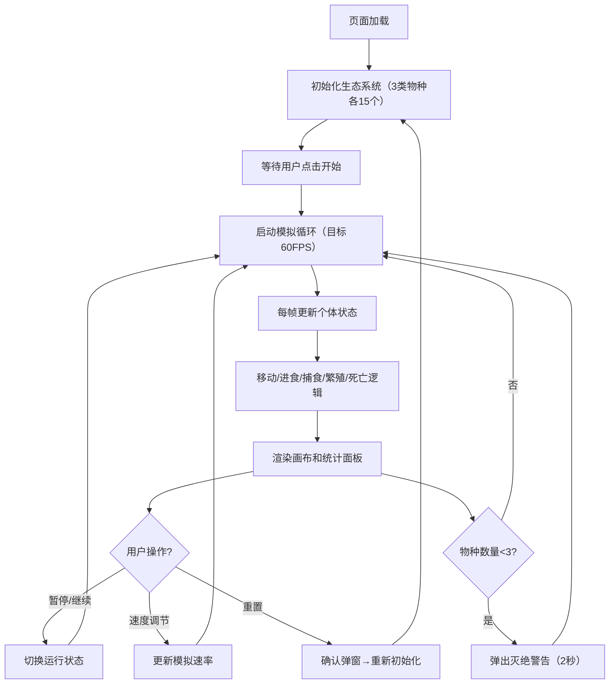

## 1. 产品概述

生态系统沙盒模拟器是一款用于生态学和进化论教学的可视化工具，通过实时模拟不同物种间的捕食、竞争、共生关系，帮助学生直观理解生态系统动态演变过程。

- 核心目的：解决传统教学中难以具象展示物种交互随时间演变的可视化困境
- 目标用户：生物学教师、学生、生态学科研人员
- 产品价值：提供交互式、可调节参数的生态模拟环境，增强教学趣味性和知识吸收效率

## 2. 核心功能

### 2.1 功能模块

1. **模拟画布**：640x480画布，实时渲染三类物种（植物、食草动物、食肉动物）的移动、交互、繁殖和死亡过程
2. **生态模拟引擎**：每帧更新个体状态，处理进食、捕食、繁殖、变异、死亡等核心逻辑
3. **实时统计面板**：展示物种数量变化曲线、捕食次数统计、模拟时长
4. **控制面板**：开始/暂停、重置、速度调节功能
5. **警告系统**：物种濒危警告、重置确认弹窗

### 2.2 页面详情

| 页面名称 | 模块名称 | 功能描述 |
|-----------|-------------|---------------------|
| 主页面 | 模拟画布 | 640x480 Canvas渲染，支持个体轨迹、摇摆动画、死亡淡出效果 |
| 主页面 | 统计面板 | 三类物种数量曲线图（最近60个采样点）、捕食/被捕食条形图、计时器 |
| 主页面 | 控制栏 | 开始/暂停按钮（颜色切换）、重置按钮（带确认）、速度滑块（0.5x-3.0x） |
| 主页面 | 弹窗系统 | 物种灭绝警告、重置确认对话框 |

## 3. 核心流程

## 4. 用户界面设计

### 4.1 设计风格

- **主色调**：深色主题（背景#1a1a2e），画布使用深蓝渐变（#0f0c29→#302b63→#24243e）
- **物种配色**：植物绿色、食草动物蓝色、食肉动物红色，与统计曲线颜色一致
- **按钮样式**：扁平化设计，圆角8px，悬停亮度+20%，点击缩放动画（0.95→1.0，0.1秒）
- **字体**：系统无衬线字体（-apple-system, sans-serif），文字白色#ffffff或浅灰#cccccc
- **视觉风格**：无投影，半透明面板（rgba(0,0,0,0.7)，圆角12px），网格线（alpha 0.15）

### 4.2 页面设计概述

| 页面名称 | 模块名称 | UI Elements |
|-----------|-------------|-------------|
| 主页面 | 模拟画布 | 居中偏左（65%宽度），深蓝渐变背景，浅灰棕色网格线，物种图形+半透明轨迹 |
| 主页面 | 统计面板 | 右侧30%宽度，半透明深色背景，白色网格坐标图，彩色曲线，条形图 |
| 主页面 | 控制栏 | 底部60px高度，绿色/橙色切换按钮、红色重置按钮、速度滑块 |
| 主页面 | 警告弹窗 | 屏幕中央红色半透明提示，2秒自动消失 |

### 4.3 响应式设计

- **桌面端**：画布居左65%，统计面板右侧30%，底部控制栏
- **移动端**（<900px）：纵向布局，画布在上，统计面板在下，控制栏保持底部
- 所有元素自适应容器尺寸，保持良好触控体验

### 4.4 动效设计

- **植物摇摆**：缓慢正弦波动动画
- **移动轨迹**：半透明尾巴（alpha 0.2），1秒后消失
- **死亡动画**：淡出效果0.5秒
- **按钮交互**：悬停亮度变化，点击缩放
- **警告弹窗**：淡入淡出过渡
