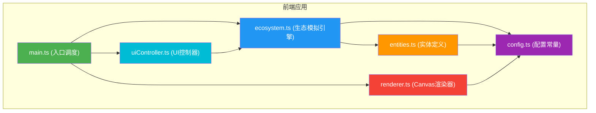

## 1. 架构设计



## 2. 技术描述

- **前端框架**：原生 TypeScript + Canvas 2D API（无第三方UI框架）
- **构建工具**：Vite 5.x
- **编程语言**：TypeScript 5.x（严格模式，target ES2020）
- **样式方案**：原生 CSS（CSS 变量管理主题）
- **数据可视化**：原生 Canvas 2D 绘制曲线图和条形图
- **开发服务器**：Vite 内置开发服务器（端口 3000）

## 3. 项目结构

```
auto162/
├── package.json          # 项目依赖和脚本
├── vite.config.js        # Vite 构建配置
├── tsconfig.json         # TypeScript 配置
├── index.html            # 入口 HTML
└── src/
    ├── main.ts           # 应用入口，模块调度
    ├── ecosystem.ts      # 生态模拟核心引擎
    ├── entities.ts       # 物种实体类定义
    ├── config.ts         # 全局配置常量
    ├── renderer.ts       # Canvas 渲染模块
    └── uiController.ts   # UI 交互控制器
```

## 4. 核心模块设计

### 4.1 config.ts - 配置模块

| 配置项 | 类型 | 值 | 说明 |
|--------|------|-----|------|
| CANVAS_WIDTH | number | 640 | 画布宽度 |
| CANVAS_HEIGHT | number | 480 | 画布高度 |
| INITIAL_PLANT_COUNT | number | 15 | 初始植物数量 |
| INITIAL_HERBIVORE_COUNT | number | 15 | 初始食草动物数量 |
| INITIAL_CARNIVORE_COUNT | number | 15 | 初始食肉动物数量 |
| PLANT_SIZE | number | 8 | 植物直径 |
| HERBIVORE_SIZE | number | 12 | 食草动物边长 |
| CARNIVORE_SIZE | number | 14 | 食肉动物边长 |
| FEEDING_RADIUS | number | 30 | 进食感知半径 |
| HUNTING_RADIUS | number | 50 | 捕食感知半径 |
| BREEDING_THRESHOLD | number | 80 | 繁殖饱食度阈值 |
| BREEDING_RADIUS | number | 20 | 繁殖距离阈值 |
| MUTATION_RATE | number | 0.05 | 变异概率 |
| STARVATION_THRESHOLD | number | 10 | 饥饿阈值 |
| EXTINCTION_THRESHOLD | number | 3 | 灭绝阈值 |
| TARGET_FPS | number | 60 | 目标帧率 |
| MIN_FPS | number | 30 | 最低保真帧率 |
| STAT_SAMPLE_INTERVAL | number | 5000 | 统计采样间隔(ms) |
| WARNING_DURATION | number | 2000 | 警告持续时间(ms) |
| FADE_DURATION | number | 500 | 死亡淡出时间(ms) |
| TRAIL_DURATION | number | 1000 | 轨迹持续时间(ms) |

### 4.2 entities.ts - 实体模块

```typescript
interface Entity {
  id: string;
  x: number;
  y: number;
  health: number;
  satiety: number;
  speed: number;
  perceptionRadius: number;
  isDying: boolean;
  deathStartTime: number;
  trail: Array<{ x: number; y: number; timestamp: number }>;
}

class Plant implements Entity {
  swayOffset: number;
  // 摇摆动画、繁殖逻辑
}

class Herbivore implements Entity {
  vx: number;
  vy: number;
  // 随机游走、进食、繁殖逻辑
}

class Carnivore implements Entity {
  vx: number;
  vy: number;
  target: Herbivore | null;
  // 追踪、捕食、繁殖逻辑
}
```

### 4.3 ecosystem.ts - 生态引擎模块

```typescript
class Ecosystem {
  plants: Plant[];
  herbivores: Herbivore[];
  carnivores: Carnivore[];
  simulationTime: number;
  speedMultiplier: number;
  isRunning: boolean;
  predationCount: number;
  grazingCount: number;
  statsHistory: { plants: number[]; herbivores: number[]; carnivores: number[] };
  
  initialize(): void;
  update(deltaTime: number): void;
  checkExtinction(): string | null;
  getCounts(): { plants: number; herbivores: number; carnivores: number };
  reset(): void;
}
```

### 4.4 renderer.ts - 渲染模块

```typescript
class Renderer {
  canvas: HTMLCanvasElement;
  ctx: CanvasRenderingContext2D;
  
  clear(): void;
  drawBackground(): void;
  drawGrid(): void;
  drawPlants(plants: Plant[]): void;
  drawHerbivores(herbivores: Herbivore[]): void;
  drawCarnivores(carnivores: Carnivore[]): void;
  drawTrails(entities: Entity[]): void;
  render(ecosystem: Ecosystem): void;
}
```

### 4.5 uiController.ts - UI控制模块

```typescript
class UiController {
  ecosystem: Ecosystem;
  
  bindEvents(): void;
  updateStatsPanel(counts: object, history: object): void;
  updateTimer(time: number): void;
  showWarning(message: string): void;
  showResetConfirm(): Promise<boolean>;
  togglePlayPause(): void;
  setSpeed(speed: number): void;
}
```

## 5. 性能优化策略

| 场景 | 优化策略 |
|------|---------|
| 个体数 ≤ 100 | 全精度碰撞检测，每帧更新所有实体 |
| 个体数 > 100 | 降低移动更新频率（每2帧更新一次），采用空间分区碰撞检测 |
| 帧率 < 30FPS | 进一步降级：每3帧更新一次，简化轨迹渲染 |
| 轨迹管理 | 自动清理超过1秒的轨迹点，限制最大轨迹点数 |
| 统计渲染 | 限制历史数据点数量（最多60个），每5秒采样一次 |

## 6. 构建配置

### vite.config.js
```javascript
export default {
  server: {
    port: 3000,
    hmr: true
  },
  build: {
    target: 'es2020',
    minify: 'esbuild'
  }
}
```

### tsconfig.json
```json
{
  "compilerOptions": {
    "target": "ES2020",
    "module": "ESNext",
    "strict": true,
    "esModuleInterop": true,
    "skipLibCheck": true,
    "moduleResolution": "bundler"
  },
  "include": ["src"]
}
```
