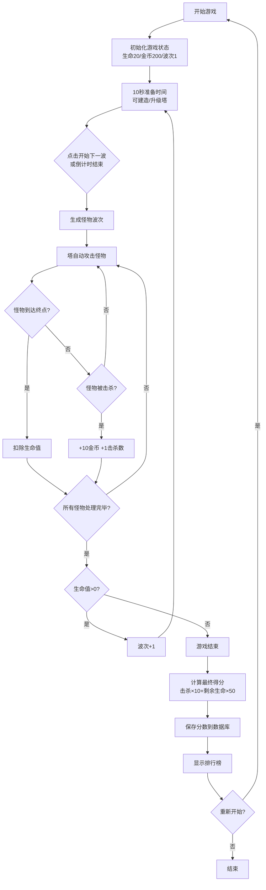

## 1. 产品概述

魔法塔防游戏是一款基于网格地图的策略塔防游戏，玩家通过建造不同类型的防御塔抵御一波波从传送门涌出的怪物，保护生命值不被消耗殆尽。

- 核心玩法：策略性放置三种魔法塔（火球、冰霜、闪电），合理升级，对抗逐渐增强的怪物波次
- 目标市场：休闲策略游戏玩家，追求简单上手但具有深度策略性的游戏体验

## 2. 核心功能

### 2.1 功能模块

1. **游戏主界面**：地图渲染、塔建造、怪物展示、攻击特效
2. **状态栏**：生命值、金币、波次显示
3. **塔控制面板**：塔选择、建造、升级、金币消耗提示
4. **波次管理**：波次倒计时、提前开始、怪物难度递增
5. **排行榜系统**：历史最高分记录与展示
6. **游戏结束界面**：最终得分、排行榜展示、重新开始

### 2.2 页面详情

| 页面名称 | 模块名称 | 功能描述 |
|---------|---------|---------|
| 游戏主界面 | 地图区域 | 6×8网格地图，显示路径、塔、怪物、攻击特效 |
| 游戏主界面 | 顶部状态栏 | 显示生命值（红心图标）、金币（金币图标）、当前波次（蓝色文字） |
| 游戏主界面 | 底部塔面板 | 三种塔的选择、建造、升级操作 |
| 游戏主界面 | 波次准备区 | 倒计时显示、提前开始按钮 |
| 游戏结束界面 | 得分展示 | 显示最终得分、击杀数、剩余生命值 |
| 游戏结束界面 | 排行榜 | 显示历史前10名最高分 |

## 3. 核心流程

## 4. 用户界面设计

### 4.1 设计风格
- **主色调**：深色背景 #1a1a2e，网格线 #16213e
- **塔类型色彩**：火球橙红 #ff6b35，冰霜蓝白 #4fc3f7，闪电金紫 #ffc107
- **生命值**：红色心形图标，金币：黄色金币图标，波次：蓝色文字
- **按钮风格**：圆角矩形，塔图标80×80px，选中时外发光3px
- **字体**：无衬线字体，居中布局

### 4.2 页面设计概览

| 页面名称 | 模块名称 | UI元素 |
|---------|---------|---------|
| 游戏主界面 | 地图区域 | Canvas绘制，6×8网格，浅灰色路径，怪物头顶绿色渐变血条 |
| 游戏主界面 | 顶部状态栏 | 左：红心+生命值，中：金币图标+金币数，右：蓝色波次文字 |
| 游戏主界面 | 底部塔面板 | 三个渐变背景塔按钮，等级数字显示，金币不足时置灰 |
| 游戏主界面 | 准备区 | 倒计时数字，蓝色"开始下一波"按钮 |
| 游戏结束界面 | 得分面板 | 居中弹窗，大号得分数字，击杀/生命明细 |
| 游戏结束界面 | 排行榜 | 排名列表，金色高亮第一名 |

### 4.3 动效设计
- **建造特效**：网格闪烁蓝色高亮，0.5秒淡出
- **塔攻击**：炮口闪光动画，0.2秒缩放
- **火球特效**：橙色圆形飞向目标
- **冰霜特效**：蓝色碎裂多边形
- **闪电特效**：黄色折线连接多个目标
- **怪物死亡**：缩小消失动画（0.3秒）带粒子碎片

### 4.4 响应式设计
- 桌面优先布局
- 屏幕宽度 < 900px 时：地图缩放至 70%，状态栏文字缩小
- 触摸设备优化：点击区域增大

## 5. 游戏平衡参数

### 5.1 防御塔参数

| 塔类型 | 等级1 | 等级2 | 等级3 |
|-------|-------|-------|-------|
| 火球塔 | 单体伤害30 | 单体伤害60 | 单体伤害100 |
| 冰霜塔 | 减速50%/2秒 | 减速70%/3秒 | 减速90%/4秒 |
| 闪电塔 | 弹射3目标/20伤害 | 弹射4目标/35伤害 | 弹射5目标/55伤害 |

### 5.2 怪物参数

| 怪物类型 | 血量 | 速度 | 特殊能力 |
|---------|------|------|---------|
| 普通怪 | 50 | 1格/秒 | - |
| 快速怪 | 30 | 2格/秒 | - |
| 精英怪 | 150 | 0.8格/秒 | 护盾减伤30% |

### 5.3 经济参数
- 初始金币：200
- 每击杀怪物：+10金币
- 建造/升级消耗金币（根据塔类型和等级递增）
