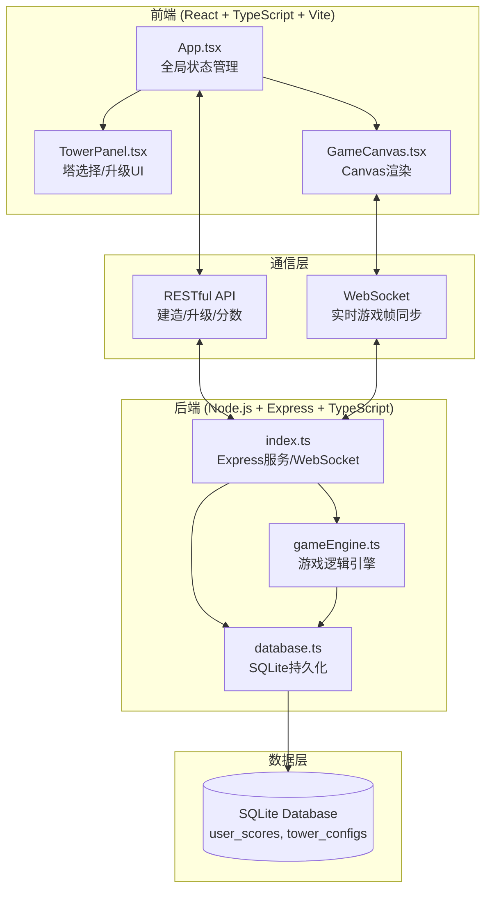

## 1. 架构设计



## 2. 技术描述

- **前端框架**：React 18 + TypeScript + Vite
- **后端框架**：Express 4 + TypeScript
- **实时通信**：express-ws (WebSocket)
- **数据库**：better-sqlite3 (SQLite)
- **构建工具**：Vite（前端端口3000，代理/api到后端3001）
- **编译目标**：ES2020，严格模式

## 3. 文件结构

```
project-root/
├── package.json
├── vite.config.js
├── tsconfig.json
├── index.html
└── src/
    ├── client/
    │   ├── App.tsx              # 主应用组件
    │   ├── TowerPanel.tsx       # 塔选择和升级UI
    │   └── GameCanvas.tsx       # Canvas渲染组件
    └── server/
        ├── index.ts             # Express服务入口
        ├── gameEngine.ts        # 游戏逻辑引擎
        └── database.ts          # SQLite数据库操作
```

## 4. API 定义

### 4.1 RESTful API

| 方法 | 路径 | 描述 | 请求体 | 响应体 |
|------|------|------|--------|--------|
| POST | /api/game/start | 开始新游戏 | - | `{ gameId: string, state: GameState }` |
| POST | /api/game/:gameId/tower/build | 建造塔 | `{ x: number, y: number, type: TowerType }` | `{ success: boolean, state: GameState }` |
| POST | /api/game/:gameId/tower/upgrade | 升级塔 | `{ x: number, y: number }` | `{ success: boolean, state: GameState }` |
| POST | /api/game/:gameId/wave/start | 提前开始下一波 | - | `{ success: boolean, state: GameState }` |
| GET | /api/scores | 获取排行榜 | - | `{ scores: ScoreEntry[] }` |

### 4.2 WebSocket 消息

**服务端推送（游戏帧）：**
```typescript
interface GameFrameMessage {
  type: 'frame';
  state: GameState;
  effects: Effect[];
}
```

**客户端发送（操作）：**
```typescript
interface ClientActionMessage {
  type: 'build' | 'upgrade' | 'startWave';
  payload: any;
}
```

## 5. 数据模型

### 5.1 核心类型定义

```typescript
type TowerType = 'fireball' | 'frost' | 'lightning';
type MonsterType = 'normal' | 'fast' | 'elite';
type GamePhase = 'preparation' | 'wave' | 'gameover';

interface Position {
  x: number;
  y: number;
}

interface Tower {
  id: string;
  type: TowerType;
  level: 1 | 2 | 3;
  position: Position;
  lastAttackTime: number;
}

interface Monster {
  id: string;
  type: MonsterType;
  hp: number;
  maxHp: number;
  position: { x: number; y: number };
  pathIndex: number;
  speed: number;
  baseSpeed: number;
  slowEndTime: number;
  slowFactor: number;
  hasShield: boolean;
  isDying: boolean;
  deathStartTime: number;
}

interface Effect {
  id: string;
  type: 'fireball' | 'frost' | 'lightning' | 'buildFlash' | 'towerMuzzle' | 'deathParticles';
  from?: Position;
  to?: Position | Position[];
  startTime: number;
  duration: number;
}

interface GameState {
  gameId: string;
  phase: GamePhase;
  lives: number;
  gold: number;
  wave: number;
  kills: number;
  towers: Tower[];
  monsters: Monster[];
  preparationEndTime: number | null;
  waveStartTime: number | null;
  score: number;
}

interface ScoreEntry {
  id: string;
  score: number;
  kills: number;
  wave: number;
  createdAt: number;
}
```

### 5.2 数据库 Schema

```sql
CREATE TABLE IF NOT EXISTS user_scores (
  id TEXT PRIMARY KEY,
  score INTEGER NOT NULL,
  kills INTEGER NOT NULL,
  wave INTEGER NOT NULL,
  created_at INTEGER NOT NULL
);

CREATE TABLE IF NOT EXISTS tower_configs (
  id TEXT PRIMARY KEY,
  type TEXT NOT NULL,
  level INTEGER NOT NULL,
  damage INTEGER,
  slow_factor REAL,
  slow_duration INTEGER,
  chain_count INTEGER,
  build_cost INTEGER NOT NULL,
  upgrade_cost INTEGER
);
```

## 6. 游戏引擎核心逻辑

### 6.1 游戏循环
- 目标帧率：30FPS
- 每帧更新：怪物移动、塔攻击判定、碰撞检测、效果生命周期
- 状态同步：每帧通过 WebSocket 推送至前端

### 6.2 塔攻击判定
- **火球塔**：寻找范围内最近怪物，发射火球，单体伤害
- **冰霜塔**：范围减速所有怪物，不直接造成伤害
- **闪电塔**：链式攻击，从最近怪物开始弹射至N个目标

### 6.3 怪物波次
- 第N波怪物数量：5 + (N-1) × 5
- 每5波出现精英怪
- 怪物沿预设路径移动，到达终点扣除生命值

### 6.4 性能优化
- FPS < 30 时自动降低粒子特效数量
- 怪物死亡动画使用对象池复用
- WebSocket 消息采用增量更新策略
