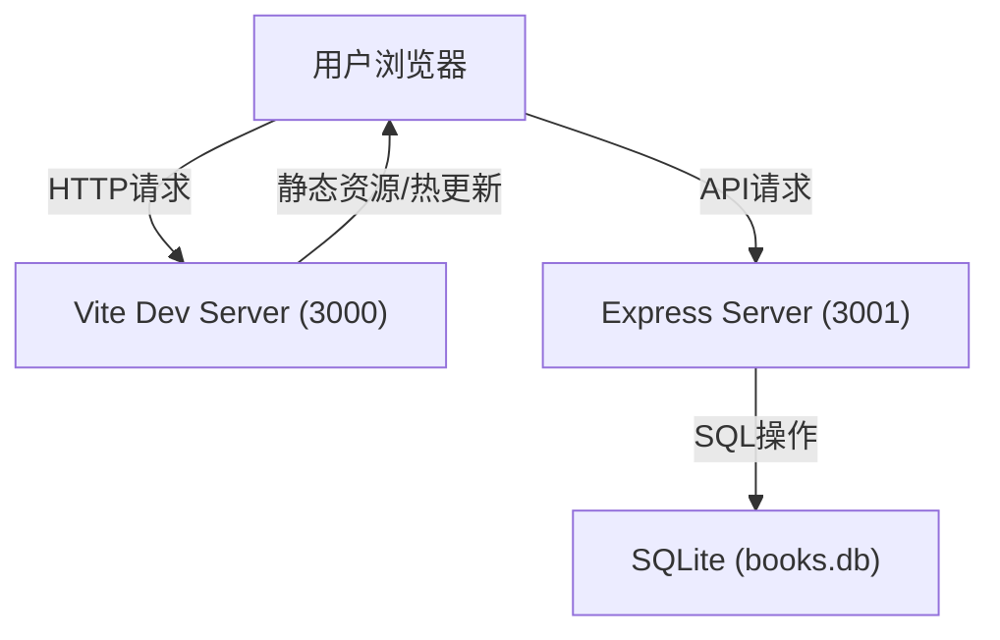
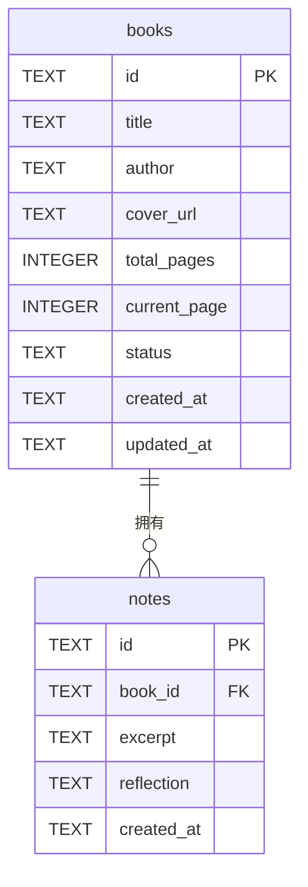

# 技术书籍阅读进度与笔记同步系统 - 技术架构文档

## 1. 架构总览

### 1.1 整体架构
前后端分离的单体应用架构：
- **前端**: React 18 SPA，Vite构建，开发端口3000
- **后端**: Node.js + Express RESTful API，端口3001
- **数据层**: SQLite本地文件数据库 (books.db)
- **通信**: HTTP/REST + JSON



### 1.2 目录结构

```
auto164/
├── package.json              # 项目依赖与脚本
├── vite.config.js            # Vite构建配置
├── tsconfig.json             # TypeScript配置
├── index.html                # 前端入口HTML
├── books.db                  # SQLite数据库(运行时生成)
└── src/
    ├── backend/
    │   └── server.ts         # Express服务端
    └── frontend/
        ├── App.tsx           # React主组件(路由/状态/布局)
        └── components/
            ├── BookCard.tsx  # 书籍卡片组件
            └── NoteCard.tsx  # 笔记卡片组件
```

---

## 2. 后端架构

### 2.1 技术选型说明
| 组件 | 选型 | 理由 |
|------|------|------|
| 运行时 | Node.js | 用户指定，前后端语言统一 |
| Web框架 | Express | 用户指定，轻量灵活，生态成熟 |
| ORM/驱动 | better-sqlite3 | 用户指定，同步API，高性能，类型友好 |
| ID生成 | uuid | 用户指定，生成全局唯一标识符 |
| 类型支持 | @types/express, @types/better-sqlite3, @types/uuid | TypeScript类型定义 |

### 2.2 数据库设计

#### 2.2.1 books 表（书籍表）

| 字段 | 类型 | 约束 | 说明 |
|------|------|------|------|
| id | TEXT | PRIMARY KEY | UUID主键 |
| title | TEXT | NOT NULL | 书名 |
| author | TEXT | NOT NULL | 作者 |
| cover_url | TEXT | | 封面图片URL |
| total_pages | INTEGER | NOT NULL DEFAULT 0 | 总页数 |
| current_page | INTEGER | NOT NULL DEFAULT 0 | 当前已读页码 |
| status | TEXT | NOT NULL DEFAULT 'want_to_read' | 状态: reading/finished/want_to_read |
| created_at | TEXT | NOT NULL DEFAULT CURRENT_TIMESTAMP | 创建时间 |
| updated_at | TEXT | NOT NULL DEFAULT CURRENT_TIMESTAMP | 更新时间 |

#### 2.2.2 notes 表（笔记表）

| 字段 | 类型 | 约束 | 说明 |
|------|------|------|------|
| id | TEXT | PRIMARY KEY | UUID主键 |
| book_id | TEXT | NOT NULL, FOREIGN KEY | 关联书籍ID |
| excerpt | TEXT | NOT NULL | 摘录原文 |
| reflection | TEXT | NOT NULL | 阅读感悟 |
| created_at | TEXT | NOT NULL DEFAULT CURRENT_TIMESTAMP | 创建时间 |

#### 2.2.3 ER图



### 2.3 API接口设计

| 方法 | 路径 | 功能 | 请求体 | 响应体 |
|------|------|------|--------|--------|
| GET | /api/books | 获取所有书籍 | - | Book[] |
| POST | /api/books | 添加书籍 | {title, author, cover_url?, total_pages?, current_page?, status?} | Book |
| PUT | /api/books/:id | 更新书籍 | {title?, author?, cover_url?, total_pages?, current_page?, status?} | Book |
| DELETE | /api/books/:id | 删除书籍 | - | {success: true} |
| GET | /api/books/:id/notes | 获取某书笔记 | - | Note[] |
| POST | /api/books/:id/notes | 添加笔记 | {excerpt, reflection} | Note |
| DELETE | /api/notes/:id | 删除笔记 | - | {success: true} |

### 2.4 服务端核心流程

#### 启动流程
1. 初始化Express应用
2. 启用CORS中间件（允许3000端口跨域）
3. 启用JSON解析中间件
4. 初始化SQLite数据库连接
5. 执行建表SQL（CREATE TABLE IF NOT EXISTS）
6. 注册所有API路由
7. 监听3001端口启动服务

#### 数据访问层策略
- 每个API路由处理函数内直接使用better-sqlite3同步API
- 使用参数化查询防止SQL注入
- 统一错误处理中间件，返回标准JSON错误响应

---

## 3. 前端架构

### 3.1 技术选型说明
| 组件 | 选型 | 理由 |
|------|------|------|
| UI框架 | React 18 | 用户指定 |
| 语言 | TypeScript | 用户指定，类型安全 |
| 构建工具 | Vite | 用户指定，极速HMR |
| 路由 | React Router v6 | 标准路由方案，用户指定隐含 |
| 样式方案 | CSS-in-JS / inline styles + 全局CSS | 无需额外依赖，满足需求 |

### 3.2 模块职责划分

#### 3.2.1 App.tsx（主组件）
**职责**:
- 顶层状态管理：books列表、当前选中书籍、notes列表、搜索关键字
- 路由管理：书架页(/)和详情页(/book/:id)
- 数据获取：useEffect调用API获取数据
- 布局组件：搜索框、总进度条、网格容器、详情页两栏布局
- 笔记虚拟滚动实现
- 模态框状态管理

**核心状态**:
```typescript
interface AppState {
  books: Book[];
  selectedBook: Book | null;
  notes: Note[];
  searchKeyword: string;
  showNoteModal: boolean;
}
```

#### 3.2.2 BookCard.tsx（书籍卡片）
**Props**:
```typescript
interface BookCardProps {
  book: Book;
  onClick: () => void;
  onEdit: () => void;
}
```

**职责**:
- 渲染封面图（含加载失败容错）
- 计算并渲染进度条（current_page/total_pages）
- 展示书名、作者、百分比
- 编辑按钮（悬停缩放动画）
- 卡片整体可点击进入详情

#### 3.2.3 NoteCard.tsx（笔记卡片）
**Props**:
```typescript
interface NoteCardProps {
  note: Note;
  index: number;  // 用于动画delay
  onDelete?: () => void;
}
```

**职责**:
- 展示摘录原文（灰底+蓝色左边框）
- 展示感悟文字
- 入场动画（淡入+上移，stagger delay）
- 可选删除功能

### 3.3 虚拟滚动实现方案

针对笔记列表实现虚拟滚动（需求P1级）：

**核心原理**:
1. 计算笔记容器的可滚动高度（总笔记数 × 预估卡片高度）
2. 监听scroll事件，计算当前可视区域的startIndex和endIndex
3. 仅渲染 `[startIndex - buffer, endIndex + buffer]` 范围内的笔记卡片
4. 使用 `padding-top` 和 `padding-bottom` 撑开滚动条高度
5. 使用 `transform: translateY` 精确定位每张卡片

**关键参数**:
- `estimateCardHeight`: 预估每张笔记卡片高度（如180px）
- `bufferSize`: 上下缓冲渲染数量（如5，避免快速滚动空白）

### 3.4 响应式断点

| 断点 | 设备类型 | 网格列数 |
|------|----------|----------|
| ≥ 1200px | 桌面 | 4列 |
| 768px - 1199px | 平板 | 3列 |
| < 768px | 手机 | 2列 |

实现方式：CSS Media Queries 配合 CSS Grid `grid-template-columns`。

### 3.5 前端性能优化

| 优化点 | 策略 |
|--------|------|
| 首屏渲染 | React 18 自动批处理 + 合理拆分组件 |
| 列表渲染 | 笔记虚拟滚动 + React key优化 |
| 动画性能 | 优先使用 transform / opacity（触发合成层，60FPS） |
| 重渲染优化 | React.memo 包装 BookCard / NoteCard |
| 图片优化 | 封面图添加loading="lazy"，onerror容错 |
| 搜索防抖 | 搜索输入添加100ms debounce（避免每帧渲染） |

---

## 4. 开发与构建

### 4.1 依赖清单

**生产依赖**:
```
react, react-dom, react-router-dom, express, better-sqlite3, uuid
```

**开发依赖**:
```
typescript, vite, @vitejs/plugin-react, concurrently,
@types/react, @types/react-dom, @types/express,
@types/better-sqlite3, @types/uuid
```

### 4.2 npm脚本

| 脚本名 | 命令 | 说明 |
|--------|------|------|
| `dev` | `concurrently "npm:dev:server" "npm:dev:client"` | 同时启动前后端 |
| `dev:server` | `ts-node src/backend/server.ts` 或编译后运行 | 启动后端(3001) |
| `dev:client` | `vite` | 启动前端开发服务器(3000) |
| `build` | `tsc && vite build` | 类型检查+构建前端 |
| `start` | `node dist/backend/server.js` | 生产启动后端 |

**注**: 由于用户明确要求`npm run dev`直接启动，使用concurrently并行管理前后端进程。

### 4.3 TypeScript配置要点
```json
{
  "compilerOptions": {
    "target": "ES2020",
    "jsx": "react-jsx",
    "strict": true,
    "module": "ESNext",
    "moduleResolution": "bundler",
    "esModuleInterop": true,
    "skipLibCheck": true
  }
}
```

### 4.4 Vite配置要点
```javascript
// vite.config.js
export default {
  plugins: [react()],
  server: {
    port: 3000,
    proxy: {
      '/api': 'http://localhost:3001'  // API代理
    }
  }
}
```

---

## 5. 关键数据类型定义

```typescript
// 书籍状态枚举
type BookStatus = 'want_to_read' | 'reading' | 'finished';

// 书籍实体
interface Book {
  id: string;
  title: string;
  author: string;
  cover_url: string | null;
  total_pages: number;
  current_page: number;
  status: BookStatus;
  created_at: string;
  updated_at: string;
}

// 笔记实体
interface Note {
  id: string;
  book_id: string;
  excerpt: string;
  reflection: string;
  created_at: string;
}

// API统一响应
interface ApiResponse<T> {
  data?: T;
  error?: string;
}
```

---

## 6. 风险与注意事项

| 风险点 | 应对策略 |
|--------|----------|
| better-sqlite3需编译原生模块 | 用户首次安装需有Node编译环境；提示安装windows-build-tools（Windows） |
| CORS跨域问题 | 后端配置cors中间件，或Vite proxy转发/api |
| 封面图片URL失效 | onerror事件切换占位图，避免空白 |
| 虚拟滚动卡片高度不固定 | 采用动态测量+缓存策略，或保守估算高度 |
| 并发写入SQLite | better-sqlite3为同步阻塞模型，单线程天然安全 |
