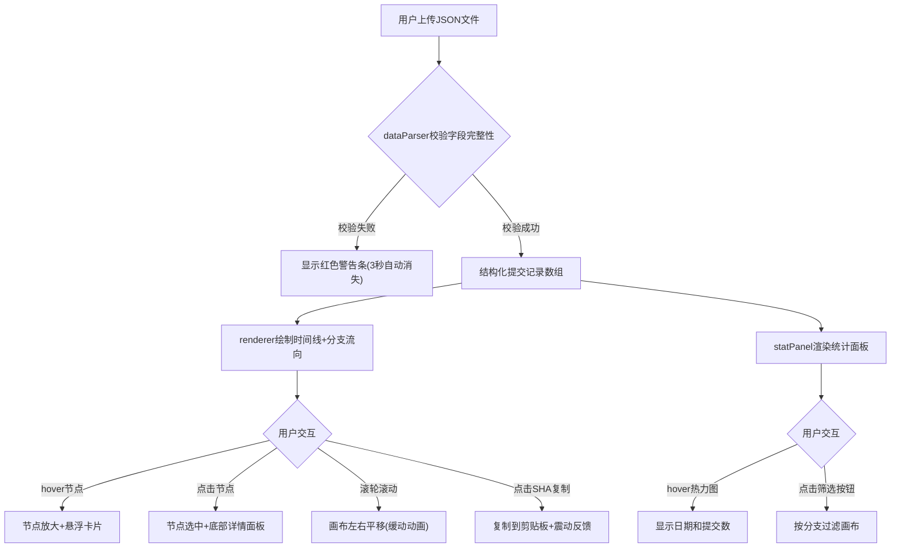

## 1. 产品概述

GitCommitFlow 是一个代码贡献流可视化看板应用，用于导入本地git仓库的提交日志（JSON格式），以时间线+分支流向图直观展示每位开发者的提交密度、代码变更量和分支合并历史，解决纯文本日志无法直观对比的问题。

- 目标用户：在线文档协作平台的团队成员、代码仓库管理者
- 核心价值：将git提交历史从文本列表转化为可视化看板，直观反映分支贡献和代码量变化

## 2. 核心功能

### 2.1 用户角色
| 角色 | 注册方式 | 核心权限 |
|------|----------|----------|
| 团队成员 | 无需注册 | 上传日志、查看可视化、筛选分支、复制SHA |

### 2.2 功能模块
1. **主看板页面**：文件上传、时间线画布、分支流向图、节点交互、统计面板、提交详情面板

### 2.3 页面详情
| 页面 | 模块名 | 功能描述 |
|------|--------|----------|
| 主看板 | 文件上传区 | 圆角虚线边框上传区域，支持拖拽上传，拖拽高亮蓝色#3b82f6 |
| 主看板 | 警告条 | 红色#ef4444警告条，内容"数据格式错误，请检查字段"，带关闭按钮，3秒自动消失 |
| 主看板 | 时间线画布 | X轴按天分格(40px/格)，Y轴作者名，圆形节点(10-30px)表示提交，8色盘区分作者 |
| 主看板 | 分支流向图 | 不同分支渐变色线，4px/分支水平偏移防重叠，交汇处2px黄色#fbbf24圆点 |
| 主看板 | Hover悬浮卡片 | 节点放大1.5倍+阴影，右侧弹出圆角卡片显示提交详情 |
| 主看板 | 统计面板(右侧280px) | 总览卡片、作者贡献排行、7行30列热力图、分支筛选按钮 |
| 主看板 | 提交详情面板(底部200px) | 底部滑入，完整消息、变更文件列表、一键复制SHA按钮(震动反馈) |
| 主看板 | 导航栏(56px) | 半透明模糊背景，应用名称、数据记录数、更新时间 |

## 3. 核心流程



## 4. 界面设计

### 4.1 设计风格
- 主色调：蓝灰色调（主色#3b82f6，辅色#1e3a5f）
- 背景：#f1f5f9
- 卡片/面板：圆角12px，阴影0 1px 3px rgba(0,0,0,0.1)
- 字体：系统字体栈，加粗标题18px，正文13px
- 布局：左右两栏，左侧画布自适应宽度，右侧统计面板固定280px

### 4.2 页面设计概览
| 模块名 | UI元素 |
|--------|--------|
| 导航栏 | 高56px，rgba(255,255,255,0.8)半透明，backdrop-blur 10px，左侧应用名18px加粗#1e3a5f，右侧数据记录数+更新时间 |
| 上传区 | 圆角虚线边框，拖拽时高亮#3b82f6，居中显示 |
| 时间线画布 | 按天分格40px，节点直径10-30px，8色色盘，分支偏移4px/分支 |
| Hover卡片 | 白色背景，圆角12px，阴影0 4px 12px rgba(0,0,0,0.15) |
| 统计面板 | 280px宽，背景#f8fafc，左边框1px #e2e8f0 |
| 热力图 | 7行×30列，5×5px方块，浅#dbeafe→深#2563eb |
| 提交详情面板 | 200px高，白色背景，底部滑入0.3s |
| 警告条 | 红色#ef4444，带关闭按钮，3秒自动消失 |

### 4.3 响应式设计
- 桌面优先设计，画布区自适应剩余宽度
- 统计面板固定280px，小屏可收起

### 4.4 动画规范
- 节点出生：0.5s从0到1缩放，轻微弹性效果
- Hover：0.2s ease过渡
- 画布平移：0.2s ease-out缓动
- 详情面板：0.3s底部滑入
- SHA复制：震动反馈动画
- 所有交互统一0.2s ease过渡

### 4.5 数据格式规范

上传的JSON提交日志必须为数组，每条记录需包含以下必填字段：
```json
[
  {
    "sha": "abc123...",
    "author": "张三",
    "timestamp": 1710489600000,
    "linesAdded": 42,
    "linesDeleted": 15,
    "branch": "main",
    "message": "feat: 添加用户认证模块",
    "files": ["src/auth.ts", "src/utils.ts"]
  }
]
```

### 4.6 性能指标
- 渲染1000条提交记录首次渲染 ≤ 500ms
- 节点hover响应 ≤ 50ms
- 帧率 ≥ 30FPS
