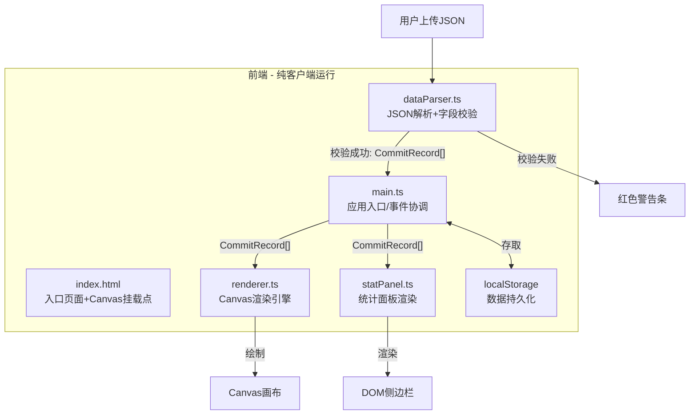

## 1. 架构设计



## 2. 技术说明
- 前端：TypeScript + 原生Canvas API + Vite
- 构建工具：Vite（开发服务器端口3000，别名@指向src）
- 数据持久化：浏览器localStorage
- 无后端，所有逻辑客户端运行

## 3. 模块调用关系与数据流向

```
用户上传JSON文件
    │
    ▼
dataParser.ts（解析+校验）
    │ 校验字段: sha, author, timestamp, linesAdded, linesDeleted, branch, message
    │ 校验类型: author(string), timestamp(number), linesAdded(number), 
    │          linesDeleted(number), branch(string), message(string)
    │ 校验失败 → 返回错误信息 → main.ts显示警告条
    │ 校验成功 → 返回 CommitRecord[]
    ▼
main.ts（协调中心）
    │
    ├──→ renderer.ts（接收CommitRecord[]）
    │       │ 绘制时间线背景（X轴按天40px分格，Y轴作者名）
    │       │ 绘制分支流向线（渐变色，0.5px虚线间隔4px）
    │       │ 绘制分支交汇点（2px黄色#fbbf24圆点）
    │       │ 绘制提交节点（圆形，直径10-30px，8色色盘）
    │       │ 绘制节点出生动画（0.5s弹性缩放）
    │       │ 处理hover（节点放大1.5倍+阴影+悬浮卡片）
    │       │ 处理点击选中（#f59e0b虚线外圈）
    │       │ 使用离屏Canvas优化性能
    │       ▼
    │     Canvas画布
    │
    ├──→ statPanel.ts（接收CommitRecord[]）
    │       │ 渲染总览卡片（总提交数+周变化百分比）
    │       │ 渲染作者贡献排行（按变更行数降序）
    │       │ 渲染热力图（7行×30列，5×5px方块）
    │       │ 渲染分支筛选按钮（胶囊按钮）
    │       ▼
    │     DOM侧边栏
    │
    └──→ localStorage（持久化提交数据）
```

## 4. 核心类型定义

```typescript
interface CommitRecord {
  sha: string;
  author: string;
  timestamp: number;
  linesAdded: number;
  linesDeleted: number;
  branch: string;
  message: string;
  files?: string[];
}

interface ParseResult {
  success: boolean;
  data?: CommitRecord[];
  error?: string;
}

interface AuthorStats {
  author: string;
  color: string;
  totalCommits: number;
  totalLinesAdded: number;
  totalLinesDeleted: number;
  activeDays: number;
}

interface HeatmapCell {
  date: string;
  count: number;
}
```

## 5. 关键算法设计

### 5.1 字段完整性校验算法（dataParser.ts）
```
对每条记录执行：
1. 检查必填字段存在性: sha, author, timestamp, linesAdded, linesDeleted, branch, message
2. 类型断言: author必须为string且非空, timestamp必须为number且>0,
   linesAdded必须为number且>=0, linesDeleted必须为number且>=0,
   branch必须为string且非空, message必须为string
3. 任一字段缺失或类型错误 → 返回具体错误信息
```

### 5.2 分支交汇点检测算法（renderer.ts）
```
1. 按时间排序所有提交记录
2. 对每个时间格子，收集该格内所有分支名
3. 若某时间格子内有>=2个不同分支的提交 → 标记为交汇点
4. 在交汇点位置绘制2px黄色#fbbf24圆点
5. 同时检测message中包含"merge"或"Merge"的提交 → 也标记交汇点
```

### 5.3 性能优化策略
- **离屏Canvas**: 将时间线背景、分支线、网格线等静态元素绘制到离屏Canvas，仅在数据变化时重绘
- **视口裁剪**: 仅绘制当前可见区域内的节点，跳过视口外的节点
- **空间索引**: 构建节点位置网格索引，hover检测时只检查鼠标附近的节点
- **节流渲染**: hover事件使用requestAnimationFrame节流
- **分层渲染**: 背景层(离屏Canvas) + 节点层 + 交互层(悬浮卡片DOM)

## 6. 文件结构

```
├── package.json          # 依赖: typescript, vite, @types/node; 脚本: npm run dev
├── vite.config.js        # Vite配置, 端口3000, 别名@→src
├── tsconfig.json         # 严格模式, target ES2022
├── index.html            # 入口页面, 上传控件+Canvas挂载点
└── src/
    ├── main.ts           # 应用入口, 初始化布局, 事件监听, 模块协调
    ├── dataParser.ts     # JSON解析+字段完整性校验+类型断言
    ├── renderer.ts       # Canvas渲染引擎(离屏Canvas+视口裁剪+空间索引)
    └── statPanel.ts      # 统计面板(热力图7×30+排行+筛选)
```
