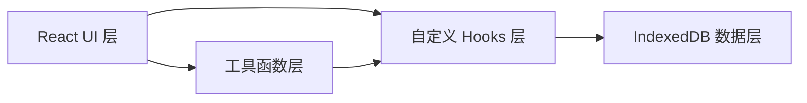
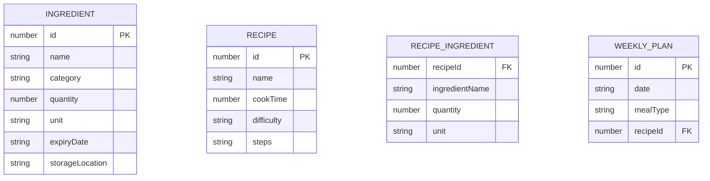

## 1. 架构设计



应用采用纯前端架构，所有数据存储在浏览器本地 IndexedDB 中，无需后端服务。

## 2. 技术栈说明

- **前端框架**：React 18 + TypeScript
- **构建工具**：Vite 5
- **本地存储**：IndexedDB (idb 库封装)
- **图标库**：lucide-react
- **状态管理**：React useState + 自定义 Hooks（轻量场景，无需 zustand）
- **样式方案**：CSS Modules + CSS Variables（无需 tailwind，保持轻量）

## 3. 项目结构

```
src/
├── components/          # React 组件
│   ├── IngredientPanel.tsx    # 食材管理面板
│   ├── RecipeGrid.tsx         # 菜谱推荐网格
│   ├── WeeklyPlan.tsx         # 本周计划日历
│   ├── ShoppingList.tsx       # 购物清单
│   ├── IngredientForm.tsx     # 食材表单模态框
│   └── RecipeCard.tsx         # 菜谱卡片组件
├── hooks/               # 自定义 Hooks
│   ├── useIndexedDB.ts        # IndexedDB 封装
│   └── useRecipeMatcher.ts    # 菜谱匹配逻辑
├── utils/               # 工具函数
│   └── recipeMatcher.ts       # 菜谱匹配纯函数
├── types/               # TypeScript 类型定义
│   └── index.ts               # 类型声明
├── data/                # 预置数据
│   └── defaultData.ts         # 初始食材和菜谱
├── App.tsx              # 主应用组件
├── main.tsx             # 入口文件
└── index.css            # 全局样式
```

## 4. 数据模型

### 4.1 数据模型定义



### 4.2 IndexedDB Store 设计

| Store 名称 | 主键 | 索引 | 说明 |
|-----------|------|------|------|
| ingredients | id (autoIncrement) | name, category, expiryDate | 食材库存表 |
| recipes | id (autoIncrement) | name | 菜谱模板表 |
| weeklyPlan | id (autoIncrement) | date, mealType | 周计划表 |
| shoppingList | id (autoIncrement) | ingredientName, category | 购物清单表 |

## 5. 核心模块说明

### 5.1 useIndexedDB Hook

封装 IndexedDB 的 CRUD 操作，提供统一的异步 API：

- `useIndexedDB(storeName)` - 返回数据和操作方法
- `addItem(item)` - 添加数据
- `updateItem(id, item)` - 更新数据
- `deleteItem(id)` - 删除数据
- `getAll()` - 获取所有数据
- `initializeWithDefaults(defaultData)` - 初始化默认数据

### 5.2 菜谱匹配算法

`recipeMatcher.ts` 纯函数模块：

输入：食材库存列表 + 菜谱模板列表
输出：分类后的匹配结果（完全匹配 / 缺少1-2样 / 缺少更多）

匹配规则：
1. 遍历每个菜谱的所需食材
2. 检查库存中是否存在对应食材且数量充足
3. 统计缺失食材数量
4. 按匹配度分类排序

### 5.3 拖拽实现

使用原生 HTML5 Drag and Drop API 实现菜谱卡片到日历格子的拖拽：

- `draggable="true"` 标记可拖拽元素
- `onDragStart` 设置拖拽数据和幽灵元素样式
- `onDragOver` 允许放置
- `onDrop` 处理放置逻辑，添加到周计划
- CSS transition 实现弹性缩放动画

## 6. 性能优化

- 列表渲染使用 React.memo 避免不必要的重渲染
- 食材列表超过 50 条时使用虚拟滚动（可选优化，优先保证 100ms DOM 更新）
- 使用 requestAnimationFrame 优化拖拽帧率，确保 ≥45fps
- IndexedDB 操作批量处理，减少事务开销
- CSS 动画优先使用 transform 和 opacity，保证硬件加速

## 7. 构建配置

- Vite dev server 端口：3000
- TypeScript 严格模式
- target: ES2020
- JSX: react-jsx
