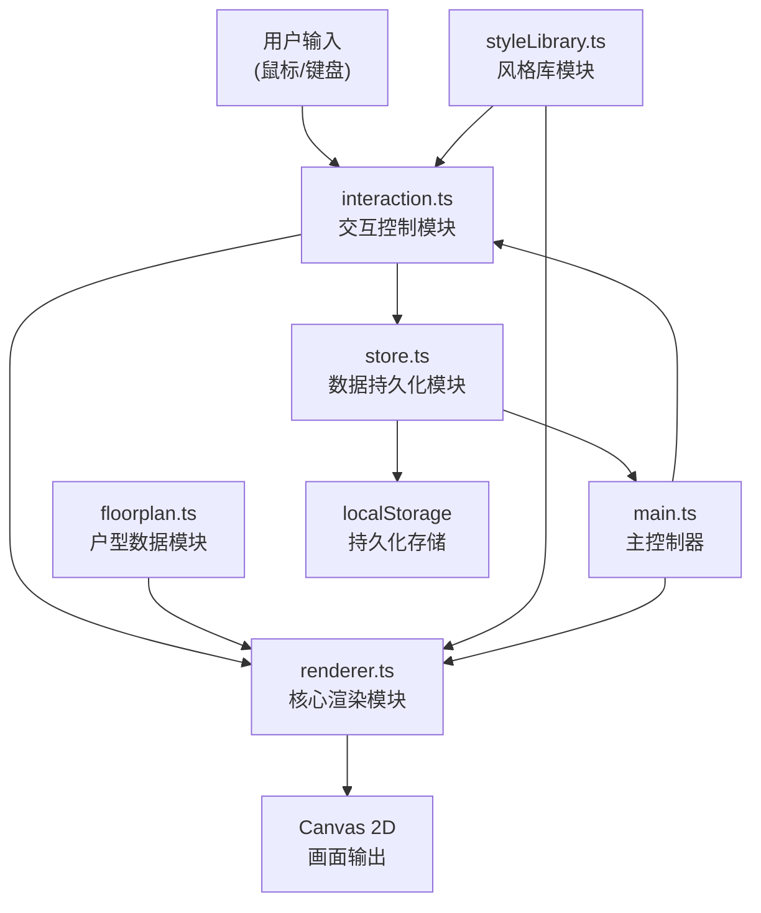

## 1. 产品概述
EasyDeco是一款室内装饰风格搭配预览应用，帮助设计师和客户直观地展示不同材质和颜色在真实户型中的搭配效果。通过交互式Canvas渲染，用户可以点击不同房间区域，实时切换墙面颜色、地板材质和家具风格组合，生成逼真的渲染预览效果。

- **核心价值**：解决传统口头描述或静态图片难以传达真实环境氛围和光影变化的痛点
- **目标用户**：室内设计师、装修业主、家居爱好者
- **市场定位**：轻量级、高效率的室内风格预览工具，所有功能在客户端运行，无需后端支持

## 2. 核心功能

### 2.1 功能模块
1. **户型展示模块**：五边形户型平面视图，包含客厅、卧室、厨房、卫生间、阳台五个区域
2. **房间拾取交互**：鼠标悬停高亮、点击选中、虚线边框闪烁动画
3. **风格切换模块**：5种预置主题风格（北欧简约、暖意田园、现代工业、地中海蓝、新中式），点击色块实时切换
4. **光影渲染模块**：Canvas 2D多边形填充、线性渐变光照模拟、HSL颜色空间过渡动画
5. **方案管理模块**：多方案保存、加载、删除，localStorage持久化存储
6. **导出功能**：导出1920x1080分辨率PNG图片

### 2.2 页面详情
| 页面名称 | 模块名称 | 功能描述 |
|---------|---------|---------|
| 主应用页 | 画布渲染区 | 居中显示户型平面图，支持房间点击选择和风格切换实时渲染 |
| 主应用页 | 左上角户型选择 | 户型选择下拉框（扁平风格） |
| 主应用页 | 右上角风格面板 | 5个32x32px色块按钮，悬停放大1.1倍 |
| 主应用页 | 底部方案抽屉 | 可折叠抽屉，展示方案卡片网格（140x100px），支持保存/加载/删除 |
| 主应用页 | 右下角导出按钮 | 蓝色圆角按钮，导出PNG图片 |

## 3. 核心流程

### 3.1 主要用户流程
1. 用户进入应用 → 默认加载五边形户型 → 画布渲染所有房间
2. 用户鼠标悬停房间 → 半透明白色高亮遮罩（0.2s淡入）
3. 用户点击房间 → 选中状态（2px虚线边框，0.5s闪烁动画）
4. 用户点击风格色块 → 选中房间以0.4s渐变动画切换配色
5. 用户保存方案 → 输入名称 → 所有房间配置存入localStorage
6. 用户展开底部抽屉 → 查看方案卡片 → 点击加载/删除方案
7. 用户点击导出按钮 → 隐藏临时元素 → 生成1920x1080 PNG并下载

### 3.2 数据流向图

## 4. 用户界面设计

### 4.1 设计风格
- **主题基调**：深色科技感主题，背景色#1a1a2e，边框#16213e，强调色#667eea
- **整体氛围**：专业、现代、沉浸式，突出Canvas渲染区域的视觉效果
- **色彩系统**：
  - 主背景：#1a1a2e（深靛蓝）
  - 边框色：#16213e（更深的靛蓝）
  - 面板背景：#0f3460（深蓝）
  - 强调色：#667eea（紫色渐变）、#3498db（亮蓝）
  - 高亮遮罩：rgba(255,255,255,0.2)
  - 文字：#ffffff

- **按钮样式**：扁平风格，圆角设计，点击有0.1s缩放反馈（0.95→1.0）
- **字体**：'Segoe UI', sans-serif，无衬线现代字体
- **排版层次**：
  - 标题：16px，加粗
  - 正文：14px，常规
  - 辅助文字：12px，浅色

- **动效系统**：
  - 所有过渡使用CSS ease-out缓动函数
  - 高亮遮罩：0.2s淡入淡出
  - 风格切换：0.4s HSL颜色渐变
  - 抽屉展开/收起：0.3s滑入滑出
  - 选中框：0.5s虚线闪烁动画

### 4.2 页面布局
| 区域 | 位置 | 尺寸 | 样式 |
|------|------|------|------|
| 画布容器 | 居中 | 宽度85%（最小1000px），高度自适应 | 20px边框#16213e |
| 户型下拉框 | 左上角 | 自适应 | 背景#0f3460，白色文字，选项悬停高亮 |
| 风格面板 | 右上角 | 5个32x32px按钮，间隔8px | 圆角6px，悬停放大1.1倍 |
| 方案抽屉 | 底部 | 高度150px | 可折叠，0.3s过渡动画 |
| 方案卡片 | 抽屉内 | 140x100px | 网格布局，显示名称和缩略图 |
| 导出按钮 | 右下角 | 自适应 | 蓝色#3498db圆角按钮 |

### 4.3 响应式设计
- **设计原则**：Desktop-first，优先保证1920x1080和1440x900分辨率显示正常
- **画布区域**：使用CSS rem单位定义间距，最小宽度1000px确保户型完整显示
- **控制面板**：固定定位在画布四周，不随画布缩放影响
- **触摸优化**：按钮最小点击区域40x40px（视觉32px，包含padding）

## 5. 性能指标
- **交互响应**：点击到画面更新延迟 ≤ 50ms
- **动画帧率**：风格切换动画 ≥ 50FPS
- **单帧渲染**：Canvas单帧绘制时间 ≤ 16ms
- **存储限制**：单个方案数据 < 10KB，localStorage总占用 < 5MB
