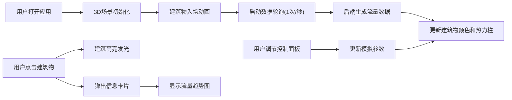

## 1. 产品概述

城市交通流量3D热力图模拟系统，为城市交通管理部门提供直观的各路段拥堵程度可视化展示，支持实时动态模拟和时间趋势分析。

- 核心价值：将抽象的交通流量数据转化为直观的3D可视化模型，帮助交通管理者快速识别拥堵热点、分析时间变化趋势
- 目标用户：城市交通管理部门、交通规划人员、城市决策者

## 2. 核心功能

### 2.1 功能模块

1. **3D城市街区模型**：8x8网格街区，程序化生成建筑物，支持实时颜色和热力柱更新
2. **交通流量模拟**：后端基于时间的正弦波+随机噪声模型生成流量数据
3. **控制面板**：模拟速度、时间进度、流量阈值三个滑块控制
4. **交互详情**：点击建筑显示街区信息、流量值和趋势折线图
5. **实时数据更新**：每秒轮询后端获取最新流量数据

### 2.2 页面详情

| 页面名称 | 模块名称 | 功能描述 |
|-----------|-------------|---------------------|
| 主应用页 | 3D场景区域 | 展示8x8街区3D模型，支持拖拽旋转、滚轮缩放，建筑物颜色和热力柱随流量实时变化 |
| 主应用页 | 控制面板区域 | 模拟速度滑块(0.5x-4x)、时间进度滑块(7:00-23:00步长15分钟)、流量阈值滑块，实时数值显示 |
| 主应用页 | 信息卡片 | 点击建筑弹出，显示街区名称、当前流量值、最近12个时间点的趋势折线图 |

## 3. 核心流程

用户打开应用 → 3D城市模型入场动画（建筑物从地面升起）→ 前端开始每秒轮询后端流量数据 → 建筑物颜色和热力柱实时更新 → 用户可拖拽旋转视角/滚轮缩放 → 用户调节控制面板滑块 → 模拟参数实时生效 → 用户点击建筑 → 建筑高亮发光 + 弹出信息卡片展示详细数据

## 4. 用户界面设计

### 4.1 设计风格

- **主色调**：深蓝(#16213e)、霓虹青蓝(#00d4ff)、赛博朋克风格
- **辅助色**：绿色(#00ff88)表示畅通，红色(#ff3366)表示拥堵，渐变过渡
- **控制面板背景**：#0f3460，文字#e2e2e2
- **滑块样式**：轨道#533483，手柄#e94560，带实时数值显示
- **按钮交互**：悬停缩放1.05倍，点击0.1秒按压动画
- **字体**：使用Orbitron作为数字显示字体，Roboto作为正文字体
- **布局**：左侧75%为3D场景，右侧25%为控制面板，全屏显示

### 4.2 页面设计概述

| 页面名称 | 模块名称 | UI元素 |
|-----------|-------------|-------------|
| 主应用页 | 3D场景区域 | 渐变天空背景(#1a1a2e到#16213e)、8x8网格建筑物、半透明热力柱、透视投影相机、45度俯角初始视角 |
| 主应用页 | 控制面板区域 | 深色半透明背景、三个带数值显示的滑块、霓虹边框效果、发光文字 |
| 主应用页 | 信息卡片 | 半透明玻璃态背景、霓虹边框、街区名称标题、流量值大号数字、SVG折线图(带移动圆圈动画) |

### 4.3 响应性

- 桌面端优先设计，全屏应用
- 3D场景自适应窗口大小变化
- 控制面板固定宽度比例

### 4.4 3D场景指导

- **环境**：渐变天空背景，无HDRI，赛博朋克都市氛围
- **灯光**：环境光+方向光+点光源，营造霓虹感
- **相机**：PerspectiveCamera，初始位置(60, 60, 60)，看向原点，45度俯角
- **控制器**：OrbitControls，支持拖拽旋转、滚轮缩放、右键平移
- **动画**：建筑物入场动画(0.8秒缓出)、热力柱高度变化(0.3秒过渡)、颜色切换(0.3秒过渡)、点击高亮光环(0.5秒循环)
- **后处理**：轻微辉光效果增强赛博朋克感
- **性能**：保持45FPS以上，几何体复用，材质实例化

