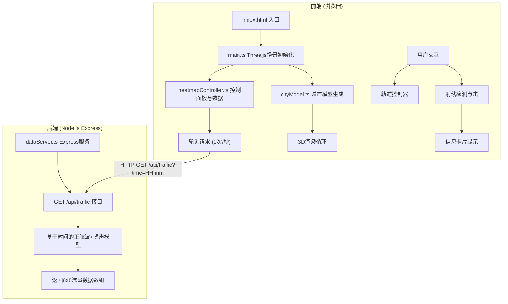

## 1. 架构设计



## 2. 技术描述

- **前端**：TypeScript + Three.js (CDN引入) + 原生DOM操作
- **构建工具**：Vite 5.x
- **后端**：Node.js + Express 4.x + CORS
- **编程语言**：TypeScript (严格模式，target ES2020)
- **前后端通信**：HTTP轮询 (每秒一次)，Vite代理/api请求到后端
- **前端端口**：3000，后端端口：3001

## 3. 项目结构

```
auto172/
├── index.html                 # 入口页面
├── package.json               # 项目依赖和脚本
├── vite.config.js             # Vite构建配置
├── tsconfig.json              # TypeScript配置
└── src/
    ├── main.ts                # Three.js场景初始化、相机、灯光、控制器
    ├── cityModel.ts           # 8x8街区模型生成、建筑物和热力柱
    ├── heatmapController.ts   # 控制面板UI、数据请求、模型更新
    └── dataServer.ts          # Express后端服务、流量数据生成
```

## 4. API 定义

### 4.1 类型定义

```typescript
// 单个街区数据
interface BlockData {
  row: number;
  col: number;
  name: string;
  flow: number;      // 0-100
  buildingHeight: number; // 5-50
  history: number[]; // 最近12个时间点
}

// 流量数据响应
interface TrafficResponse {
  time: string;      // "HH:mm"
  blocks: number[][]; // 8x8 流量值数组
}

// 控制面板状态
interface ControlState {
  speed: number;     // 0.5-4
  time: string;      // "HH:mm"
  threshold: number; // 0-100
}
```

### 4.2 接口定义

**GET /api/traffic**

请求参数：
- `time`: string (可选，格式"HH:mm")，默认根据当前模拟时间计算

响应格式：
```json
{
  "time": "08:30",
  "blocks": [
    [45, 62, 38, ...],
    [71, 55, 89, ...],
    ...
  ]
}
```

数据生成算法：
- 基于时间的正弦波模拟早晚高峰
- 叠加随机噪声增加真实感
- 每个街区有独立的相位偏移

## 5. 核心模块说明

### 5.1 main.ts - 场景管理
- 初始化 THREE.Scene, PerspectiveCamera, WebGLRenderer
- 设置 OrbitControls (拖拽旋转、滚轮缩放)
- 创建环境光、方向光、点光源
- 导出 render 函数供其他模块调用
- 处理窗口 resize 事件

### 5.2 cityModel.ts - 城市模型
- `buildCity(cityData: number[][])` 主函数
- 创建8x8网格，每个网格包含：
  - 建筑物：BoxGeometry，高度随机5-50，颜色根据流量值从绿到红渐变
  - 热力柱：CylinderGeometry，半透明，高度随流量值变化
- 入场动画：scale.y 从0到1，0.8秒缓出
- 更新函数：`updateBlock(row, col, flow)` 更新颜色和热力柱高度
- 射线检测：`getIntersectedBlock(raycaster)` 返回点击的街区

### 5.3 heatmapController.ts - 控制与数据
- 初始化三个滑块的UI和事件监听
- 启动每秒轮询请求后端数据
- 解析时间进度滑块 (早7点到晚23点，步长15分钟)
- 调用 cityModel 更新建筑物状态
- 处理建筑点击事件，显示信息卡片
- 绘制趋势折线图 (SVG)

### 5.4 dataServer.ts - 后端服务
- Express 服务监听3001端口
- 启用 CORS
- `/api/traffic` 接口处理流量数据请求
- 流量生成算法：`flow = base + sin(timePhase + blockPhase) * amplitude + noise`
- 早高峰(8:00-9:00)和晚高峰(18:00-19:00)流量显著提升

## 6. 性能优化

- 几何体复用：相同尺寸的建筑物共享Geometry
- 材质实例化：相同颜色/属性的建筑物共享Material
- 动画使用 requestAnimationFrame
- 热力柱高度和颜色使用 lerp 平滑过渡
- 射线检测只对建筑物网格进行
- 限制渲染帧率不低于45FPS

