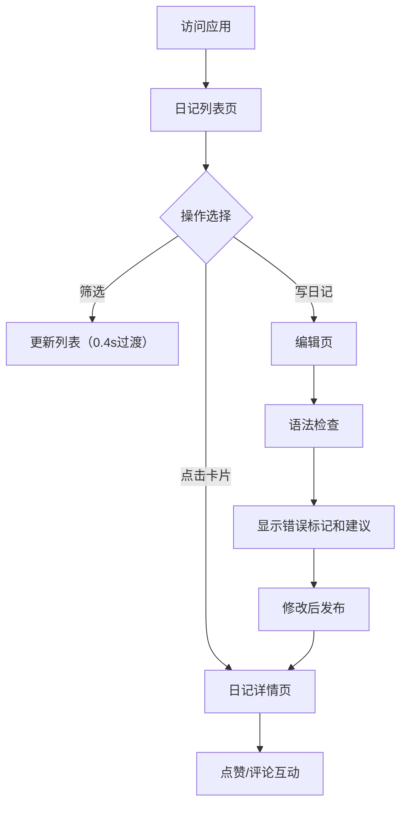

## 1. 产品概述

语言学习社区日记分享应用，帮助外语学习者通过撰写日记实践写作，并获得语法纠错和词汇建议。用户可以分享学习日记，与社区互动评论点赞，系统根据语言水平提供个性化学习建议。

- 核心目标：打造沉浸式语言学习社区，通过写作实践和智能建议提升用户外语水平
- 目标用户：外语学习者（初级、中级、高级各水平）
- 市场价值：结合社交与学习，提供比单纯写作练习更有动力的学习体验

## 2. 核心功能

### 2.1 用户角色

| 角色 | 注册方式 | 核心权限 |
|------|----------|----------|
| 访客用户 | 无需注册（localStorage生成UUID） | 浏览日记、筛选搜索、点赞、评论、发布日记 |

### 2.2 功能模块

1. **日记列表页**：分页展示日记卡片、语言/水平筛选、过渡动画、写日记入口
2. **日记编辑页**：富文本编辑器、语法检查、错误标记、建议卡片、语言/水平设置
3. **日记详情页**：全文展示、段落动画、评论列表、发表评论、点赞功能
4. **用户设置**：学习语言和水平等级配置、localStorage持久化

### 2.3 页面详情

| 页面名称 | 模块名称 | 功能描述 |
|----------|----------|----------|
| 日记列表页 | 筛选栏 | 按语言类型（英/日/法/德/西）和水平等级（初/中/高）筛选，0.4s渐隐渐现过渡 |
| 日记列表页 | 日记卡片 | 展示标题、摘要、语言标签、水平标签、点赞数、评论数，hover动效 |
| 日记列表页 | 分页器 | 每页10条，按发布时间倒序 |
| 日记编辑页 | 标题输入 | 18px字体居中，聚焦时底部边框渐变动画 |
| 日记编辑页 | 富文本编辑器 | contentEditable实现，支持加粗/斜体/下划线/列表 |
| 日记编辑页 | 语法检查 | 调用后端API，错误位置红色波浪线标记，右侧显示建议卡片 |
| 日记编辑页 | 语言/水平选择 | 下拉框选择语言，标签选择水平等级 |
| 日记详情页 | 正文展示 | 富文本渲染，每段淡入动画 |
| 日记详情页 | 评论列表 | 时间线形式，圆形渐变头像，暖色调随机背景 |
| 日记详情页 | 评论输入 | 100%宽度，实时字数统计，提交后滚动到最新评论 |
| 全局 | 点赞按钮 | 心形SVG，未点赞灰色，点赞后红色并缩放脉冲动画 |
| 全局 | 设置菜单 | 齿轮图标下拉菜单，配置学习语言和水平 |

## 3. 核心流程

### 浏览日记流程
用户访问首页 → 加载日记列表（分页10条） → 可选择语言/水平筛选 → 点击日记卡片进入详情页

### 发布日记流程
用户点击"写日记" → 进入编辑页 → 输入标题和正文 → 选择语言和水平 → 点击发布前自动语法检查 → 显示错误标记和建议 → 用户修改后发布 → 跳转详情页

### 互动流程
用户浏览日记 → 点击心形图标点赞（仅一次） → 滚动到评论区 → 输入评论 → 提交后显示最新评论

## 4. 用户界面设计

### 4.1 设计风格
- 主色调：渐变紫蓝 #667eea → #764ba2（用于强调元素和动画）
- 背景色：浅灰 #f0f2f5
- 卡片背景：白色 #ffffff
- 圆角：卡片12px，标签4px，建议卡片8px，菜单6px
- 阴影：卡片默认0 2px 8px rgba(0,0,0,0.06)，hover时0 4px 16px rgba(0,0,0,0.1)
- 字体：标题18px，正文16px，辅助文字14px/12px

语言类型标签颜色：
- 英语：蓝色 #3498db
- 日语：红色 #e74c3c
- 法语：紫色 #9b59b6
- 德语：橙色 #e67e22
- 西班牙语：绿色 #2ecc71

水平等级标签背景：
- 初级：绿色 #d4edda
- 中级：黄色 #fff3cd
- 高级：红色 #f8d7da

### 4.2 页面设计概述

| 页面名称 | 模块名称 | UI元素 |
|----------|----------|----------|
| 日记列表页 | 筛选栏 | 语言下拉框、水平标签组、卡片式布局 |
| 日记列表页 | 日记卡片 | 标题、摘要、两个标签、点赞/评论计数 |
| 日记编辑页 | 标题输入 | 居中18px，底部边框渐变动画 |
| 日记编辑页 | 富文本区 | 工具栏（粗/斜/下划线/列表）、contentEditable区域 |
| 日记编辑页 | 建议卡片 | 浅黄背景#fff3cd，左侧绿色竖条边框 |
| 日记详情页 | 评论区 | 时间线布局、圆形渐变头像（5种暖色调）、14px用户名#666、16px正文#333、12px时间#999 |
| 日记详情页 | 评论输入 | 100%宽度，下方实时字数统计 |
| 全局 | 点赞按钮 | 心形SVG，灰色#ccc→红色#e74c3c，缩放脉冲动画1.0→1.2→1.0（0.3s） |
| 全局 | 设置菜单 | 齿轮图标、白色下拉菜单、阴影0 4px 12px rgba(0,0,0,0.1) |

### 4.3 响应式设计

采用桌面优先设计：
- **桌面（≥768px）**：内容区最大宽度1100px，左右内边距15px
- **平板（<768px）**：内容区宽度95%，卡片内边距减少至16px
- **手机（<480px）**：内容区宽度100%，单列布局，编辑器工具栏折叠为汉堡菜单，动画禁用或简化

### 4.4 动画与交互

- 列表筛选：0.4s渐隐再渐现
- 标题输入聚焦：底部边框0.3s从#667eea渐变到#764ba2
- 卡片hover：向上平移2px，阴影加深，0.2s过渡
- 点赞成功：缩放脉冲动画1.0→1.2→1.0，0.3s
- 日记详情段落：逐个淡入动画
- 移动端：动画禁用或降低复杂度
