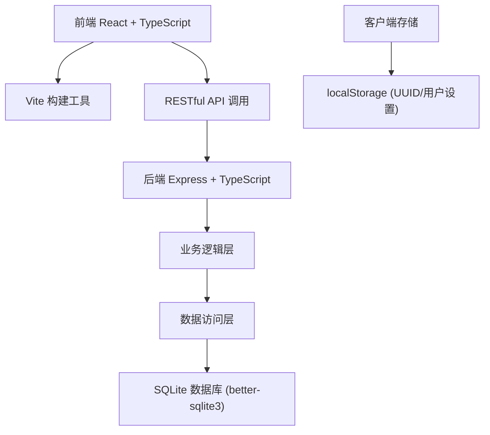
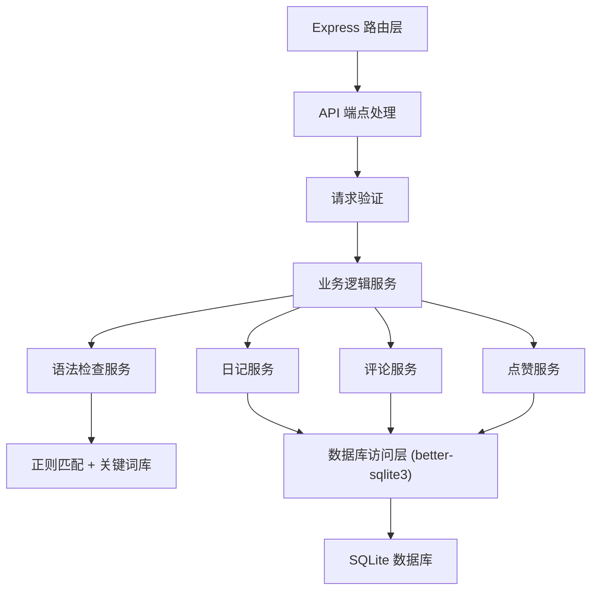
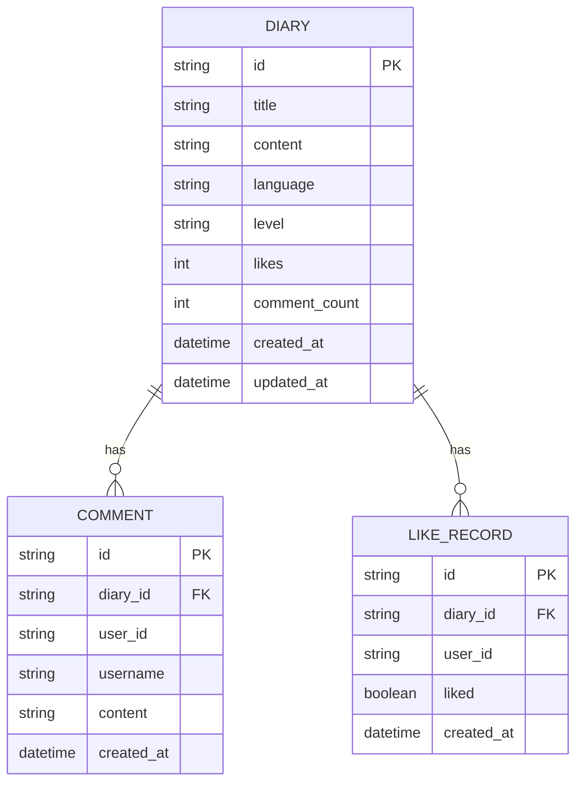

## 1. 架构设计



## 2. 技术描述

- **前端**：React@18 + TypeScript + Vite
- **状态管理**：React useState/useEffect + localStorage 持久化
- **后端**：Express@4 + TypeScript
- **数据库**：SQLite (better-sqlite3)
- **API通信**：RESTful API + fetch
- **构建工具**：Vite@5 + @vitejs/plugin-react
- **开发代理**：Vite 代理 /api 到后端服务

## 3. 项目文件结构

```
auto173/
├── package.json
├── vite.config.js
├── tsconfig.json
├── index.html
└── src/
    ├── server.ts              # Express 后端入口
    ├── shared/                # 前后端共享类型
    │   └── types.ts
    └── client/
        ├── App.tsx            # 主组件，路由管理
        ├── DiaryCard.tsx      # 日记卡片组件
        ├── Editor.tsx         # 日记编辑组件
        ├── DiaryDetail.tsx    # 日记详情组件
        ├── DiaryList.tsx      # 日记列表组件
        ├── Settings.tsx       # 设置菜单组件
        ├── LikeButton.tsx     # 点赞按钮组件
        ├── CommentSection.tsx # 评论区组件
        └── utils/
            ├── api.ts         # API 调用封装
            └── helpers.ts     # 工具函数
```

## 4. 路由定义

| 路由 | 页面/组件 | 说明 |
|------|----------|------|
| `/` | DiaryList | 日记列表页（首页） |
| `/editor` | Editor | 新建日记编辑页 |
| `/diary/:id` | DiaryDetail | 日记详情页 |

## 5. API 定义

### 类型定义

```typescript
// 语言类型
type Language = 'english' | 'japanese' | 'french' | 'german' | 'spanish';

// 水平等级
type Level = 'beginner' | 'intermediate' | 'advanced';

// 日记
interface Diary {
  id: string;
  title: string;
  content: string;
  language: Language;
  level: Level;
  likes: number;
  commentCount: number;
  createdAt: string;
  updatedAt: string;
}

// 评论
interface Comment {
  id: string;
  diaryId: string;
  userId: string;
  username: string;
  content: string;
  createdAt: string;
}

// 点赞记录
interface LikeRecord {
  diaryId: string;
  userId: string;
  liked: boolean;
}

// 语法建议
interface GrammarSuggestion {
  id: string;
  startIndex: number;
  endIndex: number;
  original: string;
  suggestion: string;
  explanation: string;
  type: 'grammar' | 'vocabulary' | 'spelling';
}
```

### API 端点

| 方法 | 路径 | 说明 | 请求体 | 响应 |
|------|------|------|--------|------|
| GET | `/api/diaries` | 获取日记列表（分页+筛选） | `?page=1&pageSize=10&language=&level=` | `{ data: Diary[], total: number, page: number }` |
| GET | `/api/diaries/:id` | 获取单篇日记详情 | - | `Diary` |
| POST | `/api/diaries` | 创建日记 | `{ title, content, language, level }` | `Diary` |
| POST | `/api/diaries/:id/comments` | 添加评论 | `{ userId, username, content }` | `Comment` |
| GET | `/api/diaries/:id/comments` | 获取日记评论 | - | `Comment[]` |
| POST | `/api/diaries/:id/like` | 点赞/取消点赞 | `{ userId, liked: boolean }` | `{ likes: number, liked: boolean }` |
| GET | `/api/diaries/:id/like` | 检查用户是否点赞 | `?userId=` | `{ liked: boolean, likes: number }` |
| POST | `/api/grammar-check` | 语法检查 | `{ content, language, level }` | `{ suggestions: GrammarSuggestion[] }` |

### 后端服务架构



## 6. 数据模型

### 6.1 数据模型定义



### 6.2 数据库初始化

```sql
-- 日记表
CREATE TABLE IF NOT EXISTS diaries (
    id TEXT PRIMARY KEY,
    title TEXT NOT NULL,
    content TEXT NOT NULL,
    language TEXT NOT NULL,
    level TEXT NOT NULL,
    likes INTEGER DEFAULT 0,
    comment_count INTEGER DEFAULT 0,
    created_at DATETIME DEFAULT CURRENT_TIMESTAMP,
    updated_at DATETIME DEFAULT CURRENT_TIMESTAMP
);

-- 评论表
CREATE TABLE IF NOT EXISTS comments (
    id TEXT PRIMARY KEY,
    diary_id TEXT NOT NULL,
    user_id TEXT NOT NULL,
    username TEXT NOT NULL,
    content TEXT NOT NULL,
    created_at DATETIME DEFAULT CURRENT_TIMESTAMP,
    FOREIGN KEY (diary_id) REFERENCES diaries(id) ON DELETE CASCADE
);

-- 点赞记录表
CREATE TABLE IF NOT EXISTS like_records (
    id TEXT PRIMARY KEY,
    diary_id TEXT NOT NULL,
    user_id TEXT NOT NULL,
    liked BOOLEAN DEFAULT 1,
    created_at DATETIME DEFAULT CURRENT_TIMESTAMP,
    UNIQUE(diary_id, user_id),
    FOREIGN KEY (diary_id) REFERENCES diaries(id) ON DELETE CASCADE
);

-- 索引
CREATE INDEX IF NOT EXISTS idx_diaries_language ON diaries(language);
CREATE INDEX IF NOT EXISTS idx_diaries_level ON diaries(level);
CREATE INDEX IF NOT EXISTS idx_diaries_created_at ON diaries(created_at DESC);
CREATE INDEX IF NOT EXISTS idx_comments_diary_id ON comments(diary_id);
CREATE INDEX IF NOT EXISTS idx_like_records_user ON like_records(user_id);
```

## 7. 性能优化

### 前端性能
- 分页加载（每页10条），避免一次性渲染过多DOM
- 使用CSS transforms处理动画，保证GPU加速
- 响应式图片和资源加载
- 组件懒加载（按需加载详情页和编辑页）

### 后端性能
- SQLite 索引优化（language、level、created_at）
- better-sqlite3 同步API，高性能
- 数据库连接池（better-sqlite3 自动管理）
- API 响应压缩

### 动画性能
- 使用 `transform` 和 `opacity` 属性动画，避免重排重绘
- 移动端 `prefers-reduced-motion` 媒体查询禁用动画
- 列表过渡使用 CSS opacity 动画
