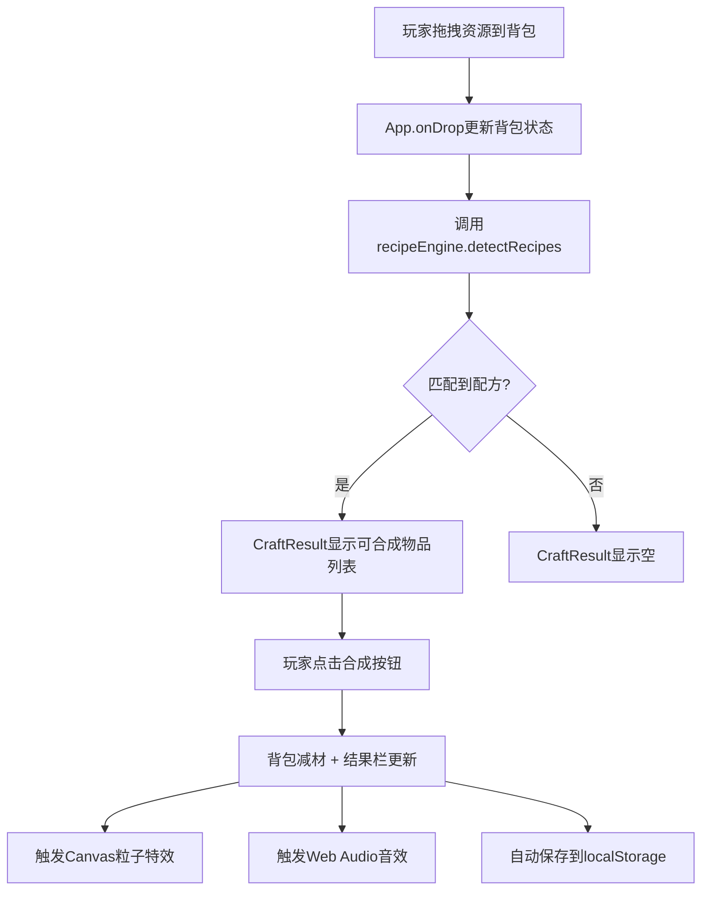

## 1. 产品概述
CraftPlanner是一款轻量级的生存类游戏合成配方模拟器，供玩家在战斗间隙快速规划资源分配和装备升级路径。
- 核心功能：拖拽式资源管理、实时配方检测、可视化合成反馈、本地数据持久化
- 目标用户：生存类游戏玩家、游戏策划人员、合成系统爱好者
- 产品价值：无需登录游戏即可预览和验证资源配置方案，提升游戏效率

## 2. 核心特性

### 2.1 功能模块
1. **主界面**：背包网格区、合成结果区、资源仓库区
2. **拖拽系统**：资源仓库→背包、背包内格子互换
3. **配方引擎**：纯函数配方匹配，支持多配方同时检测
4. **合成反馈**：Canvas粒子爆裂特效 + Web Audio合成音效
5. **数据持久化**：localStorage自动保存/恢复背包状态

### 2.2 页面详情
| 页面名称 | 模块名称 | 功能描述 |
|-----------|-------------|---------------------|
| 主页面 | 背包网格(6x2) | 12个droppable格子，显示资源图标和数量，hover高亮，支持拖拽互换 |
| 主页面 | 资源仓库 | 固定展示石头x5、木头x5、铁锭x3、皮革x3、线x3，作为拖拽源 |
| 主页面 | 合成结果区 | 磨砂玻璃效果，列出当前可合成物品，含预览图标和合成按钮 |
| 主页面 | 粒子系统 | Canvas叠加层，合成成功时30粒子径向散射0.8s |
| 主页面 | 音效模块 | Web Audio API生成短促合成成功音 |

## 3. 核心流程
玩家从资源仓库拖拽资源放入背包网格 → 每次状态变化触发recipeEngine检测 → 匹配的配方显示在合成结果区 → 玩家点击合成按钮 → 背包减材、结果更新、触发粒子+音效 → 自动持久化到localStorage

## 4. 用户界面设计

### 4.1 设计风格
- **主题**：深色末日风格
- **背景**：径向渐变 #1a1a2e → #16213e
- **背包格子**：背景 #00000050，边框1px实线 #4a4a5a，hover边框高亮 #f39c12
- **资源图标**：彩色圆形，石头灰#7f8c8d、木头棕#8b4513、铁锭银#bdc3c7、皮革褐#d35400、线白#ecf0f1
- **合成结果区**：磨砂玻璃效果 rgba(255,255,255,0.05) + blur(10px)
- **合成按钮**：渐变橙色 #e67e22 → 红色 #c0392b，hover放大1.1倍 + 光晕
- **粒子颜色**：渐变 暖黄#f1c40f → 橙红#e67e22

### 4.2 响应式设计
- **桌面**：左右两列布局（左列背包+结果区，右列资源仓库）
- **平板/手机**：上下两行布局
- **格子尺寸**：桌面60x60px，手机44x44px
- **触摸优化**：300ms长按触发拖拽

### 4.3 性能指标
- 配方检测响应时间 ≤ 16ms（60FPS）
- 所有状态更新在一个requestAnimationFrame周期内完成
- 粒子特效独立低优先级requestAnimationFrame循环
- 核心交互帧率稳定 55-60FPS
