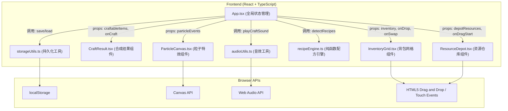

## 1. 架构设计



## 2. 技术描述
- **前端框架**：React@18 + TypeScript@5
- **构建工具**：Vite@5 + @vitejs/plugin-react
- **拖拽实现**：react-dnd + react-dnd-html5-backend（原生HTML5 DnD，触摸设备自动回退touch事件）
- **状态管理**：React useState/useEffect（轻量级，无需额外状态库）
- **样式方案**：原生CSS Modules / SCSS（避免额外依赖，性能更优）
- **类型定义**：严格TypeScript模式（strict: true）

## 3. 类型定义

```typescript
// 资源类型
type ResourceType = 'stone' | 'wood' | 'iron' | 'leather' | 'string';

// 资源元数据
interface ResourceMeta {
  id: ResourceType;
  name: string;
  color: string;
  initialStock: number;
}

// 背包格子
interface InventorySlot {
  id: number;       // 0-11, 6x2网格索引
  resource: ResourceType | null;
  count: number;
}

// 背包整体
type Inventory = InventorySlot[];  // 长度固定12

// 合成配方
interface Recipe {
  id: string;
  name: string;
  iconColor: string;
  requirements: Partial<Record<ResourceType, number>>;
  output: {
    type: 'tool' | 'armor' | 'misc';
    name: string;
  };
}

// 可合成结果（检测输出）
interface CraftableResult {
  recipeId: string;
  name: string;
  iconColor: string;
  requirements: Partial<Record<ResourceType, number>>;
}

// 已合成物品记录
interface CraftedItem {
  id: string;
  recipeId: string;
  name: string;
  iconColor: string;
  timestamp: number;
}
```

## 4. 文件结构

```
auto177/
├── package.json
├── vite.config.js
├── tsconfig.json
├── index.html
└── src/
    ├── main.tsx              # React入口，渲染<App />
    ├── App.tsx               # 主组件：状态中心+数据流调度
    ├── types/
    │   └── index.ts          # 全局TypeScript类型定义
    ├── components/
    │   ├── InventoryGrid.tsx   # 6x2背包网格（droppable）
    │   ├── CraftResult.tsx     # 可合成物品列表+合成按钮
    │   ├── ResourceDepot.tsx   # 资源仓库（draggable源）
    │   ├── ParticleCanvas.tsx  # Canvas粒子系统层
    │   └── InventorySlot.tsx   # 单个背包格子（子组件）
    ├── utils/
    │   ├── recipeEngine.ts   # 纯函数配方检测引擎
    │   ├── audioUtils.ts     # Web Audio音效生成
    │   └── storageUtils.ts   # localStorage读写封装
    ├── data/
    │   └── recipes.ts        # 配方数据常量
    └── styles/
        └── global.css        # 全局样式+主题变量
```

## 5. 数据流向与调用关系

| 调用者 | 被调用 | 触发时机 | 数据流向 |
|--------|--------|----------|----------|
| main.tsx | App.tsx | 应用启动 | 挂载根组件 |
| App.tsx | storageUtils.loadState | 组件挂载 | localStorage → 初始化inventory/craftedItems |
| App.tsx | recipeEngine.detectRecipes | inventory状态变更后（useEffect依赖） | Inventory → CraftableResult[] |
| InventoryGrid.tsx | App.onDrop | 背包格子drop事件 | (slotIndex, resource, count) → 更新inventory |
| InventoryGrid.tsx | App.onSwap | 两个格子间拖拽互换 | (fromIdx, toIdx) → 交换inventory元素 |
| ResourceDepot.tsx | react-dnd useDrag | 仓库资源拖拽开始 | 生成DragItem { resource, count } |
| CraftResult.tsx | App.onCraft | 合成按钮点击 | recipeId → 执行减材+添加craftedItem |
| CraftResult.tsx | ParticleCanvas.spawn | 合成成功 | { x, y, particleCount: 30 } |
| CraftResult.tsx | audioUtils.playCraftSound | 合成成功 | 无返回 → 播放音效 |
| App.tsx | storageUtils.saveState | inventory/craftedItems变更后 | 状态 → localStorage |

## 6. 配方引擎算法（性能约束≤16ms）

**算法思路**：将背包资源聚合成 countMap → 遍历所有配方做一次减法比较 → 无嵌套循环，O(N)复杂度N为配方数

```
输入: Inventory[12]
步骤:
  1. countMap = { stone:0, wood:0, iron:0, leather:0, string:0 }
     遍历Inventory[12]一次，累加各类资源数量
  2. result = []
     遍历RECIPES数组每个recipe:
       match = true
       对recipe.requirements每项{k, v}:
         if countMap[k] < v: match=false; break
       if match: result.push({ recipeId, name, ... })
输出: CraftableResult[]
```

**配方定义（内置）**：
- 石斧：石头x4 + 木头x2 → 石斧
- 石镐：石头x3 + 木头x2 → 石镐
- 皮靴：皮革x1 + 线x4 → 皮靴
- 铁剑：铁锭x3 + 木头x1 → 铁剑
- 皮甲：皮革x5 + 线x2 → 皮甲
- 弓：木头x3 + 线x3 → 弓

## 7. 性能优化策略

1. **配方检测防抖**：useMemo缓存detectRecipes结果，依赖项仅为inventory的序列化值
2. **状态更新**：useCallback包裹所有事件处理函数，避免子组件不必要重渲染
3. **粒子系统**：独立requestIdleCallback/低优先级rAF循环，使用离屏Canvas（如需要）
4. **拖拽渲染**：react-dnd的自定义DragLayer，拖拽预览脱离DOM重排
5. **持久化节流**：useEffect内使用debounce(200ms)写入localStorage，避免高频I/O
6. **重渲染控制**：InventoryGrid.memo + CraftResult.memo，浅比较props变更

## 8. 运行方式

```bash
npm install
npm run dev
# 浏览器打开 http://localhost:3000
```
